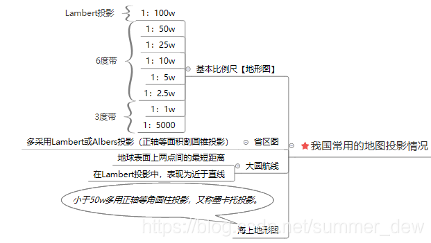

## 我国常见的地图投影

| 投影名称 | 投影类型 | 介绍 | 特征 | 用途 |
| --- | --- | --- | --- | --- |
| 墨卡托投影 | 正轴等角圆柱投影 | 圆柱割于地球，投影到圆柱面上，展开 | 1. 等角。长度和面积变形明显，基准纬线无变形 2. 经纬线平行成直角，经线间隔相等、纬线不等 | 航海图、航空图 |
| 通用横轴墨卡托UTM | 横轴割圆柱等角投影 | 使用笛卡尔坐标系，标记南纬80°-北纬84°的地区 | 1. 每6°一带，由西向东01-60，中央经线为直线且为投影对称轴 2. 两条割线没有变形 | 1. 美国世界军用地图、地球资源卫星像片 2. 某些国家局部采用UTM作为地图数学基础，我国卫星影像资料常采用 |
| 高斯克里格投影 | 横轴切圆柱等角投影 | 1. 6°带：0°开始（中国72E-136E，13-23带） 2. 3°带：从1°30′开始 | 1. 中央精度和赤道投影后互为垂直的直线且为投影对称轴 2. 等角，中央经度不变形，赤道变形最厉害 | 适合幅员广大地区，按经线分带进行投影，各带变形情况相似，利于全球地图拼接 |
| 兰勃特等角投影 | 等角正轴割圆锥投影 | 德国数学家兰勃特 | 1. 小而均匀 2. 等角 3. 两条标准纬线无变形，同一纬线变形处处相同，变形均匀、两条纬线间经纬线长度处处相等 | 1. 制作沿纬线分布的中纬度地区中、小比例尺地图 2. 1:100万地形图和航空图（我国1:100万采用兰勃特投影） 3. 东西半球图和分洲图多用此投影 |