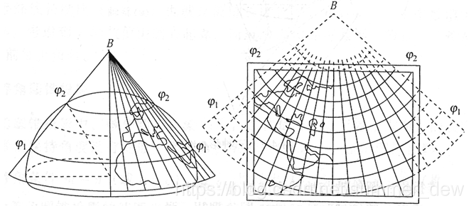

Lambert conformal conic（德国数学家兰勃特）

- 等角正轴割圆锥投影

## 特点

1. 小而均匀
2. 没有角度变形
3. 两条标准纬线无变形
4. 同一纬线上变形处处相同、变形均匀、两条纬线间经纬线长度处处相等

## 适用

1. 制作沿纬线分布的中纬度地区中、小比例尺地图
2. 1:100万地形图和航空图（我国1:100万采用兰勃特投影）
3. 东西半球图和分洲图多用此投影