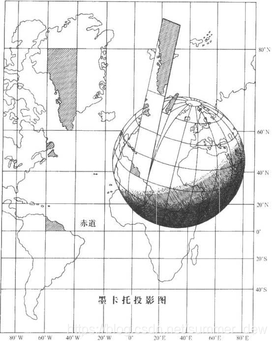

1569荷兰地图学家墨卡托 正轴等角圆柱投影

1. 正轴，等角条件，圆柱割于地球
2. 投影到圆柱面上，展开
3. 最早最常用的切圆柱投影

## 特征

1. 没有角度变形->各方向长度比相等
2. 经纬线都是平行直线，且相交成直角
	1. 经线间隔相等
	2. 纬线间隔从基准纬线处向两极逐渐增大
3. 长度和面积变形明显，基准纬线无变形，从基准纬线处向两极变形逐渐增大。但它具有各个方向均等扩大的特性，保持了方向和相互位置关系的正确

## 适用
航海图和航空图：循着墨卡托投影图上两点间的直线航行，方向不变可以一直到达目的地