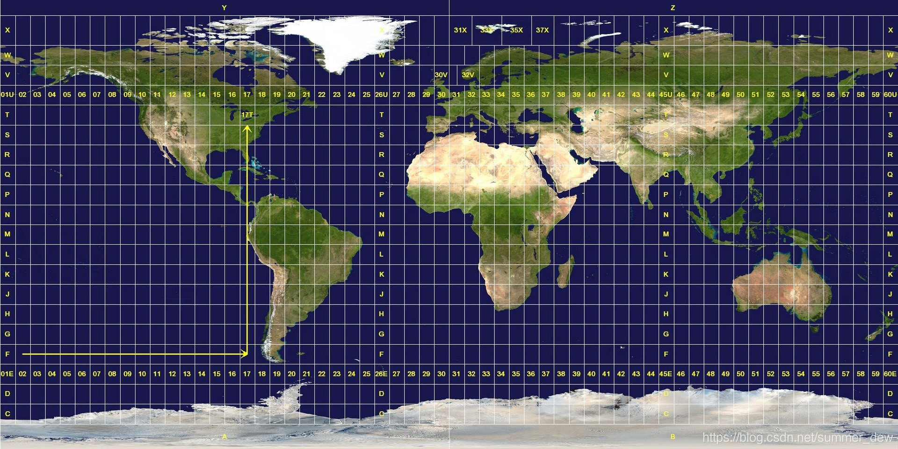
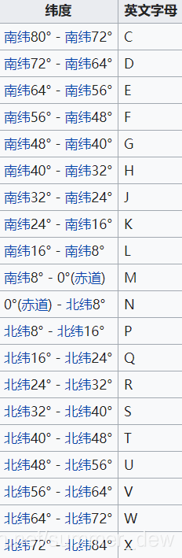

【介绍】它使用笛卡儿座标系，标记南纬80°至北纬84°之间的所有位置

## 用途

1. 美国编制世界各地军用地图和地球资源卫星像片所采用的投影系统
2. 某些国家局部采用UTM作为地图数学基础
3. 我国的卫星影像资料常采用UTM

## 类型

横轴割圆柱等角投影

1. 圆柱割于南纬80°、北纬84°两条等高圈上
2. 两条割线没有变形，离这两条割线越远变形越大
3. 割线以内，长度变形为负值，以外为正值

## 特点

1. 和高斯相似，角度没有变形，中央经线为直线，且为投影的对称轴
2. 中央经线的比例因子取0.9996是为了保证离中央经线约330km处有两条不失真的标准经线
3. 6°标准，从西经180自西向东进行投影带分类，共分60个投影带。6°带内长度变形较小

  

## 座标编排

  

【格式】`[经度区间][纬度区间] [方格座标]`

- 例子：50Q 1947 3910
- 含义：经纬 北距 东距

  

【纬度区间】从南纬80°开始，每8°被编排为一个纬度区间，"C"至"X"编排

  

【经度区间】

1. 每6°被编排为一经度区间（每一个经度区间均以一个数字表示，由西向东数以01至60编排）