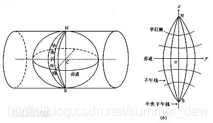
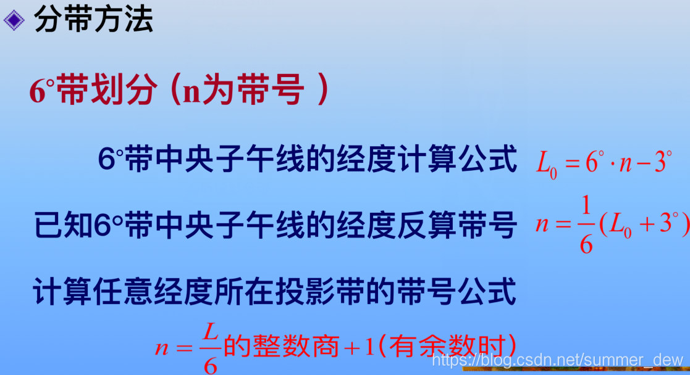
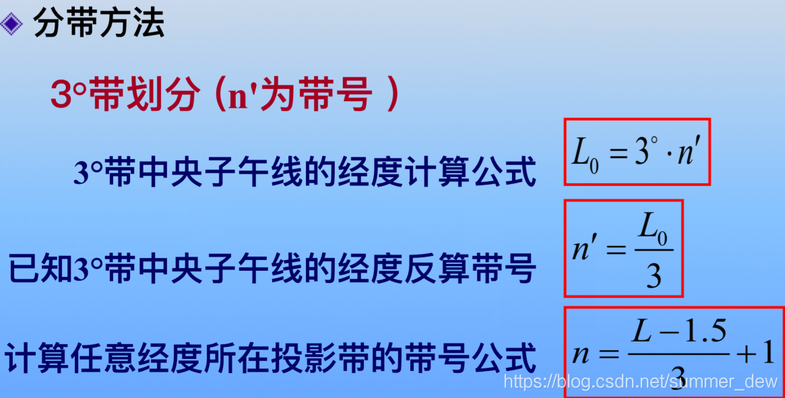

高斯-克吕格投影

- 由高斯提出，克吕格补充
- 横轴切圆柱等角投影
- 为了减少长度变形的误差，进行分带

  

## 形成条件
1. 中央经线和赤道投影后为互相垂直的直线，且为投影的对称轴
2. 等角性质
3. 中央经线投影后长度不变

## 特点
1. 中央经线没有变形，其他地方长度比都大于1（投影后更长了）
2. 只有中央经度不变形，离中央经线越远，变形越大
3. 离赤道越近，变形越大
4. 等角投影，面积比为长度比的平方
5. 长度比的等变形线平行于中央子午线

## 适用
适合幅员广大的地区，按经线分带进行投影，各带变形情况相似，利于全球地图拼接

## 分带
### 6度带

- 从0°开始
- 中国72E-136E，跨越了1323共11个带

### 3度带
- 从1°30′开始

