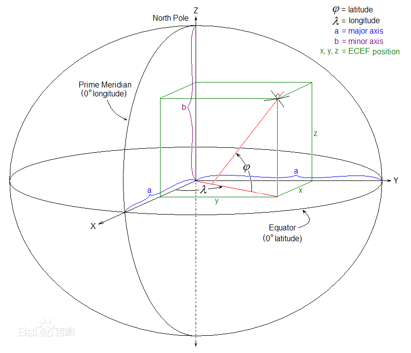

**地心地固坐标系**（**E**arth-**C**entered, **E**arth-**F**ixed，简称**ECEF**）简称**地心坐标系**

- 是一种以[地心](https://baike.baidu.com/item/%E5%9C%B0%E5%BF%83?fromModule=lemma_inlink)为原点的[地固坐标系](https://baike.baidu.com/item/%E5%9C%B0%E5%9B%BA%E5%9D%90%E6%A0%87%E7%B3%BB?fromModule=lemma_inlink)（也称[地球坐标系](https://baike.baidu.com/item/%E5%9C%B0%E7%90%83%E5%9D%90%E6%A0%87%E7%B3%BB?fromModule=lemma_inlink)），是一种[笛卡儿坐标系](https://baike.baidu.com/item/%E7%AC%9B%E5%8D%A1%E5%84%BF%E5%9D%90%E6%A0%87%E7%B3%BB?fromModule=lemma_inlink)
- 原点 O (0,0,0)为地球质心
- z 轴与地轴平行指向[北极点](https://baike.baidu.com/item/%E5%8C%97%E6%9E%81%E7%82%B9?fromModule=lemma_inlink)
- x 轴指向[本初子午线](https://baike.baidu.com/item/%E6%9C%AC%E5%88%9D%E5%AD%90%E5%8D%88%E7%BA%BF?fromModule=lemma_inlink)与赤道的交点
- y 轴垂直于xOz平面(即东经90度与赤道的交点)构成右手坐标系

