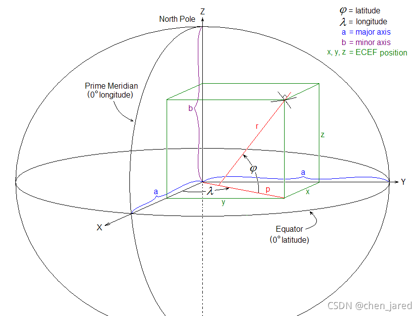

相关链接

1. [WGS 84 - EPSG:4978](https://epsg.io/4978)
2. [WGS 84: EPSG Projection -- Spatial Reference](https://spatialreference.org/ref/epsg/wgs-84-2/)

EPSG 4978

- 原点位于地球质心
- z轴沿着地轴指向北极
- y轴沿着赤道平面与格林威治子午面的交线上
- y轴在赤道平面与x轴z轴满足右手法则
- 该坐标系一般和WGS84坐标系相互转换，属于同一基准下不同表达。

## 示例
### 4326与4978

- 4326：`-74.6604194, 40.3450248, 50.0`
- 4978：`1287785.7839034656, -4694607.645412987, 4107291.4290166595`