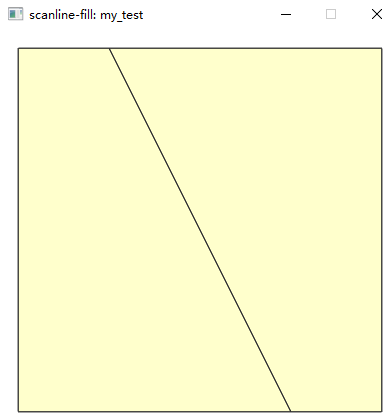
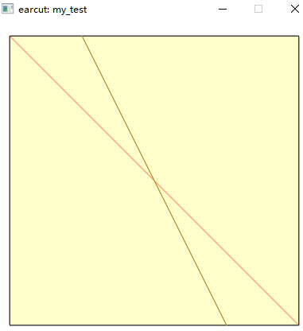
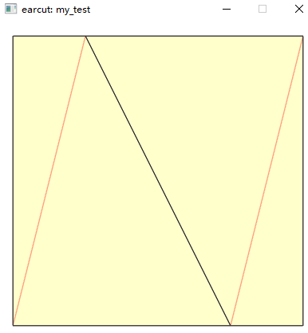

测试数据

1. 一个正方形
2. 一个能够切断正方形的线段，作为约束三角化的线段



### 将约束线段作为内环传入（失败）
```cpp
{
	using collector = mapbox::fixtures::Collector<mapbox::fixtures::FixtureTester *>;
	collector::collection().clear(); //清空原来的示例
	
	{
		static mapbox::fixtures::Fixture<short> mytest("my_test", 7, 1e-14, 0.000001, 
			{ //Polygon
				{ { 2, 2 }, { -2, 2 },{ -2, -2 },{ 2, -2 }, {2,2,} }, //外环
				{ { 1, 2 }, { -1, -2 } } //约束线段作为内环传入
			});
		collector::add(&mytest);
	}
}
```

根据三角化结果，可以看出，没有基于约束线段来进行三角化



### 将约束线段与外环构成收尾相连的环（成功）
约束线段与外环构成一个收尾相连的环，然后传入

```cpp
static mapbox::fixtures::Fixture<short> mytest("my_test", 7, 1e-14, 0.000001, 
{ 
	{ { 1, 2 }, { -1, -2 }, { -2, -2 }, { -2, 2 }, { 2, 2 }, { 2, -2 }, {-1,-2} }
});
```



### 总结

1. earcut不支持带约束线段的三角剖分
2. 如果实在要使用earcut做这件事，可以将约束线段与外环构成一个首位相连的环，进行三角化
3. 其实，从耳切法的原理上看，是不支持约束线段的