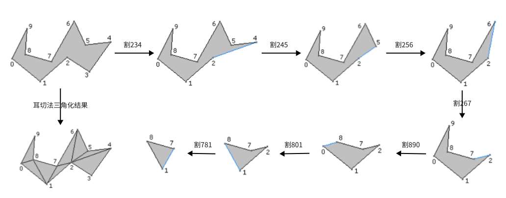

耳切法支持复杂多边形（带岛且嵌套）的三角化。

## 原理简介
### 多边形的耳朵
取多边形连续的三个顶点A、B、C，如果满足以下条件

1. B是凸顶点（内角小于180°）
2. 线段AC在多边形内
3. 没有其他顶点落在三角形ABC里面

则称

1. A、B、C是该多边形的一个耳朵
2. B叫做耳尖

### 耳切法
耳切法的思路就是：不断迭代找到耳朵，然而移除耳朵，直到只剩下一个耳朵（三角形）

示例：简单Polygon

## 相关资料

1. [Triangulation by Ear Clipping (geometrictools.com)](https://www.geometrictools.com/Documentation/TriangulationByEarClipping.pdf)；[中文翻译](https://www.cnblogs.com/xignzou/p/3721494.html)

