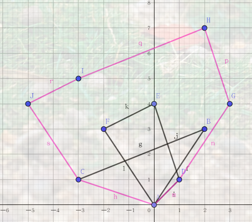
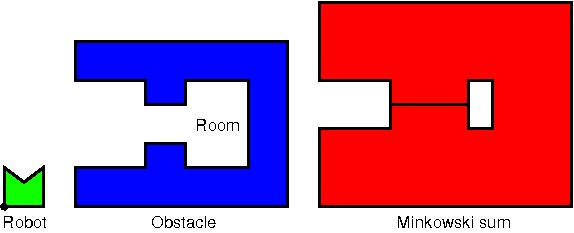

意义：计算一个多面体，沿着多边形线扫过的区域

## 计算示例
示例

```
A = {
	(1,0),
	(0,1),
	(0,-1)
}

B= {
	(0, 0), 
	(1, 1), 
	(1, −1)
}

A + B = {
	(1, 0), 
	(2, 1), 
	(2, −1),
	(0, 1), 
	(1, 2), 
	(1, 0), 
	(0, −1), 
	(1, 0), 
	(1, −2)
}
```

示例

```
A = {
	(0, 0),
	(2, 3),
	(-3, 1)
};

B = {
	(0, 0),
	(1, 1),
	(0, 4),
	(-2, 3)	
}

//1. A集合沿B的边际连续运动一周扫过的区域
//2. B集合本身
//1和2的并集
A + B = {
	(0, 0),
	(1, 1),
	(3, 4),
	(2, 7),
	(-3, 5),
	(-5, 4),
	(-3, 1)
}
```





## 应用

- 计算平移机器人的位移空间
- 计算一些图形操作，例如滑翔操作

### 机器人移动
机器人可以进入房间吗？

- 闵可夫斯基和描述了机器人相对于房间的非法位置（红色区域）
- 由闵可夫斯基和可以计算出机器人能够运动到的区域，根据区域的连通性，可判断机器人是否能够进入某个区域

图：来源CGAL [Figure 33.2](https://doc.cgal.org/latest/Minkowski_sum_3/index.html#fig__figmotionPlanning)


## 参考文章

1. [闵可夫斯基和（Mincowsky sum）](https://www.cnblogs.com/icmzn/p/10754758.html)
2. [CGAL 5.5.1 - 3D Minkowski Sum of Polyhedra](https://doc.cgal.org/latest/Minkowski_sum_3/index.html#Chapter_3D_Minkowski_Sum_of_Polyhedra)

