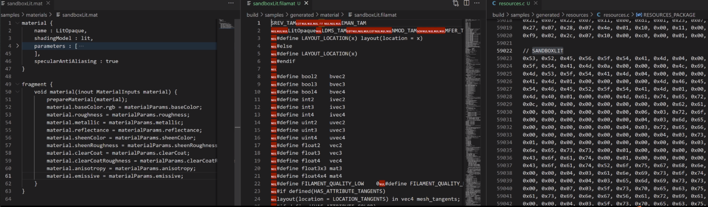

相关文档

- PBR实现文档：[Physically Based Rendering in Filament](https://google.github.io/filament/Filament.html)

## 示例工程
demo工程material_sandbox，演示材质sandboxlit.mat

调试运行：右键子工程`material_sandbox` > 调试 > 命令参数 > 输入模型，如`D:\model\1.obj`


## 材质编译
每个材质所对应的shader是不同的，因为它们的参数都不一样，我们很难用一个统一的shader去描述所有材质。因此，材质编译的目的，就是为了生成此材质的shader。

材质编译的流程

1. Filament的材质文件以`mat`为后缀名
2. 它会经过`matc`工具编译成`filamat`文件，此文件也包含了完整的着色器
3. filament会将N个`filamat`文件统一存储到`RESOURCES_PACKAGE`数组里



filament是如何编译shader的？

- 引擎内部提供一些内置的shader文件（在shaders子工程中），这些文件（`.fs`、`vs`）并不是完整的shader程序，而是一些程序片段（如函数等）
- `ShaderGenerator`类会根据shadingModel、材质的参数等，拼接出完整的shader（参见：`ShaderGenerator::createVertexProgram`、`ShaderGenerator::createFragmentProgram`）

## 材质系统设计原则
起源于Disney "principled" BRDF，之后的PBR材质系统基本都参照于它

## 源码笔记

```
N：法线
L：光线方向（指向光源）
V：观察方向（指向相机）
H：归一化半程向量
o：表示点乘并且截断0~1之间
```

## 参考链接

1. [PBR学习笔记（三）PBR shader实现基础](https://www.bilibili.com/video/BV1TB4y197W7)