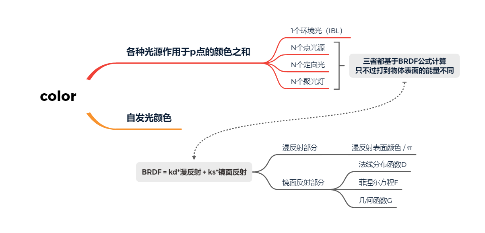
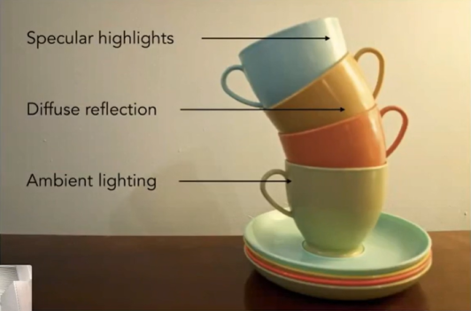
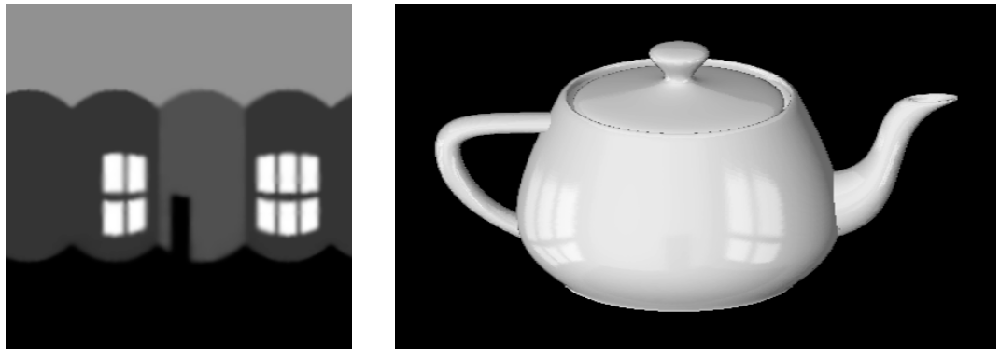
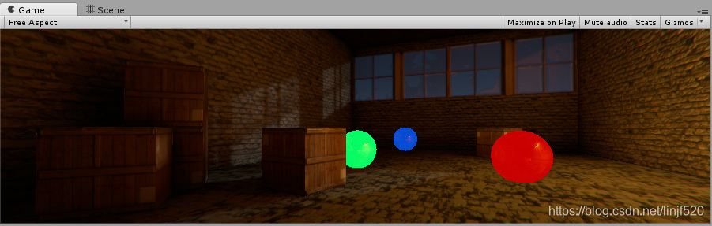

> 笔者最近在捣鼓PBR，但网上的资料都偏理论，非常严谨，公式也很多、很长。  
> 因此，笔者想沉淀出一个《HelloPBR》系列，此系列会忽略大量细节，增加科普性。  
> 系列内容：自顶向下简单介绍一下PBR的原理，并基于OpenGL实现一个Hello版本。非技术人员可忽略代码。

## 引言

在图形学渲染中，有一个问题很棘手：光线打在三维模型上之后，在屏幕上要显示什么颜色？如何计算出这个颜色呢？

- 简单来说，PBR就是一种计算公式，它所计算出来的颜色，和真实世界非常像
- 这正是因为PBR公式是基于物理原理所总结出的，因此得名“基于物理的渲染”，英文名“Physically-Based Rendering”
- 在图形学中，“计算某点的颜色”的这个动作，叫“着色”

本文章将自顶向下的介绍PBR公式，在过程中简要介绍涉及的相关内容。


## 如何计算物体表面上某个点的颜色
针对物体表面上的一个点(记为$p$)，场景中各种光线打过来，这一点会显示什么颜色(记为$color$)呢？

color由三个部分所贡献   
$$
color = colorIBL + colorEmissive + colorInLights
$$

1. $colorIBL$表示环境光所贡献的颜色
2. $colorEmissive$物体自己发出的光，由自发光所贡献的颜色
3. $colorInLights$在场景中各个光线作用下，$p$点显示出来的颜色

### 环境光颜色
如下图，光源在右上角，而茶杯的背光位置（Ambient lighting箭头所指位置）居然还有颜色

- 根据物理原理，我们知道，若一个点接受不到光，那应该是黑色的
- 背光部分不是黑色，那正是因为我们能接收到光，但它不是直接光源，是一种间接光照



环境光：光源发出的光，在环境中弹来弹去，最终到达了这个背光点  
环境光颜色：在环境光作用下，物体表面产生的颜色  
环境光贴图

- 因为环境光弹来弹去的，计算量很大，也很难模拟。一般，我们用一个环境贴图来模拟环境光
- 环境光贴图可以让模型反射出周围环境的样子，如下图右侧，而左侧的图像就是环境光贴图




### 自发光的颜色
在现实世界中，有一些物体是会自己发光的，比如萤火虫、光源。在计算机图形学中，自发光常用一个RGB来表示。

红、绿、蓝三个球都使用了自发光材质。即使在黑暗的场景下，我们依然可以看到它们的颜色。



### 各个光线所作用的颜色
场景中可能会有N个光源，`colorInLights`是这些光源共同作用之后的颜色。  
$colorInLights = colorInLight_1 + colorInLigh_2 + ... + colorLight_n$

#### 光源的三种类型

| 类型 | 说明 |
| - | - |
| 点光源 |  光源的能量会随着距离的增大而衰减 |
| 定向灯 | 光线拥有恒定的能量，并且不会随着距离的增大而衰减 |
| 聚光灯 | 光源的能量集中打在一个地方 |

#### 计算一束光线在点p处所贡献的颜色（BRDF）

计算某个光源对物体表面某个点所贡献的颜色，都是用 **BRDF公式** 计算得出的。只不过，不同类型的光源到达物体表面的能量不同而已。

- 因为，尽管光源的强度相同，不同光源类型，达到同一个物体表面的能量也会有所不同

#### 光的强度
买灯泡时，我们都会用“瓦”来定量描述灯的亮度，比如35W的白炽灯。那么，在计算机中，我们如何定量描述光源的亮度（强度）呢？

- 在计算机中，一般不用“瓦”来衡量，我们考虑的重点是如何方便计算。

根据辐射度量学，我们可以使用三原色（RGB）来定量描述光源的强度（在辐射度量学中，称为“辐射通量”）。

- R分量描述红光的强度
- G分量描述绿光的强度
- B分量描述蓝光的强度

这也刚好契合计算机对颜色的描述，很方便在公式中计算。  
例如，计算点光源在$p$的能量

```glsl
//灯光颜色（实际上不是颜色，而是光的强度，用RGB三色编码来定量表示）
vec3  lightColor  = vec3(23.47, 21.31, 20.79);

//点p与光源的距离
float distance = length(lightPositions - WorldPos);
//光源衰减因子（距离越远，衰减越严重）
float attenuation = 1.0 / (distance * distance);
//辐射率，光源打在点p（片元）上的总能量
vec3 radiance = lightColor * attenuation;   
```

#### 伪代码

```cpp
vec4 evaluateLights(const PbrMaterial material) 
{
	//描述点p（物体表面的一个点）的一些信息量
	PixelParams pixel = getPixelParams(material); 

	vec3 colorInLights = vec3(0.0);

	//环境光（环境光实际上是在这里计算的，因为要参加后面的blend）
	colorInLights += evaluateIBL(material); 
	
	//遍历所有光源（除了环境光）
	for(Light light : material.Lights)
	{
		//计算光线在点p处贡献的颜色
		colorInLights += evaluateBRDF(pixel, light, material);
	}

#if defined(BLEND_MODE_FADE) && !defined(SHADING_MODEL_UNLIT)
	colorInLights *= material.baseColor.a;
#endif

	float alpha = computeDiffuseAlpha(material.baseColor.a);
	return vec4(colorInLights, alpha);
}
```

## PBR材质
PBR公式里有一堆的输入参数，例如基础色、金属度、粗糙度等等。有了这些输入参数，渲染器才能根据PBR公式，得出逼真的颜色。  
这些参数其实存储在材质当中，因此包含了PBR输入参数的材质称为“PBR材质”。“PBR材质”一般是由艺术家根据材料的感光情况，调制与建模所得。