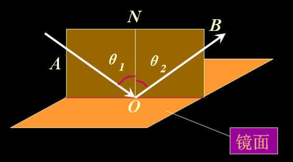
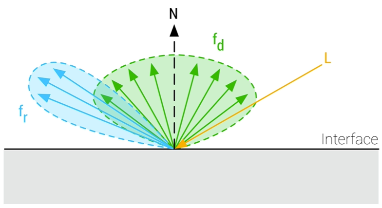

## PBR简介

在图形学渲染中，有一个问题很棘手：光线打在三维模型上之后，在屏幕上要显示什么颜色？如何计算出这个颜色呢？

- 简单来说，PBR就是一种计算公式，它所计算出来的颜色，和真实世界非常像
- 这正是因为PBR公式是基于物理原理所总结出的，因此得名“基于物理的渲染”，英文名“Physically-Based Rendering”
- 在图形学中，“计算某点的颜色”的这个动作，叫“着色”

本文章将自顶向下的介绍PBR公式，在过程中简要介绍涉及的相关内容。


## 如何计算物体表面上某个点的颜色
针对物体表面上的一个点(记为$p$)，场景中各种光线打过来，这一点会显示什么颜色(记为$color$)呢？

color由三个部分所贡献   
$$
color = colorIBL + colorEmissive + colorInLights
$$

1. $colorIBL$表示环境光所贡献的颜色
2. $colorEmissive$物体自己发出的光，由自发光所贡献的颜色
3. $colorInLights$在场景中各个光线作用下，$p$点显示出来的颜色

### 环境光颜色
如下图，光源在右上角，而茶杯的背光位置（Ambient lighting箭头所指位置）居然还有颜色

- 根据物理原理，我们知道，若一个点接受不到光，那应该是黑色的
- 背光部分不是黑色，那正是因为我们能接收到光，但它不是直接光源，是一种间接光照


环境光：光源发出的光，在环境中弹来弹去，最终到达了这个背光点  
环境光颜色：在环境光作用下，物体表面产生的颜色  
环境光贴图

- 因为环境光弹来弹去的，计算量很大，也很难模拟。一般，我们用一个环境贴图来模拟环境光
- 环境光贴图可以让模型反射出周围环境的样子，如下图右侧，而左侧的图像就是环境光贴图


### 自发光的颜色
在现实世界中，有一些物体是会自己发光的，比如萤火虫、光源。在计算机图形学中，自发光常用一个RGB来表示。

红、绿、蓝三个球都使用了自发光材质。即使在黑暗的场景下，我们依然可以看到它们的颜色。


### 各个光线所作用的颜色
场景中可能会有N个光源，`colorInLights`是这些光源共同作用之后的颜色。  
$colorInLights = colorInLight_1 + colorInLigh_2 + ... + colorLight_n$

#### 光源的三种类型

| 类型 | 说明 |
| - | - |
| 点光源 |  光源的能量会随着距离的增大而衰减 |
| 定向灯 | 光线拥有恒定的能量，并且不会随着距离的增大而衰减 |
| 聚光灯 | 光源的能量集中打在一个地方 |

#### 计算一束光线在点p处所贡献的颜色（BRDF）

计算某个光源对物体表面某个点所贡献的颜色，都是用 **BRDF公式** 计算得出的。只不过，不同类型的光源到达物体表面的能量不同而已。

- 因为，尽管光源的强度相同，不同光源类型，达到同一个物体表面的能量也会有所不同

#### 光的强度
买灯泡时，我们都会用“瓦”来定量描述灯的亮度，比如35W的白炽灯。那么，在计算机中，我们如何定量描述光源的亮度（强度）呢？

- 在计算机中，一般不用“瓦”来衡量，我们考虑的重点是如何方便计算。

根据辐射度量学，我们可以使用三原色（RGB）来定量描述光源的强度（在辐射度量学中，称为“辐射通量”）。

- R分量描述红光的强度
- G分量描述绿光的强度
- B分量描述蓝光的强度

这也刚好契合计算机对颜色的描述，很方便在公式中计算。  
例如，计算点光源在$p$的能量

```glsl
//灯光颜色（实际上不是颜色，而是光的强度，用RGB三色编码来定量表示）
vec3  lightColor  = vec3(23.47, 21.31, 20.79);

//点p与光源的距离
float distance = length(lightPositions - WorldPos);
//光源衰减因子（距离越远，衰减越严重）
float attenuation = 1.0 / (distance * distance);
//辐射率，光源打在点p（片元）上的总能量
vec3 radiance = lightColor * attenuation;   
```

#### 伪代码

```cpp
vec4 evaluateLights(const PbrMaterial material) 
{
	//描述点p（物体表面的一个点）的一些信息量
	PixelParams pixel = getPixelParams(material); 

	vec3 colorInLights = vec3(0.0);

	//环境光（环境光实际上是在这里计算的，因为要参加后面的blend）
	colorInLights += evaluateIBL(material); 
	
	//遍历所有光源（除了环境光）
	for(Light light : material.Lights)
	{
		//计算光线在点p处贡献的颜色
		colorInLights += evaluateBRDF(pixel, light, material);
	}

#if defined(BLEND_MODE_FADE) && !defined(SHADING_MODEL_UNLIT)
	colorInLights *= material.baseColor.a;
#endif

	float alpha = computeDiffuseAlpha(material.baseColor.a);
	return vec4(colorInLights, alpha);
}
```

## BRDF
BRDF帮助我们计算出：**一条光线** 打到物体表面一点上，应该成什么颜色。

- BRDF，Bidirectional Reflective Distribution Function，双向反射分布函数

### 镜面反射与漫反射
根据物理定律，我们知道当一束入射光（incident light）打在一个表面上时，将分成两部分：镜面反射（specular reflection）和漫反射（diffuse reflection）。


它们还有很多别名，归纳如下

- 镜面反射：specular reflection、高光反射
- 漫反射：diffuse reflection、折射+散射

#### 镜面反射
根据光的反射定律，当一束光碰撞到物体表面上时，它的一部分能量会沿着与平面法向量的对称方向反射出去，而不进入平面，这一部分即被称为“镜面反射”。



如下图Specular highlights箭头所指区域，即是“镜面反射”的效果

- 白色：由于入射光是白光，而“镜面反射”是光线撞到表面后，直接反射出去的，因此“镜面反射”也是白光。
- 亮亮的：镜面反射光的方向一般都集中在上图的$B$方向的周围，因此看起来亮亮的。这与漫反射不同，漫反射的光线是四面八方的，它的能量被均摊到四面八方了。


镜面反射与表面的粗糙度有关

1. 如果表面越粗糙，下图中$f_r$区域就越大。那意味着，在物体表面上高光区域很大，但强度较弱
2. 如果表面越光滑，下图中的$f_r$区域就越窄，直到反射光全集中在镜面方向（入射光轴对称的方向），这意味着，在物体表面上高光区域很小，但强度非常大，非常刺眼



#### 漫反射
根据物理定律，我们有以下认识（如下图中的橘色光线）

1. 当一束光碰撞到表面上时，它的一部分能量会折射进物体内部
2. 物体由无数微小的粒子所组成，光线进入物体内部之后，会与这些粒子再次发生碰撞，在粒子间“弹来弹去”（即在物体内部发生 **散射**）
3. 在碰撞过程中，粒子会吸收光线的一部分能量，然后转为热量
	1. 若在传播过程中，光线的某条分支能量耗尽，光线就出不去了，全被吸收转换为了热量
	2. 若在传播过程中，光线能量未能被全部吸收，就成功离开表面，构成所谓的“漫反射光“，它们将协同构成物体表面的颜色（只是漫反射部分的颜色）


漫反射：经过折射、散射之后，还能从物体内部射出表面的光线。它们的方向随机，但各个方向的能量可以假定为相同。

- 如下图，Diffuse reflection箭头所值即是漫反射作用下产生的颜色
- 漫反射其实是物体的主要颜色，从上面交代的物理原理可知，它是物体的主要颜色，也直接取决于物体的材质。比如某个红色衣服，它能把绿光、蓝光都给吸收了，只有红光能从它内部弹出来，因此呈现红色


#### 能量守恒
根据热力学第一定律（ **能量守恒** 定律），我们有以下推论

1. 记入射光的总能量为1（单位1）
2. 镜面反射系数$k_s$：假设镜面反射部分占总能量的$k_s$（如$k_s=0.8$，即代表80%的能量参与镜面反射作用）
3. 漫反射系数$k_d$：根据能量守恒定律，参与漫反射部分的能量即占总能量的$k_d = 1-k_s$（即$k_d=0.2$）

[Tips] 对于漫反射系数，还需要乘以一个逆金属度

- 根据上面的例子，其中只是20%的能量 **参与** 漫反射作用的，但实际上不一定20%的能量都能从物体里面出来
- 这要根据物体的材质，如果是金属材质，它反射出来的能量几乎为0，因为光线进入物体之后，会被金属完全吸收
- 金属度`metallic`：用于表达此物体材料的金属度。取值范围是[0, 1]，1完全是金属，0是介电质（非金属）

```glsl
vec3 kD = vec3(1.0) - kS;   //漫反射系数（能量守恒定律）
kD *= 1.0 - metallic;       //乘以逆金属度
	//若metallic=1.0，则kD=0，表示没有光线能出来
	//若metallic=0.0，则表示参与漫反射作用的所有能量都能从物体内部弹出来
```

### 总结
根据上面的原理可知，一束光打到物体表面呈现出来的颜色，由两部分构成：漫反射（diffuse）、镜面反射（specular）。
$$
f_r = k_d * f_{diffuse} + k_s * f_{specular}
$$

伪代码如下：
```glsl
vec3 evaluateBRDF(const PixelParams pixel, const Light light, const PbrMaterial material)
{
	//计算一些参数，如NoV, NoL, NoH, LoH等，后续要用
	//..

	vec3 specular = evaluateSpecular(...); //镜面反射的颜色
	vec3 diffuse = evaluateDiffuse(...);   //漫反射的颜色

	//两个系数
	vec3 kS = material.Fresnel; //镜面反射系数 = 菲涅尔项（可以有别的算法）
	vec3 kD = vec3(1.0) - kS;   //漫反射系数（能量守恒定律）
	kD *= 1.0 - metallic;       //乘以逆金属度

	return kD * diffuse + kS * specular;
}
```

关于这两项的求解，有很多种公式，因此衍生出了很多种BRDF，每一种都能近似得出“物体表面对于光的反应”，都很逼真。但是当前很多实时渲染管线使用的都是Cook-Torrance BRDF模型，这不在展开。

## PBR材质
PBR公式里有一堆的输入参数，例如基础色、金属度、粗糙度等等。有了这些输入参数，渲染器才能根据PBR公式，得出逼真的颜色。这些参数其实存储在材质当中，因此包含了PBR输入参数的材质称为“PBR材质”。“PBR材质”一般是由艺术家根据材料的感光情况，调制与建模所得。

## 总结
在上文当中，频繁看到物理学的身影，它正是为了让渲染结果和现实世界同频所引入的。
