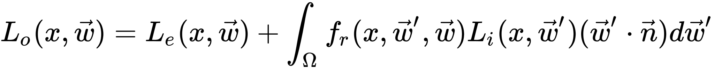

---
tags:
  - 渲染方程
  - 反射率方程
---

【背景知识】在此之前，需要了解[辐射度量学]的相关概念。


## 渲染方程

[渲染方程](./../../../概念/渲染方程)是某些聪明绝顶的人所构想出来的一个精妙的方程式，是如今我们所拥有的用来模拟光的视觉效果最好的模型：




## 反射率方程

而反射率方程是一种特化的渲染方程

1. 反射率公式计算了，点$p$在$\omega_0$方向上，被反射出来的辐射率$L_o(p, \omega_0)$的总和
2. 换而言之，$L_0$表示了从$\omega_0$方向上观察，光线投射到点$p$上反射出来的辐照度

$$
L_o(p,\omega_o) = \int\limits_{\Omega} f_r(p,\omega_i,\omega_o) L_i(p,\omega_i) n \cdot \omega_i d\omega_i
$$

### 入射方向向量

【$\omega_i$】立方角，可以视作是入射方向向量$\omega_i$

### 出射方向向量

【$\omega_o$】表示观察方向，也急速光线的出射方向

### 辐射率

【$L$】即辐射率，具体而言，是代表通过某个无限小的立方体$\omega_i$、在某个点$p$上的辐射率

### 能量

【$n \cdot \omega_i$】

1. 记 光线与平面间的入射角为$\theta$
2. 我们利用$\cos \theta$来计算能量，而$\cos \theta = 平面法向量 * 光线方向$，即$\cos \theta = n \cdot \omega_i$

### 半球领域内的辐照度

【$\int$ 与 $d\omega_i$】

当目前为止，我们计算的只是一个方向（$\omega_i$）上的入射光。但这远远不够，我们应该计算以点$p$为球心，[半球领域](./../半球领域)$\Omega$内所有方向上的入射光。而$\int$ 与 $d\omega_i$即是为了求半球领域内的辐照度。


如何计算？

- 如何计算某些面积的值，或者说，如何计算像半球领域中某一个体积的值？我们将用到“积分(Integral)”，也就是公式中的$\int$
- $\int ... d\omega_i$ 包含了半球领域$\Omega$内所有入射方向上的$d\omega_i$

积分如何计算？

- 积分运算的值 等于 一个函数曲线的面积，它的计算结果要么是解析解，要么是数值解
- 由于渲染方程的反射率方程都没有解析解，我们将会用离散的方法来 **求这个积分的数值解**

因此，这个问题就转换为

1. 在半球领域$\Omega$中，按一定步长将反射率方程分别求解
2. 然后再按照步长大小，将所得到的的结果平均化
3. 这种方法被称之为“黎曼和(Riemann sum)”

如下，给出一个粗糙的代码帮助理解

- `dW`即黎曼和中的离散步长，而用此方法得到的函数总面积也是一个近似值。我们可以通过增加离散部分的数量来提高黎曼和的准确度
- 通过利用`dW`的值，来对所有离散部分进行缩放，其和最后就等于积分函数的总面积或者总体积
- 这个用来对每个离散步长进行缩放的`dW`，就可以认为是反射率方程中的$d\omega_i$
- 在数学上，用来计算积分的$d \omega_i$表示的是一个连续的符号，而我们使用的`dW`在代码中和它并没有直接的联系

```cpp
int steps = 100;
float sum = 0.0f; 
vec3 P = ...; 
vec3 Wo = ...; 
vec3 N = ...; 
float dW = 1.0f / steps; 

for(int i = 0; i < steps; ++i) 
{ 
	vec3 Wi = getNextIncomingLightDir(i); 
	sum += Fr(p, Wi, Wo) * L(p, Wi) * dot(N, Wi) * dW; 
}
```

### BRDF

【$f_r$】至此，剩下的就是$f_r$了。它被称为BRDF，作用是基于表面材质属性来对入射辐射率进行缩放或加权。

具体参考[BRDF](./../BRDF)文档。


### 总结

反射率方程概括了

1. 半球领域$\Omega$内
2. 碰撞到了点$p$上的所有入射方向$\omega_i$上的光线的辐射率
3. 并受到了$f_r$的约束
4. 然后返回观察方向上反射光的$L_0$

入射光辐射率从哪里获得？

1. 入射光辐射率可由光源处获得（参考[光照](./../光照)）
2. 此外，还可以，利用一个环境贴图来测算所有入射方向上的辐射率（参考[漫反射辐照度](./../漫反射辐照度)）


## Cook-Torrance反射率方程

如果，BRDF使用Cook-Torrance模型，那么此反射率方程即可叫做“Cook-Torrance反射率方程”。

公式如下：

$$
L_o(p,\omega_o) = \int\limits_{\Omega} (k_d\frac{c}{\pi} + k_s\frac{DFG}{4(\omega_o \cdot n)(\omega_i \cdot n)})L_i(p,\omega_i) n \cdot \omega_i d\omega_i
$$

此方程描述了一个基于物理的渲染模型，它其实就是我们常用的PBR了。