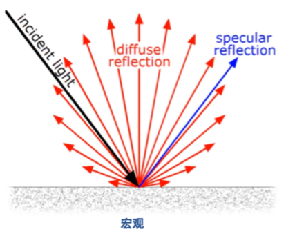
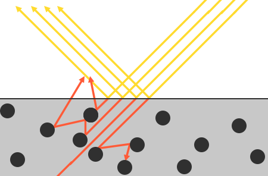
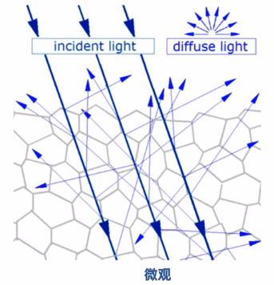

## 简介

微平面理论认为，在微观尺度上，任何平面都可以看成由N个微平面（Microfacets）所组成，而一个微平面是一个细小的镜面。

由于平面的粗糙程度不同，这些微平面的排列方向相当不一致

1. 如左图，这个平面越粗糙，那么在这个平面上的微平面排列就越混乱。在镜面反射（镜面光）下，入射光线会向四面八方散射（Scatter）开
2. 如右图，相对光滑的平面，入射光线几乎只朝一个方向反射，因此会造成更小、更锐利的反射（因为能量集中在一个方向）


## 平面的粗糙度

为什么要提出“粗糙度”的概念？提出“粗糙度”的原因是什么？

- 在微观尺度下，没有任何平面是完全光滑的
- 而微平面非常微小，比一个像素还小
- 因此为一个平面假设一个 **粗糙度（Roughness）参数**，然后用统计学的方法来估计微平面的粗糙程度

有了“粗糙度”怎么做

- 我们可以基于平面粗糙度计算出，在众多微平面中，与 **半程向量** 方向同向的比例（具体参阅：《法线分布函数》）
- 如果 微平面的朝向 与 平面半程向量 的方向越一致，镜面反射的效果越是强烈和锐利

平面粗糙度的效果

- 平面粗糙度参数 阈值是[0, 1]
- 粗糙度越高，镜面反射的轮廓要大一些，镜面反射的区域会增加，但是镜面反射的亮度却会下降
- 粗糙度越小，显示出的镜面反射轮廓则更小更锐利


## 能量守恒
**微平面近似法** 使用了这样一种形式的能量守恒（Energy Conservation）

- 出射光线的能量 永远不能超过 入射光线的能量（自发光的面除外）

如何体现出微平面模型使用了这种能量守恒？

- 入射光线能量一定，就意味着出射光线的能量一定
- 如上图，随着粗糙度上升，镜面反射的区域不断扩大（0.1是一个小点，1.0是整个圆），那么均摊到每个像素点的能量就越小了，因此反射的亮度也在下降
- 因此，光滑平面的镜面反射更强烈（能量都集中在一个点上反射出来），而粗糙平面的反射却更昏暗（能量被均摊到更多地方了）

## 折射与反射

为遵守能量守恒定律，我们需要对漫反射、镜面反射光做出区分

- 当一束光碰撞到表面时，它会分离成两个部分：折射、反射
- 反射（镜面反射）：直接反射开，而不进入平面，也就是我们所说的“镜面光照”
- 折射（漫反射、角度散射）：除了反射部分的能量，余下部分的能量会进入表面并被吸收，这就是我们所说的“漫反射光照”



如何计算折射与反射？

- 根据能量守恒定律，如果入射光线的能量为`1`，设反射了`kS`份能量，那么即折射出了`1-ks`份能量

```cpp
// 反射/镜面 部分，入射光线被反射的能量所占的百分比
float kS = calculateSpecularComponent(...); 
// 折射/漫反射 部分
float kD = 1.0 - ks;
```



### 漫反射（折射光）

漫反射的原理？漫反射颜色是怎么来的？

- 当光线接触到一个表面的时候，折射光是不会立即就被吸收的，而是进入物体内部
- 通过物理学可知，光线实际上可以被认为是一束没有耗尽就不停向前运行的能量，而光束是通过碰撞的方式来消耗能量
- 每一种材料都由无数微小的粒子所组成，这些粒子都能如下图所示，与光线发生碰撞，导致光线折来折去（折来折去就称之为散射）
- 这些粒子在每次的碰撞中，都可以吸收光线所携带的一部分或者全部的能量，而后转变为热量
- 一般来说，并非全部能量都会被吸收，而光线会继续沿着随机的方向发散，然后在和其他粒子进行碰撞，直至能量完全耗尽（或离开表面）
- 而光线脱离物体表面后将会协同构成该表面的（漫反射）颜色。如果表面把折射光都吸收完了，那么就展现出来黑色，因为没有任何能量反射出来



漫反射非常复杂，很难模拟，因此在PBR中，我们进行了简化

- 假设对平面上的每一点所有的折射光都会被完全吸收，而不会散开
- 而有一些折射光的能量会被 **次表面散射（Subsurface Scattering）** 考虑，它们显著地提升了一些诸如皮肤、大理石或者蜡质这样材质的视觉效果，不过伴随而来的代价是性能的下降

### 金属表面

金属表面，只会产生镜面反射（反射光），不会产生漫反射（即折射光为0）

- 金属表面对光的反应 与 非金属（也称为介电质，Dielectrics）表面对光的反应 是不同的
- 金属表面上，所有的折射光都会被直接吸收而不会散开，只会留下反射光或者镜面反射光
- 也就是说，金属表面只会显示镜面反射颜色，而不会显示出漫反射颜色

由于金属与电介质之间存在这样明显的区别，因此它们两者在PBR渲染管线中被区别处理，所以有了两种工作流。

【PS】金属为什么没有漫反射？

- 金属是由阳离子和自由电子组成的，进入金属内部的光子，会被自由电子完全吸收，导致光子在金属内部无法出来，因此没有漫反射

【PS】金属没有漫反射，为什么还有颜色呢？金子是偏黄的颜色，铜是偏黄偏红的颜色

- 不同物质对可见光波长的吸收与程度是不一样的
- 黄金会吸收掉青蓝光，保留黄光、一定的红光、微弱的紫光。因此，基于金属工作流中有一个基础色
- 猜想：这也许与光的波粒二象性有关，光子是被金属吸收的，但不同金属对电磁波的吸收与程度是不一样的。也许金属也有一丢丢的漫反射吧，也许这是它有颜色的原因


## 微平面模型相关函数

| 常用符号 | 函数名 | 物理量 | 说明 |
| - | - | -| -|
| $D$ | 法线分布函数<br/>Normal Distribution Function |估算微平面的主要函数 | 估算在受到表面粗糙度的影响下，朝向方向与半程向量方向一致的微平面的数量 |
| $F$ | 菲涅尔方程<br/>Fresnel Rquation | 在不同的表面角下表面所反射的光线所占的比率 | |
| $G$ |  几何函数<br/>Geometry Function | 微平面自成阴影的属性 | 当一个平面相对比较粗糙的时候，平面表面上的微平面有可能挡住其他的微平面从而减少表面所反射的光线 |

### 如何选择

这些函数能够分别估算出一个物理参数。  
而且，用来求这些物理参数的函数可能不止一个，有的函数非常真实，有的则非常高效。对于这方面，英佩游戏公司的Brian Karis对于这些函数的多种近似实现方式进行了大量的[研究](http://graphicrants.blogspot.nl/2013/08/specular-brdf-reference.html)。

我们推荐采用Epic Games在Unreal Engine 4中所使用的函数

1.  D使用Trowbridge-Reitz GGX（具体请参考《法线分布函数》）
2.  F使用Fresnel-Schlick近似（具体请参考《菲涅尔方程方程》）
3.  G使用Smith’s Schlick-GGX（具体请参考《几何函数》）


## 参考链接

1. [PBR理论](https://learnopengl-cn.github.io/07%20PBR/01%20Theory/)