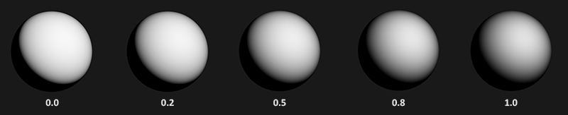

## 几何函数

几何函数从统计学上近似的求得了微平面间相互遮蔽的比率，这种相互遮蔽会损耗光线的能量。


与NDF类似，几何函数采用一个材料的粗糙度参数作为输入参数，粗糙度较高的表面其微平面间相互遮蔽的概率就越高。

## Schlick-GGX

本节介绍的几何函数，是GGX与Schlick-Beckmann近似的结合体，因此又被称为Schlick-GGX

1. $n$平面法向量
2. $v$观察方向

$$
G_{SchlickGGX}(n, v, k) = \frac{n \cdot v}{(n \cdot v)(1 - k) + k }
$$

【$k$】$k$是$a$（粗糙度）的重映射（Remapping）。有两种情况

1. 如果使用直接光照：$k_{direct} = \frac{(\alpha + 1)^2}{8}$
2. 如果使用IBL光照：$k_{IBL} = \frac{\alpha^2}{2}$

### 史密斯法

为了有效的估算几何部分，需要将观察方向（几何遮蔽，Geometry Obstruction）和光线方向向量（几何阴影，Geometry Shadowing）都考虑进去

我们可以使用史密斯法(Smith’s method)来把两者都纳入其中：

$$
G(n, v, l, k) = G_{sub}(n, v, k) G_{sub}(n, l, k)
$$

### 效果
使用史密斯法与Schlick-GGX作为$G_{sub}$可以得到如下所示不同粗糙度的视觉效果：



几何函数是一个值域为[0.0, 1.0]的乘数，其中白色或者说1.0表示没有微平面阴影，而黑色或者说0.0则表示微平面彻底被遮蔽。


### GLSL

```glsl
float GeometrySchlickGGX(float NdotV, float k)  
{  
    float nom   = NdotV;  
    float denom = NdotV * (1.0 - k) + k;  
  
    return nom / denom;  
}  
  
float GeometrySmith(vec3 N, vec3 V, vec3 L, float k)  
{  
    float NdotV = max(dot(N, V), 0.0);  
    float NdotL = max(dot(N, L), 0.0);  
    float ggx1 = GeometrySchlickGGX(NdotV, k);  
    float ggx2 = GeometrySchlickGGX(NdotL, k);  
  
    return ggx1 * ggx2;  
}
```