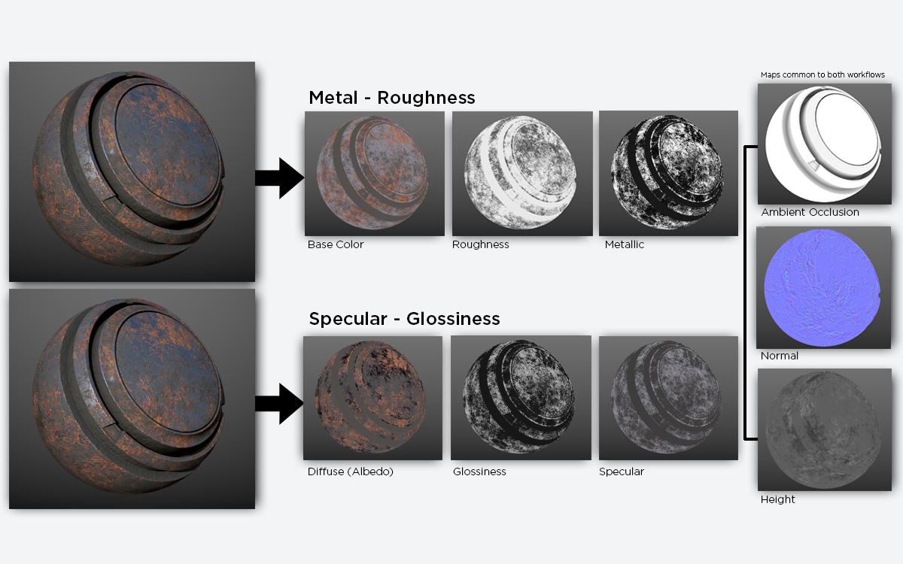

## 引言
> PBR更像是一种概念，而不是一套严格的规则。——Joe Wilson

## 简介
PBR就是Physically-Based Rendering的缩写，意为基于物理的渲染。

- 它是计算机图形学中的一种方法，旨在模拟现实世界中光和物体的真实交互，以达到一种逼真的、真实的渲染效果
- Blinn-Phong实际上是根据现实世界的现象总结出来的经验模型，这与现实世界的物理原理很不搭。而PBR与物理原理非常契合，它使得艺术家创建材质更加容易，渲染结果也更像现实世界

## 两种工作流
【PBR材质有两种工作流程】

| 名称 | 参数值（或贴图） | 共有贴图 |
| --- | --- | --- |
| 1.基于金属的工作流 2.Metallic/Roughness 3.金属/粗糙度 | 基色(BaseColor) 金属度(Metallic) 粗糙度(Roughness) | 法线(Normal) 环境光遮蔽(Ambient Occlusion) 高度(Height) |
| 1.基于镜面反射的工作流 2.非金属工作流 3.Specular/Glossiness 4.镜面反射/光泽度 | 漫反射(diffuse) 镜面反射(specular) 光泽度(glossiness) | 同上 |

【PS】不要被名字所迷惑。基于镜面反射工作流也可以做金属，只是它做出来的金属，有可能没有比金属工作流来的真实

【两种工作流的对比图】

| 参数 | 非金属工作流 | 金属工作流 |
| --- | --- | --- |
| Diffuse(Albedo) 漫反射(反照率) | 1. 当金属度=0,，Albedo即代表漫反射 2. 当金属度=1，Albedo即代表金属的反射率值 因此还需要加一个金属度值的蒙版 | 无（金属没有漫反射，因此把这项改成了Base Color） |
| Base Color 基础色 | 无 | 包含了两种信息： 1. 金属的反射率值 2. 非金属的颜色信息（在此案例中，非金属是铁锈） |
| Glossiness和Roughness (两者为一体两面) | Glossiness光泽度 白色代表光滑 黑色代表粗糙 | Roughness粗糙度 白色代表粗糙 黑色代表光滑 |
| Specular 镜面反射率 | 除了漫反射，还需表达镜面反射率 | 无（金属没有漫反射，全是镜面反射，因此不需要Specular，改成了Metallic） |
| Metallic 金属 | 无 | 白色代表金属 黑色代表黑金属 |

## 参考链接

1. [The PBR Guide - Part 2 (adobe.com)](https://substance3d.adobe.com/tutorials/courses/the-pbr-guide-part2-zh)
2. [PBR材质用法及讲解](https://www.bilibili.com/video/BV1jg411n7vA)
