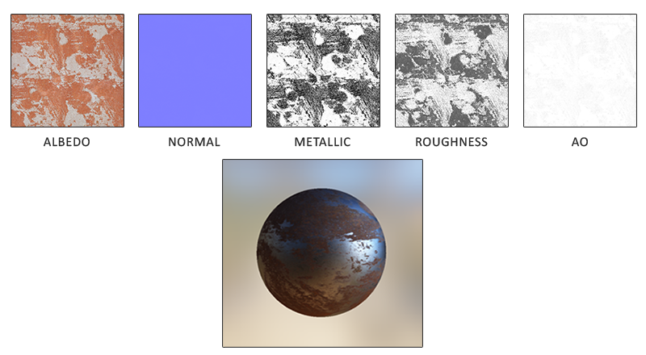

PBR渲染管线所需的每一个表面参数都可以用一个纹理来定义或者建模。

使用纹理可以让我们逐片段（fragment）的来控制每个表面上特定的点，对于光线是如何响应的（不论那个点是何种材质，是金属，是粗糙，还是平滑；也不论表面对于不同波长的光会有如何反应）

例如下图，是你可能在PBR渲染管线中经常会遇到的纹理列表

## 五个参数
一共有5个参数。

美术师们可以在纹素级别设置或调整这些基于物理的输入值，还可以以现实世界材料的表面物理性质来建立他们的材质数据。

这是PBR渲染管线最大的优势之一，因为不论环境或者光照的设置如何改变这些表面的性质是不会改变的，这使得美术师们可以更便捷地获取物理可信的结果。在PBR渲染管线中编写的表面可以非常方便的在不同的PBR渲染引擎间共享使用，不论处于何种环境中它们看上去都会是正确的，因此看上去也会更自然。

### 反照率
**反照率**：反照率(Albedo)纹理为每一个金属的纹素(Texel)（纹理像素）指定表面颜色或者基础反射率。这和我们之前使用过的漫反射纹理相当类似，不同的是所有光照信息都是由一个纹理中提取的。漫反射纹理的图像当中常常包含一些细小的阴影或者深色的裂纹，而反照率纹理中是不会有这些东西的。它应该只包含表面的颜色（或者折射吸收系数）。

### 法线

**法线**：法线贴图纹理和我们之前在[法线贴图](https://learnopengl-cn.github.io/05%20Advanced%20Lighting/04%20Normal%20Mapping/)教程中所使用的贴图是完全一样的。法线贴图使我们可以逐片段的指定独特的法线，来为表面制造出起伏不平的假象。

### 金属度

**金属度**：金属(Metallic)贴图逐个纹素的指定该纹素是不是金属质地的。根据PBR引擎设置的不同，美术师们既可以将金属度编写为灰度值又可以编写为1或0这样的二元值。

### 粗糙度

**粗糙度**：粗糙度(Roughness)贴图可以以纹素为单位指定某个表面有多粗糙。采样得来的粗糙度数值会影响一个表面的微平面统计学上的取向度。一个比较粗糙的表面会得到更宽阔更模糊的镜面反射（高光），而一个比较光滑的表面则会得到集中而清晰的镜面反射。某些PBR引擎预设采用的是对某些美术师来说更加直观的光滑度(Smoothness)贴图而非粗糙度贴图，不过这些数值在采样之时就马上用（1.0 – 光滑度）转换成了粗糙度。

### 环境光遮蔽

**AO**：环境光遮蔽(Ambient Occlusion)贴图或者说AO贴图为表面和周围潜在的几何图形指定了一个额外的阴影因子。比如如果我们有一个砖块表面，反照率纹理上的砖块裂缝部分应该没有任何阴影信息。然而AO贴图则会把那些光线较难逃逸出来的暗色边缘指定出来。在光照的结尾阶段引入环境遮蔽可以明显的提升你场景的视觉效果。网格/表面的环境遮蔽贴图要么通过手动生成，要么由3D建模软件自动生成。

