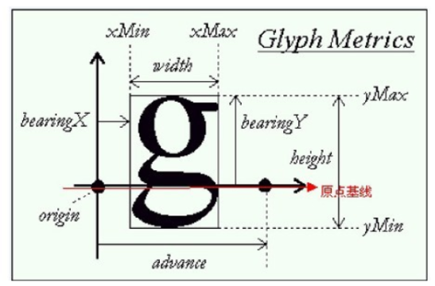

FreeType

1. 是一个免费、开源、可移植且高质量的字体引擎；
2. 支持多种字体格式文件，并提供了统一的访问接口。包括点阵字、TrueType、OpenType、Type1等
3. 不但可以处理点阵字体（位图），也可以处理多种矢量字体
4. 支持单色位图、反走样位图渲染，这使字体显示质量达到Mac的水平；
5. 采用面向对象思想设计，用户可以灵活的根据需要裁剪。

## 基本概念
### 字形
「字形」一个字形就是一种书写风格

### 字符图
「字符图」字体文件包含一个或多个表，叫做字符图。用来将某种字符码转换成字形索引。一种字符编码方式(如ASCII、Unicode、Big5)对应一张表。

### 字形轮廓
「字形轮廓」
点：字形文本的大小通常用点(point)表示。点是一种简单的物理单位，数字印刷中，一点等于1/72英寸

1. 设备的分辨率通常使用dpi(每英寸点数)表示的两个数
2. 点数大小和像素数的转换公式：像素大数  = 点数*分辨率/72

轮廓线：字形轮廓的源格式是一组封闭的路径

1. 每个轮廓线划定字形的外部或内部区域，它们可以是线段或者Bezier曲线

EM正方形：字体在创建字形轮廓时，字体创建者所使用的假象的正方形，他可以将此想象成一个画字符的平面

1. 它是用来将轮廓线缩放到指定文本尺寸的参考；
2. 它的尺寸越大，可以达到更大的字形分辨率
3. 字形可以自由的超出EM正方形

### 位图
位图：指从字形轮廓转换成一个位图的过程

## FreeType的度量值
FreeType在加载字形的时候还生产了几个度量值来描述生成的字形位图的大小和位置。

【基线】每一个字形都放在一个水平的基线（Baseline）上，上图中被描黑的水平箭头表示该字形的基线

1. 这条基线类似于拼音四格线中的第二根水平线
2. 一些字形被放在基线以上(如’x’或’a’)，而另一些则会超过基线以下(如’g’或’p’)

【度量值】FreeType的这些度量值中包含了字形在相对于基线上的偏移量用来描述字形相对于此基线的位置，字形的大小，以及与下一个字符之间的距离。

| 属性 | 获取方式 | 生成位图描述 |
| --- | --- | --- |
| width  | face->glyph->bitmap.width | 宽度，单位:像素 |
| height | face->glyph->bitmap.rows | 高度，单位:像素 |
| bearingX | face->glyph->bitmap_left | 水平位置(相对于起点origin)，单位:像素 |
| bearingY | face->glyph->bitmap_top | 垂直位置(相对于基线Baseline)，单位:像素 |
| advance  | face->glyph->advance.x | 起点到下一个字形的起点间的距离(单位:1/64像素) |
| 其他 | face->glyph->bitmap.pitch | 绝对值表示一行所占字节数 |
|  | face->glyph->bitmap.pixel_mode | 像素模式，1指单色的，8表示反走样灰度值 |
|  | face->glyph->bitmap.buffer | glyph的点阵位图内存绶冲区 |

### 附：TrueType字体库
TrueType字体不采用像素或其他不可缩放的方式来定义，而是一些通过数学公式(曲线的组合)。
这些字形，类似于矢量图像，可以根据你需要的字体大小来生成像素图像。
通过使用TrueType字体可以轻易呈现不同大小的字符符号并且没有任何质量损失。
