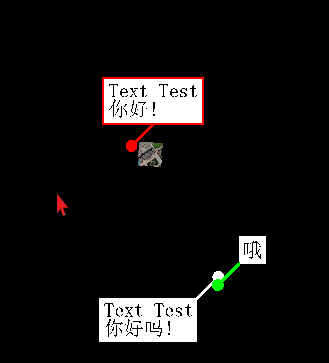
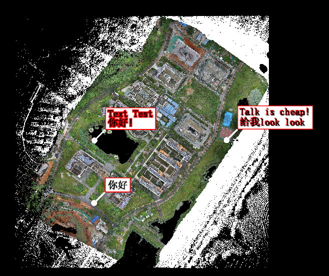

在Office软件当中，对于文字的设置参数非常丰富，有基础的字体、字体大小、字体颜色、加粗、下划线等，还有字间距、行间距、对齐等等内容。但是这些内容OpenGL、Vulkan等图形API都没有提供，因为它们只是提供一些基础的绘图API，例如提供`GL_LINES`，帮助你画线。

**文字渲染** 其实是文字库帮我们做的，例如常用的FreeType第三方库。我们可以将上述参数传给FreeType，就能获得文字的outlines，再基于`GL_LINES`等基础绘图API，将文字在屏幕上一笔一划的画出来。

## 解决方案
根据图形API画画的习惯，文字渲染也可以分为三大类。最常用的是第三种，将字符纹理绘制到一个矩形框上。

| **解决方案** | **说明与难点** | **缺点** |
| --- | --- | --- |
| **绘制文字的轮廓线** | 获取文字的轮廓线，并通过绘制线的API来绘制（如OpenGL的`GL_LINES`） | 1. 会走样，带来锯齿状，**效果差** 2. **不能实现填充的字体** 3. 轮廓线可能会 **部分缺失**|
| **绘制文字的三角网** | 将文字的轮廓线三角化，从而绘制文字轮廓线的三角网 | 1. 会走样，带来锯齿状，**效果差** 2. 因涉及三角化等操作， **生成文字的速度慢** 。因此遇到大量刷新文字的功能，渲染会卡顿|
| **基于纹理绘制** | 将文字生成图片，并将其当成纹理画到一个矩形框内 | 1. 一般文字库（如FreeType）提供自动生成图片的API，它们已经帮我们做了反走样，因此渲染 **效果好** 2. **生成文字的速度快**，时间复杂度就是遍历一张图片|

### 绘制轮廓线
todo:

### 绘制三角网

### 基于纹理绘制

| **解决方案** | **说明** | **优点** | **缺点** |
| --- | --- | --- | --- |
| 一个字 对应 一个纹理 | 将要绘制的文字按照每一个字生成一个小纹理的方式，然后再用将纹理贴到网格的表面，绘制出来。例如：“博客园-你好”，则会生成6个小纹理，然后生成网格，将纹理贴到网格的表面。 | 每一个字的大小颜色都可选择 | 文字多了以后，频繁的切换，纹理造成效率低下。 OSG中使用了这种方式，效率极差，尤其是在文字更新的情况下。 |
| 多个字 一个纹理 | 直接将随绘制的文本字符串生成一个纹理数据 | 效率上比第一种要好很多 | 更新的时候要重新构建一个新的纹理，速度上有很大损失 |
| 所有文字一个纹理 | 将所绘制的文字都放到一个较大的纹理上去； 然后在纹理上做索引； 当绘制的时候，去查表，再将纹理贴到网格上绘制出来 | 速度很快，很多游戏引擎都在使用这种方式 | 存在的问题绘制的文字多了以后速度会变慢，占用大量的cpu时间，当然对于小的应用已经足够了 |

## 相关资料

1. [LearnOpenGL-文字渲染](https://learnopengl-cn.readthedocs.io/zh/latest/06%20In%20Practice/02%20Text%20Rendering/)
2. [freetype使用详解(中文).pdf](https://www.yuque.com/attachments/yuque/0/2022/pdf/1465826/1645931662726-f8deeeb3-1286-46d4-8ed9-ae335196d963.pdf?_lake_card=%7B%22src%22%3A%22https%3A%2F%2Fwww.yuque.com%2Fattachments%2Fyuque%2F0%2F2022%2Fpdf%2F1465826%2F1645931662726-f8deeeb3-1286-46d4-8ed9-ae335196d963.pdf%22%2C%22name%22%3A%22freetype%E4%BD%BF%E7%94%A8%E8%AF%A6%E8%A7%A3(%E4%B8%AD%E6%96%87).pdf%22%2C%22size%22%3A365020%2C%22type%22%3A%22application%2Fpdf%22%2C%22ext%22%3A%22pdf%22%2C%22source%22%3A%22%22%2C%22status%22%3A%22done%22%2C%22mode%22%3A%22title%22%2C%22download%22%3Atrue%2C%22taskId%22%3A%22u55b8576e-eabe-409d-90c4-b359816d4dc%22%2C%22taskType%22%3A%22transfer%22%2C%22id%22%3A%22id501%22%2C%22card%22%3A%22file%22%7D)
3. [NeHe OpenGL第四十三课：FreeType库](https://blog.51cto.com/yarin/381911)
