EDL，全称Eye-Dome Lighting，有文章译为“鹰眼穹顶布光”。EDL是一种后处理技术，它基于深度图中的深度信息，对帧图像中某些边缘做一个增强（类似于弄一个黑边），常用于点云数据当中。

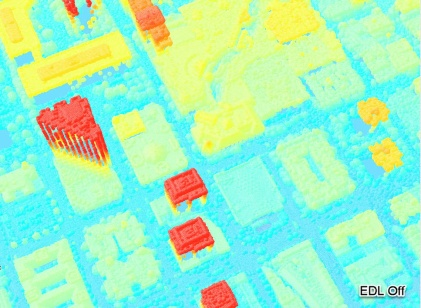
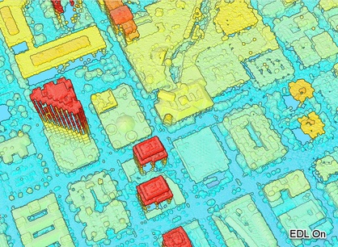


简而言之，EDL对帧图像每个像素做了一个加权处理

1. 权重取决于像素周边的深度值，如果与周边深度相差越大，则权重越小。
2. result = 权重 * 像素值。因此，权重越小，像素值就越小。像素值越小，就越黑。
3. 因此，深度变化大的地方就会产生“描边”。

## EDL算法流程
EDL算法共有三个工序

1. 算法输入即是帧图像、深度图，以及帧图像的长宽
2. 第一个工序是shade，是EDL的关键步骤。它会根据邻近像素的深度解算权重，并进行加权处理。需要注意的是，此步骤会做三次shade，每次的分辨率不同。
3. 第二个工序是bilateral，分别对三个shade结果做一次平滑
4. 第三个工序是mix，将三种分辨率的结果进行混合，获得EDL的最终结果

注：bilateral工序也可省略，直接将shade的结果进行mix也行。

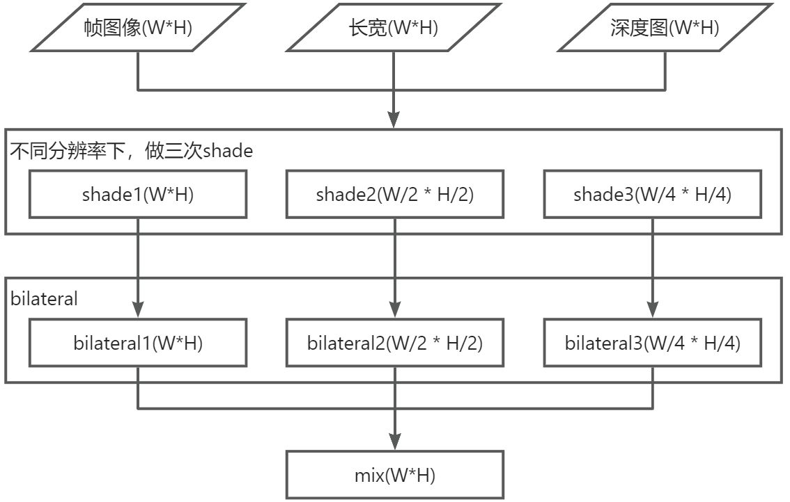

事实上，EDL即是把每一帧的渲染结果（帧图像与深度图）做 **图像处理** ，对“深度差异大的地方”进行描边。

1. 因此EDL可以在CPU上做，暴力遍历每个像素进行处理，然后再将结果绘制到屏幕上，但很耗时
2. 大家一般都在GPU上做。直接绘制一个与渲染结果长宽相同的长方形（两个三角形），然后将帧图像当成纹理，贴在长方形上；然后将EDL算法写在着色器上；渲染出一帧，即是EDL特效的结果。

接下来将介绍基于着色器实现EDL的方案。以下着色器都摘自CloudCompare软件。

### Mesh
构建与渲染结果长宽相同的长方形，并通过UV坐标将输入图像映射上去。
```cpp
//物体的宽高与渲染结果的相同
auto result_resolution = resultResolution();
int _width = result_resolution.width();
int _height = result_resolution.height();

Vec3f vertices[4] =
{
    Vec3f(0, 0, 0),
    Vec3f(_width, 0, 0),
    Vec3f(_width, _height, 0),
    Vec3f(0, _height, 0)
};
Vec2f texcoords[4] =
{
    Vec2f(0.0f, 0.0f),
    Vec2f(1.0f, 0.0f),
    Vec2f(1.0f, 1.0f),
    Vec2f(0.0f, 1.0f)
};
int indices[] = 
{
	0, 1, 2,
	0, 2, 3
};
```

### MVP矩阵
构建一个正交投影，正对着Mesh即可。

1. ModelView为单位矩阵即可
2. 投影矩阵为正交投影，参数如下。需要注意的是，这里的长宽是屏幕的长宽（即一开始输入的“帧图像”的长宽）

需要注意的是，OpenGL与Vulkan的NDC坐标系不同，Y轴相反。

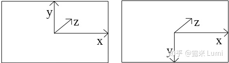

因此在设置投影矩阵时要注意top与bottom的设置，参考代码如下：
```cpp
//屏幕的长宽
auto width = static_cast<double>(sceneResolution().width());
auto height = static_cast<double>(sceneResolution().height());

if (isVulkanRenderer()) //vulkan
{
    ortho = {
        0.0,	//left
        width,	//right
        height,	//bottom
        0.0,	//top
        -1.0,	//near
        1.0		//far
    };
}
else //opengl
{
    ortho = {
        0.0,	//left
        width,	//right
        0.0,	//bottom
        height,	//top
        -1.0,	//near
        1.0		//far
    };
}
```

### 顶点着色器
三个工序的顶点着色器相同，而且都很简单（`edl_shade.vert`、`bilateral.vert`、`edl_mix.vert`），并没有做特殊处理。

1. 计算此顶点的uv
2. 计算此顶点的相机坐标

```glsl
void	main ()
{
  gl_TexCoord[0]	=	gl_MultiTexCoord0;	
  gl_Position     =	ftransform ();
}
```

### shade.frag
shade工序的片元着色器如下所示：

```glsl
//#extension GL_ARB_draw_buffers : enable
//#version 110

/**************************************************/
uniform	sampler2D	s1_color;	//帧图像
uniform	sampler2D	s2_depth;	//帧图像对应的深度图

/*图像的缩放因子
	1不缩放；
	2原来像素的一半；
	4原来像素的一半的一半
 */
uniform float		Pix_scale;					// (relative) pixel scale in image
//八领域的方向向量
uniform vec2		Neigh_pos_2D[8];		// array of neighbors (2D positions)
//颜色加深的因子
uniform float		Exp_scale;					// exponential scale factor (for computed AO)

//深度图的最小值、最大值（PerspectiveMode=1时，才会使用）
uniform float		Zm;						// minimal depth in image
uniform float		ZM;						// maximal depth in image

//屏幕的高宽，即帧图像的高宽
uniform float		Sx;						// screen width (pix)
uniform float		Sy;						// screen height (pix)

//计算邻域时的搜索距离（像素单位）
uniform float		Dist_to_neighbor_pix;	// distance to neighbors (in pixel)
//透射投影：开启为1；未开启为0（开启的话，会根据Zm与ZM加工深度）
uniform int			PerspectiveMode;		// whether perspective mode is enabled (1) or not (0) - for z-Buffer compensation

//光线方向
uniform vec3		Light_dir;
/**************************************************/

//修正深度
float fixDepth(float depth)
{
	if (PerspectiveMode == 1) 
	{
	    //如果是透视，则会根据深度值的最大值、最小值加工深度
	    //简单理解，就是将深度在最大值、最小值范围内做了一个归一化
    
		//'1/z' depth-buffer transformation correction
		float z_n = 2.0 * depth - 1.0;
		depth = (2.0 * ZM * Zm) / ((ZM + Zm) - z_n * (ZM - Zm));
		//eventually we want the depth to fall between 0 and 1
		depth = depth / (ZM - Zm);
	}

	//深度越大 => 离carmea越远。因此这里做了一个取反，即离carmea越近，depth越大
	return clamp(1.0 - depth, 0.0, 1.0);
}

//计算遮挡（Obscurance）
//结合周边邻域，计算一个权重
float computeObscurance(float depth, float scale)
{
	// light-plane point
	vec4 P = vec4( Light_dir.xyz , -dot(Light_dir.xyz,vec3(0.0, 0.0, depth)) );

	float sum = 0.0;

	//计算8邻域
	// contribution of each neighbor
	for(int c = 0; c < 8; c++)
	{
	    //邻域的相对坐标
		vec2 N_rel_pos = scale * Dist_to_neighbor_pix / vec2(Sx, Sy) * Neigh_pos_2D[c];	//neighbor relative position
	    //邻域的绝对坐标
		vec2 N_abs_pos = gl_TexCoord[0].st + N_rel_pos;					//neighbor absolute position
		
		// version with background shading
		float Zn = fixDepth(texture2D(s2_depth, N_abs_pos).r);			//depth of the real neighbor
		float Znp = dot(vec4(N_rel_pos, Zn, 1.0), P);					//depth of the in-plane neighbor

		// obscurance (pseudo angle version)
		sum +=  max(0.0, Znp) / scale;
	}

	return	sum;
}

void main (void)
{
	// ambient occlusion
	vec3 rgb = texture2D(s1_color, gl_TexCoord[0].st).rgb;						//原始颜色
	float depth = fixDepth(texture2D(s2_depth, gl_TexCoord[0].st).r);	//修正深度

	if (depth > 0.001)
	{
	    //结合周边邻域的深度，计算出f，f越大，表示深度变化越大
		float f = computeObscurance(depth, Pix_scale);
	    //对f进行加工（做了一个倒数） => f越小，权重越小
		f = exp(-Exp_scale*f);

		gl_FragData[0] = vec4(f*rgb, 1.0);	//depth>0.001，则用权重f相乘
	}
	else
	{
		gl_FragData[0] = vec4(rgb, 1.0);	//depth<=0.001,则用原来的颜色
	}
}
```

注：`clamp(v, left, right);`

1. 若v<left，则返回left
2. 若v>right，则返回right
3. 否则，返回v

### bilateral.frag
bilateral工序的着色器如下所示
```glsl
//#extension GL_ARB_draw_buffers : enable

/****************************************************/
uniform	sampler2D	s2_I;	//shade工序的结果
uniform	sampler2D	s2_D;	//深度图

//屏幕的宽高
//需要注意的是，这里不是s2_I的宽高。而是shade输入帧图像的宽高，即屏幕的宽高
uniform	float		SX;	
uniform	float		SY;

uniform	int		  NHalf;						//	half filter size (<= 7!)
uniform float		DistCoefs[64];		//	pixel distance based damping coefs (max = 8*8).
uniform float		SigmaDepth;				//  pixel depth distribution variance
/****************************************************/

void main (void)
{
	float	z		= texture2D(s2_D,gl_TexCoord[0].st).r;

	float	wsum	=	0.0;				// sum of all weights
	vec3	csum	=	vec3(0.0);			// sum of all contributions
	vec2	coordi	=	vec2(0.0,0.0);		// ith neighbor position

	for(int c=-NHalf; c<=NHalf; c++)
	{
		//neighbor position (X)
	    coordi.x = float(c)/SX;
		int cabs;
		if (c < 0)
			cabs = -c;
		else
			cabs = c;

	    for(int d=-NHalf; d<=NHalf; d++)
	    {
	        //neighbor position (Y)
	        coordi.y    = float(d)/SY;
	
	        //neighbor color
	        vec3 ci	=	texture2D(s2_I,gl_TexCoord[0].st+coordi).rgb;
	
	        //pixel distance based damping
			int dabs;
			if (d < 0)
				dabs = -d;
			else
				dabs = d;
	      
	        float fi	=	DistCoefs[cabs*(NHalf+1)+dabs];
	  
	        //pixel depth difference based damping
	        if (SigmaDepth > 0.0)
	        {
				//neighbor depth
				float zi	=	texture2D(s2_D,gl_TexCoord[0].st+coordi).r;
				float dz	=	(z-zi)/SigmaDepth;
				fi			*=	exp(-dz*dz/2.0);
			}
	
	        csum	+=	ci * fi;
	        wsum	+=	fi;
	    }
	}

	//output
	gl_FragColor = vec4(csum/wsum,1.0);
}
```

### edl_mix.frag
mix工序的着色器如下
```glsl
//#extension GL_ARB_draw_buffers : enable

/**************************************************/
//W*H分辨率的EDL结果（可以是shade结果，也可以是bilateral的结果）
uniform	sampler2D	s2_I1;	//	X1 scale
//W/2 * H/2分辨率的EDL结果
uniform sampler2D	s2_I2;	//	X2 scale
//W/4 * H/4分辨率的ELD结果
uniform sampler2D	s2_I4;	//	X4 scale
//深度图
uniform sampler2D	s2_D;		// initial depth texture

//混合因子
uniform float		A0;
uniform float		A1;
uniform float		A2;
/**************************************************/

void main (void)
{
	float d = texture2D(s2_D,gl_TexCoord[0].st).r;
	if( d > 0.999)
	{
		gl_FragData[0].rgb = texture2D(s2_I1,gl_TexCoord[0].st).rgb;
		gl_FragData[0].a = 1.;
		return;
	}

	//color version
	vec3 C1 = texture2D(s2_I1,gl_TexCoord[0].st).rgb;
	vec3 C2 = texture2D(s2_I2,gl_TexCoord[0].st).rgb;
	vec3 C4 = texture2D(s2_I4,gl_TexCoord[0].st).rgb;
	vec3 C = (A0*C1 + A1*C2 + A2*C4) / (A0+A1+A2);

	gl_FragData[0] = vec4(C.x,C.y,C.z,1.);
}
```

## 渲染流程
在渲染流程中，需要避免EDL处理到光标、帧率、文字标签（文字标签总是正对着摄像机）等内容。下图中，文字标签也参与了EDL特效，这显然不是产品要的效果。

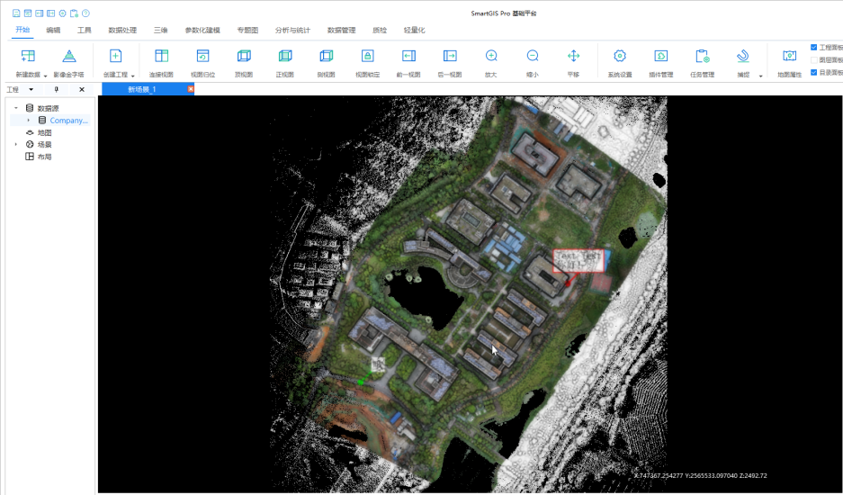

对于这个问题，在SmartGIS自主渲染引擎中，对于场景数据、光标、帧率、文字标签等内容分开管理，而EDL只处理场景数据，不处理文字标签等其他内容。

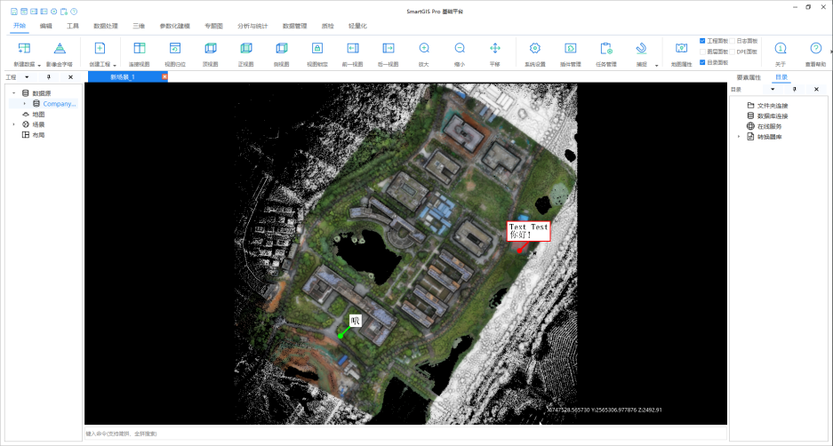

我们在Vulkan中遇到了不同着色器之间uniform buffer重叠的问题（OpenGL没有）：EDL Mix的uniform与另一个着色器的uniform有重叠。经查证，两个uniform的地址都不同，但却会被压盖，这很奇怪。我们未能找到原因，最终我们优化渲染流程，从而避免了这个问题。

为避免不同着色器之间uniform buffer的重叠，建议渲染流程如下。实际上就是分两帧渲染，这样两个uniform buffer就不会有冲突

1. 第一帧渲染EDL的结果
   1. 拦截场景数据的渲染结果
   2. 对场景数据的渲染结果进行EDL处理
2. 第二帧加上鼠标、文字标签等内容
   1. 将EDL的结果直接绘制在屏幕上
   2. 渲染鼠标、文字标签等内容

PS：在vulkan中，将命令队列`submit`，即标志渲染一帧。

## 效果
整体流程回顾：


### 输入
深度图：深度放在R通道，GB通道为0。因此，离摄像机越远 => 深度越大 => 越红

- 帧图像


- 深度图
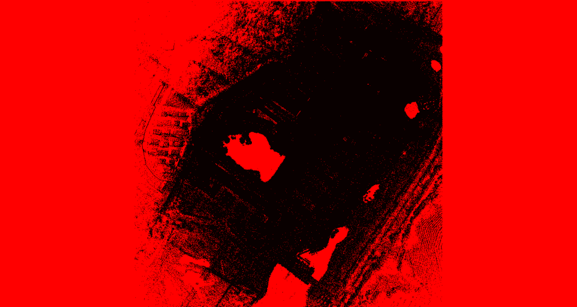

### shade与bilateral

- shade1(W*H)
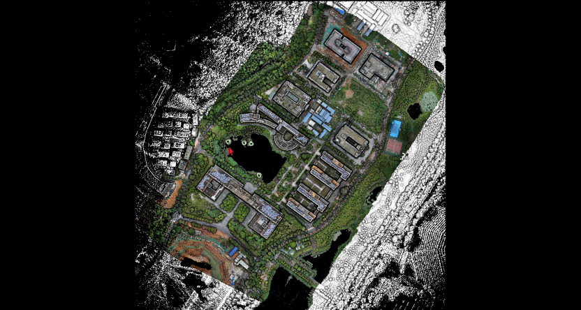

- bilateral1(W*H) 


- shade2(W/2 * H/2)  


- bilateral1(W/2*H/2)   
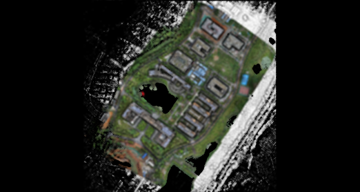

- shade3(W/4 * H/4)   


- bilateral1(W/4*H/4)  
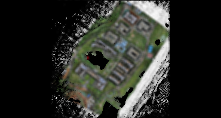


### 输出（mix）

- 输入（帧图像）  
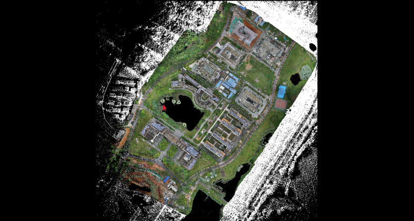

- mix(W*H)   
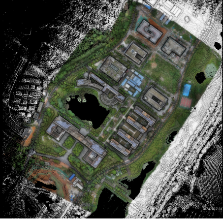

## 参考文章

1. [稠密的无人机激光雷达点云数据处理与分析方法与工具科普系列（三）](https://zhuanlan.zhihu.com/p/355228810)
2. [[VTK] Eye-Dome Lighting: a non-photorealistic shading technique](https://www.kitware.com/eye-dome-lighting-a-non-photorealistic-shading-technique/)
3. [[UE] Eye-Dome Lighting Mode for Point Clouds](https://docs.unrealengine.com/4.27/en-US/WorkingWithContent/LidarPointCloudPlugin/EnableEyeDomeLightingMode/)
4. [[ArcGIS] Eye-Dome Lighting Enhanced Point Cloud Rendering in ArcGIS Pro](https://www.esri.com/arcgis-blog/products/arcgis-pro/3d-gis/eye-dome-lighting/)
5. [cloudcompare EDL (shader)](https://www.cloudcompare.org/doc/wiki/index.php?title=EDL_(shader))

