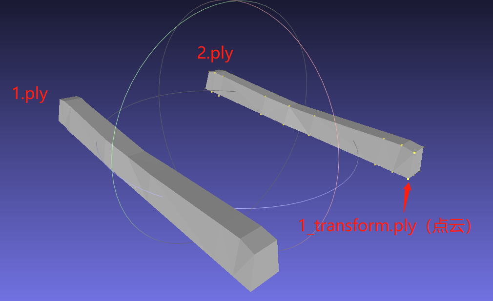

> 依赖：OpenCV contrib（扩展模块）

## ICP简介
ICP用于计算出一个变换矩阵，使一个点云匹配到另一个点云上。

输入

1. 场景3D点的坐标集合$A$
2. 场景3D点的坐标集合$B$

输出

1. 点对集合$C = \{ (i,j) | a_i∈A, b_j ∈B \}$
2. 或者，$A$、$B$两个点击间的变换参数$R$、$t$

方法：ICP及ICP算法的变种有很多，OpenCV SurfaceMatching使用的是Picky ICP算法

## Picky ICP算法简介
Pickly ICP算法不同于其他ICP算法，它采用分层的思想

- 每次只对输入点集A中的一部分点进行迭代计算
- 当算法收敛时，再对下一层的点进行同样的计算，并将当前计算结果作为下一次计算的初始值

### 选取控制点
对输入场景点集，将其分为$h+1$层

1. 第一次选取下标为$2^h$的倍数的点作为控制点
2. 之后逐层选取下标为$2^{h-1}$, $2^{h-2}$, ..., $2^0$的点作为控制点，直到所有点都被选为控制点

### 计算对应点对
对每一个控制点，计算模型点集$B$中的最近点，作为其对应点

- 选取非常耗时，可以采用k-d树进行加速
- 同时，对于存在多个对应点对的情况，只保留距离最近的点对（ICP的名字由此而来，“迭代最近点”）

### 删除离群点
对第二步得到的所有点对，通过点对距离阈值判断的方法，删除一些离群点对，增加算法的鲁棒性。

1. 计算所有点对的标准差 σ
2. 当$dist(a_i, b_j) > SCALE *σ$时，该点被认为是离群值。在后续的计算中，该点被忽略

### 迭代计算模型参数
基于误差平法，迭代求解出误差最小的情况，并获取$(R, t)$。

当$(R, t)$的参数变化小于某个阈值，或者迭代次数达到，则停止计算。

## ICP API介绍
> _[OpenCV ICP API](https://docs.opencv.org/master/dc/d9b/classcv_1_1ppf__match__3d_1_1ICP.html)_

### 类介绍
```cpp
/**
* @brief This class implements a very efficient and robust variant of the iterative closest point (ICP) algorithm.

* The task is to register a 3D model (or point cloud) against a set of noisy target data. The variants are put together
* by myself after certain tests. The task is to be able to match partial, noisy point clouds in cluttered scenes, quickly.

* You will find that my emphasis is on the performance, while retaining the accuracy.
* This implementation is based on Tolga Birdal's MATLAB implementation in here:
* http://www.mathworks.com/matlabcentral/fileexchange/47152-icp-registration-using-efficient-variants-and-multi-resolution-scheme

* The main contributions come from:
* 1. Picky ICP:
* http://www5.informatik.uni-erlangen.de/Forschung/Publikationen/2003/Zinsser03-ARI.pdf
* 2. Efficient variants of the ICP Algorithm:
* http://docs.happycoders.org/orgadoc/graphics/imaging/fasticp_paper.pdf
* 3. Geometrically Stable Sampling for the ICP Algorithm: https://graphics.stanford.edu/papers/stabicp/stabicp.pdf
* 4. Multi-resolution registration:
* http://www.cvl.iis.u-tokyo.ac.jp/~oishi/Papers/Alignment/Jost_MultiResolutionICP_3DIM03.pdf
* 5. Linearization of Point-to-Plane metric by Kok Lim Low:
* https://www.comp.nus.edu.sg/~lowkl/publications/lowk_point-to-plane_icp_techrep.pdf
*/
class CV_EXPORTS_W ICP;
```

### 构造函数
```cpp
/**
 *  \brief ICP constructor with default arguments.

 *  @param [in] iterations
	迭代次数

 *  @param [in] tolerence Controls the accuracy of registration at each iteration of ICP.
	控制ICP每次迭代的配准精度

 *  @param [in] rejectionScale Robust outlier rejection is applied for robustness. This value actually corresponds to the standard deviation coefficient. Points with rejectionScale * &sigma are ignored during registration.
	标准差系数，用于鲁棒性。在ICP算法的 '删除离群点(reject outliers)' 步骤中的scale系数

 *  @param [in] numLevels Number of pyramid levels to proceed. Deep pyramids increase speed but decrease accuracy. Too coarse pyramids might have computational overhead on top of the inaccurate registrtaion. This parameter should be chosen to optimize a balance. Typical values range from 4 to 10.
	金字塔层数。numLevels越大，速度越快，但精度越差。应选择这个参数来优化平衡，典型值4~10
	
 *  @param [in] sampleType Currently this parameter is ignored and only uniform sampling is applied. Leave it as 0.
	目前该参数被忽略

 *  @param [in] numMaxCorr Currently this parameter is ignored and only PickyICP is applied. Leave it as 1.
	目前该参数被忽略

 */
CV_WRAP ICP(const int iterations, 
			const float tolerence = 0.05f, 
			const float rejectionScale = 2.5f, 
			const int numLevels = 6, 
			const int sampleType = ICP::ICP_SAMPLING_TYPE_UNIFORM, 
			const int numMaxCorr = 1);
```

```python
<ppf_match_3d_ICP object> = cv.ppf_match_3d_ICP( iterations[, tolerence[, rejectionScale[, numLevels[, sampleType[, numMaxCorr]]]]] )
```

### 配准
```cpp
/**
 * @brief: 使用 'Picky ICP' 算法对齐场景和模型点，同时返回残差和姿态 
 * @param srcPc/dstPc: 模型/场景3D坐标+法向量集合。大小为(Nx6)，且目前只支持 CV_32F 类型。
		 场景和模型点数量不用相同。
 * @param residual: 最终的残差
 * @param pose: 'srcPc' 到 'dstPc' 点集 的变换矩阵
 */
int cv::ppf_match_3d::ICP::registerModelToScene	(	
    const Mat & 	srcPC,
	const Mat & 	dstPC,
	double & 	residual,
	Matx44d & 	pose)
```

```python
retval, residual, pose = cv.ppf_match_3d_ICP.registerModelToScene(srcPC, dstPC)
```

## 示例
### C++
> 完整代码：[opencv-examples/icp.cpp](https://github.com/geodoer/opencv-examples/blob/main/examples/SurfaceMatching/icp.cpp)

ICP的输入数据应是粗配准之后的结果。两个模型应基本重叠，再做ICP，获得精确的变换矩阵。

- 本例子的输入数据不正确！两个模型没有做任何处理，离的太远，ICP不是应用这种场景下的。但此例子也能跑出来结果，这倒是很意外的事情，它刚好用ICP原理来做是正确的。



```cpp
#include <iostream>
#include <vector>

#include "opencv2/core/utility.hpp"
#include "opencv2\opencv_modules.hpp"

#include "opencv2\surface_matching.hpp"
#include "opencv2\surface_matching\ppf_helpers.hpp"

using namespace std;
using namespace cv;
using namespace cv::ppf_match_3d;

int main(int argc, char** argv)
{
    string modelAPath = DATA_PATH "ICP/1.ply";
    string modelBPath = DATA_PATH "ICP/2.ply";
    string modelATransformPath = DATA_PATH "ICP/1_transform.ply";

    Mat modelA = loadPLYSimple(modelAPath.c_str(), 1);
    //Mat是6*N的矩阵，包含N个顶点，6表示：点xyz 法向量xyz
    Mat modelB = loadPLYSimple(modelBPath.c_str(), 1);

    ICP icp(100, 0.005f, 2.5f, 8);

    int64 t1 = cv::getTickCount();

    double residual;
    Matx44d pose;
    icp.registerModelToScene(modelA, modelB, residual, pose);

    std::cout << "ICP residual " << residual << std::endl;
    std::cout << "ICP pose " << pose << std::endl;

    Mat result = transformPCPose(modelA, pose);
    writePLY(result, modelATransformPath.c_str());

    int64 t2 = cv::getTickCount();
    cout << endl << "ICP Elapsed Time " << (t2 - t1) / cv::getTickFrequency() << " sec" << endl;

    return 0;
}
```

输出：

```
ICP residual 0.019302
ICP pose [0.9999801698090472, -9.037320064110299e-05, 0.0062969692196677, 1.765833327267956;
 8.518909416652164e-05, 0.9999996572676749, 0.0008235334548834371, 0.134204716080859;
 -0.006297041486846941, -0.0008229806909539528, 0.9999798347823297, -10.98554184876832;
 0, 0, 0, 1]

ICP Elapsed Time 0.0063701 sec
```

## 参考文章

1. https://docs.opencv.org/4.x/dc/d9b/classcv_1_1ppf__match__3d_1_1ICP.html
2. [PPF算法-OpenCV三维点匹配(Surface Matching)](https://blog.csdn.net/Anderson_Y/article/details/81907119)

