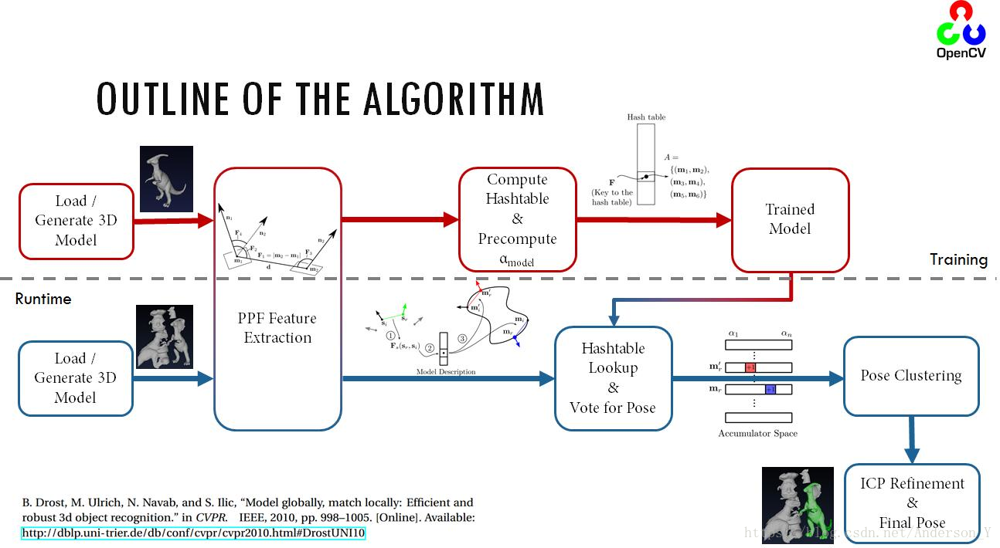
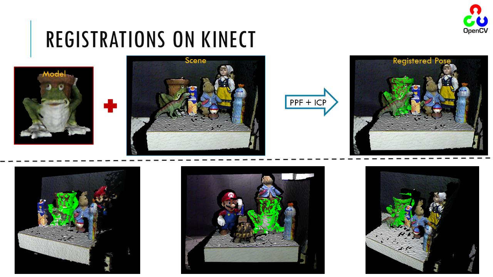
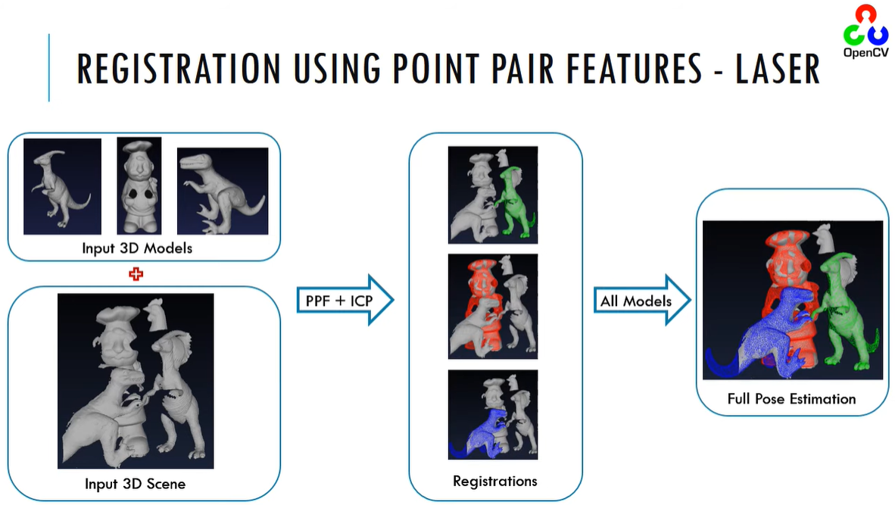

## 问题定义

输入

1. 目标模型$M$
2. 场景数据$S$

目标：当场景$S$存在目标模型$M$时，估算出目标在场景中的位置，并计算出变换矩阵

方法

1. 根据$M$，训练一个目标模型
2. 在场景中检测3D特征点
3. 利用PPF算法，匹配特征点，计算出一个变换矩阵，应用变换矩阵得到初始姿态$p0$。这一步即是粗配准
4. 利用ICP算法，将$p_0$作为初始输入，对求得的姿态进一步精配准，得到更准确的结果$p$。这一步即是精配准

## 效果
> 视频演示：[GSoC 2014 - New Surface Matching in OpenCV using Point Pair Features - YouTube](https://www.youtube.com/watch?v=uFnqLFznuZU)

## 参考链接
1. [OpenCV: Surface Matching官方文档](https://docs.opencv.org/4.x/d9/d25/group__surface__matching.html)
2. [PPF算法-OpenCV三维点匹配(Surface Matching)_匹配图像和三维模型上的点](https://blog.csdn.net/Anderson_Y/article/details/81907119)
3. [c++ - Opencv Surface Matching - Stack Overflow](https://stackoverflow.com/questions/41758221/opencv-surface-matching)

