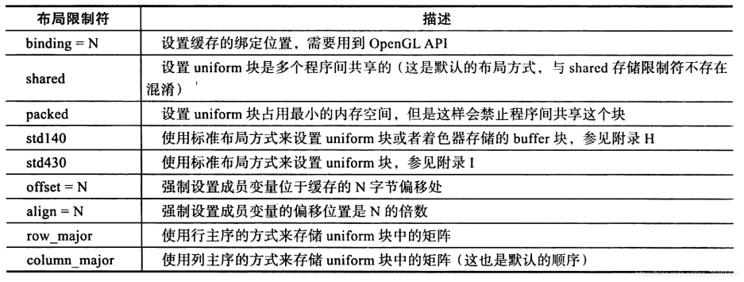
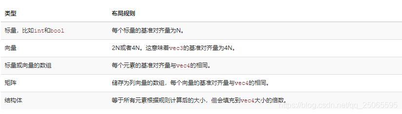
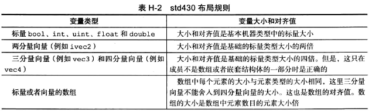
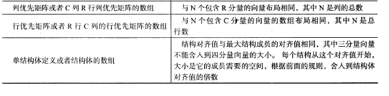

## 相关链接

1. [C语言字节对齐](https://www.yuque.com/softdev/cpp/vlvo4x)


## layout
语法：`layout(布局限定符1, 布局限定符2, ....)`
例如

1. `layout(binding = 2) uniform sampler s1_color_sampler;`
2. `layout(binding = 6, std140) uniform `



### shared（默认）
默认情况下，GLSL使用的布局方式是shared，即共享。

1. 共享的含义：一旦硬件定义了偏移量，它们在多个程序中共享并保持一致
2. shared有不确定性：出于优化的目的，GLSL有权优化变量所占用的内存空间，因此我们无法事先知道变量的偏移值

虽然shared具有不确定性，但GLSL提供了以下函数帮助我们查询

1. `glGetUniformIndices`获取指定名称uniform变量的索引位置
2. `glGetActiveUniformsiv`获取指定索引位置的偏移量和大小
```cpp
void glGetUniformIndices(GLuint program, GLsizei uniformCount, const char** uniformNames,GLuint* uniformIndices);
//返回uniformCount 个 uniform变量的索引位置；变量的名称通过uniformNames来指定，每个名称都以NULL结尾；
```

例子：顶点着色器 和 片元着色器 共享一个名为Uniform的变量

1. GLSL的uniform定义
```glsl
//未指定布局，默认即为shared
uniform Uniform{
  vec3 translation;
  float scale;
  vec4 rotation;
  bool enabled;
}
```

2. C++程序代码
```cpp
enum {
    Translation,
    Scale,
    Rotation,
    Enabled,
    NumUniforms
};

//# 对应着色器中的uniform 块中 uniform的变量名称
const char* names[NumUniforms] = {
    "translation",
    "scale",
    "rotation",
    "enabled"
}

//# 变量的值
GLfloat scale = 0.5;
GLfloat translation[] = {0.1,0.1;0.0};
GLfloat rotation[] = {90,0.0,0.0,1.0};
GLBoolean enabled = GL_TRUE;

//# 获取
GLuint indices[NumUniforms];
GLuint size[NumUniforms];
GLuint offset[NumUniforms];
GLuintt type[NumUniforms];
//获取所有uniform变量的索引
glGetUniformIndices(program,NumUniforms,names,indices);
//通过uniform 变量的索引来获取相应的偏移值、大小、类型等信息
glGetActiveUniformsiv(program,NumUniforms,indices,GL_UNIFORM_OFFSET,offset);
glGetActiveUniformsiv(program,NumUniforms,indices,GL_UNIFORM_SIZE,size);
glGetActiveUniformsiv(program,NumUniforms,indices,GL_UNIFORM_TYPE,type);

//# 传值
GLvoid* buffer;
//获取uniform缓存的索引，并获取整个块的大小
GLuint uboIndex = glGetActiveUniformBlockiv(program,"Uniforms");
glGetActiveUniformBlockiv(program,uboIndex,GL_UNIFORM_BLOCK_DATA_SIZE,&uboSize);
buffer = malloc(uboSize);
//组装buffer
memcpy(buffer + offset[Scale],&scale， size[Scale]*4);
```

### std140
std140指定了一系列规则，在这些规则之下，我们能够明确一个uniform的内存布局。保持唯一性的同时，是会浪费点内存。
计算清楚每个变量的偏移之后，我们就可以使用`glBufferSubData`函数来给变量赋值（填充内存块）了。

GLSL中每个类型，比如int，float，bool，都被定义为4字节，每4个字节用N来表示：



| 变量类型 | 布局规则 |
| --- | --- |
| 标量类型（int, bool,float等） | 大小和对齐值都是基本机器类型的标量大小 |
| 两个分量的向量（如vec2） | 大小和对齐值是基础类型大小的2倍 |
| 三分量向量和4分量向量(vec3,vec4) | 大小和对齐值是基础标量类型大小的4倍 |
| 数组 | 数组中每个元素大小取整到vec4大小的整数倍 |
| 矩阵 | 类似于包含n个向量的数组，n是列总数 |
| 结构体 | 对齐值是最大结构成员的对齐值，取整到vec4大小的整数倍 |

其他规则

1. 没有设置矩阵是行主序还是列主序，默认就使用列主序，等价于`layout(std140, row_major)`。

例：
```glsl
layout (std140) uniform ExampleBlock
{
  float value;		//4 + 12	=16
  vec3 vector; 		//16(4*4) 	=16
  mat4 matrix;		//4个列向量	=64
                      //16(4*4)	=16
                      //16(4*4)	=16
                      //16(4*4)	=16
                      //16(4*4)	=16
  float values[3];	//一个float取到vec4的整数倍	=48
                      //values[0]	4取到vec4的整数倍=16
                      //values[1]	=16
                      //values[2]	=16
  bool boolean;			//1	+ 3		=4
  int integer; 			//4			=4
};	//152
```

例子：

1. GLSL
```cpp
layout(binding = 6, std140) uniform Shade
{
    vec2		Neigh_pos_2D[8];	//16*8=128
        //vec2数组。数组的每个元素都要与vec4对齐 => vec2数组的一个元素即16
    float		Pix_scale;	//4
    float		Exp_scale;	//4
    float		Zm;			//4
    float		ZM;			//4
    float		Sx;			//4
    float		Sy;			//4
    float		Dist_to_neighbor_pix;	//4
    float 		PerspectiveMode;	//4
    vec3		Light_dir;	//16
        //vec3即vec4 => 16个
};
```

2. C++对应的数据结构
```cpp
	struct ShaderParams
	{
		float		Neigh_pos_2D[8 * 4];
		float		Pix_scale;
		float		Exp_scale;
		float		Zm;
		float		ZM;
		float		Sx;	
		float		Sy;
		float		Dist_to_neighbor_pix;
		float		PerspectiveMode;
		float		Light_dir[4];
	};
```

### std430
std430只适用于GLSL 4.30或更高版本。




### packed
当使用紧凑（Packed）布局时，是不能保证这个布局在每个程序中保持不变的（即非共享），因为它允许编译器去将uniform变量从uniform 块中优化掉，这在每个着色器中都可能是不同的。

### binding
从OpenGL 4.2版本起，你也可以添加一个布局标识符，显式地将Uniform块的绑定点储存在着色器中，这样就不用再调用glGetUniformBlockIndex和glUniformBlockBinding了。下面的代码显式地设置了Lights Uniform块的绑定点。
```cpp
layout(std140, binding = 2) uniform Lights { ... };
```


