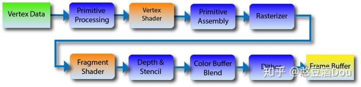

## 顶点着色器与片元着色器

1.  对于每个顶点，都会调用一次顶点着色器
2.  由于顶点着色器，只处理了顶点，所以在光栅化步骤当中，会插值出三角形内、除三角形顶点的值。在这一步当中，会插值出所有`varying`类型的变量的值（这也是为什么`varying`不能是bool的原因，因为它要插值嘛）
3.  对于每个像素，都会调用一次片元着色器。在片元着色器当中，变量的值，是在光栅化当中插值来的。