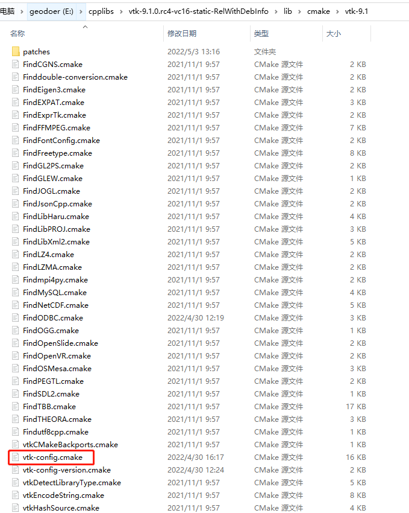

---
tags:
    - cmake
    - find_package
---

在CMake当中，常用`find_package`命令来搜索一个第三方库。

## 用法

### 搜索库
`find_package`用法很简单，以下参数除了名称是必须的，其他都是可选项。
```cmake
find_package(
  Boost 	    #库名称，记为<PackageName>
  1.46.1        #版本
  REQUIRED 	    #是否必须，如果没有找到该库就会报错强制退出
  COMPONENTS 	#只加载该库的某些组件（后可以跟N个组件名）
  	filesystem 	  #组件名
    system        #组件名
)

if(Boost_FOUND)	#如果找到，则<PackageName>_FOUND为真
    message ("boost found")
else()
    message (FATAL_ERROR "Cannot find Boost")
endif()
```

### 引用库
如果搜索成功，你有两种方式引用这个库。

#### 旧版CMake
TODO

#### 现代CMake
在现代CMake，如果成功引入，会创建一个第三方库的TARGET，你直接链接即可，无需像原先一样麻烦。

完整示例：
```cmake
cmake_minimum_required(VERSION 3.5)

# Set the project name
project (imported_targets)

# find a boost install with the libraries filesystem and system
find_package(Boost 1.46.1 REQUIRED COMPONENTS filesystem system)

# check if boost was found
if(Boost_FOUND)
    message ("boost found")
else()
    message (FATAL_ERROR "Cannot find Boost")
endif()

# Add an executable
add_executable(imported_targets main.cpp)

# link against the boost libraries
#直接引用<PackageName>::<ComponentName>
target_link_libraries(imported_targets
    PRIVATE
        Boost::filesystem
)
```

## 搜索模式

> 问题：find_package`在哪个目录下搜索？搜索的是什么文件？

`find_package`搜索有两种模式（方式）

1. Module，模块模式
2. Config，配置模式

两种模式的优先级

- 默认的顺序是先Module，再Config（当Module模式失败之后，才会使用Config模式）
- 通过`find_package(... CONFIG)`即可更改顺序，先Config，再Module

两种模式搜索的目录与搜索的文件

| 模式         | 搜索的路径                                                                                                                                            | 搜索的文件                                                                                                                                                       | 说明                                                                                                                              |
| ------------ | ----------------------------------------------------------------------------------------------------------------------------------------------------- | ---------------------------------------------------------------------------------------------------------------------------------------------------------------- | --------------------------------------------------------------------------------------------------------------------------------- |
| 模块(Module) | 1. `CMAKE_FIND_PACKAGE_REDIRECTS_DIR(3.24)`<br/>2. `CMAKE_MODULE_PATH`<br/>3. `<CMake安装目录>/share/cmake-<version>/Modules`<br/>4. 环境变量中的目录 | `Find<PackageName>.cmake`                                                                                                                                        |                                                                                                                                   |
| 配置(Config) | 1. `CMAKE_FIND_PACKAGE_REDIRECTS_DIR(3.24)`<br/>2. `CMAKE_PREFIX_PATH`<br/>3. 环境变量中的目录<br/>4. 详情请看下文                               | `<PackageName>Config.cmake`或者<br/>`<PackageName小写>-config.cmake`或者<br/>`<PackageName>ConfigVersion.cmake`或者<br/>`<PackageName小写>-config-version.cmake` | 对于Version可参照[Config Mode Version Selection](https://cmake.org/cmake/help/latest/command/find_package.html#version-selection) |

在Cmake3.24以后，又新增了一种名为**FetchContent redirection**的模式。
> 这里不过多介绍，笔者还未用过，后续接触到再补充。


### 搜索的文件（库的CMake文件）
如上表，`find_package`会在指定路径下搜索`Find<PackageName>.cmake`、`<PackageName>Config.cmake`文件，我愿意将它们称为“库的CMake文件“。

它们负责找到库的所在路径，为我们的项目引入头文件路径和库文件路径。
这个文件中有三个变量：

| 变量名                                                    | 说明                           | 例子        |
| --------------------------------------------------------- | ------------------------------ | ----------- |
| `<PackageName>_FOUND`                                     | 值为真，常用于判断是否搜索成功 | Boost_FOUND |
| `<PackageName>_INCLUDE_DIR` 或者<br/>`<PackageName>_INCLUDES` |                                |             |
| `<PackageName>_LIBRARY` 或者<br/> `<PackageName>_LIBRARIES`                                                          |                                |             |


#### `Find<PackageName>.cmake`文件

`Find<PackageName>.cmake`文件是模块（Module）模式的搜索目标，它通常不由包本身提供，它通常由第三方提供，例如操作系统、CMake等等。甚至你也可以编写这个文件

1. 在文件中定义那三个变量，方便旧版CMake方式引用第三方库
2. 在文件中创建一个名为`<PackageName>`的Target，方便新版CMake方式引用第三方库

#### `<PackageName>Config.cmake`文件

`<PackageName>Config.cmake`文件是配置模式的搜索目标，它通常由包本身提供。

若一个第三方库支持CMake，在它的install目录下一般会有一个`cmake`文件夹，在此文件夹下有它的配置文件。
例如，vtk的安装目录


如果你想使用它，有好几种方式：

1. 第一种，将目录添加到`CMAKE_PREFIX_PATH`变量中即可

TODO 


### CMAKE_MODULE_PATH与CMAKE_PREFIX_PATH
[`CMAKE_MODULE_PATH`](https://cmake.org/cmake/help/latest/variable/CMAKE_MODULE_PATH.html#variable:CMAKE_MODULE_PATH "CMAKE_MODULE_PATH")和 [`CMAKE_PREFIX_PATH`](https://cmake.org/cmake/help/latest/variable/CMAKE_PREFIX_PATH.html#variable:CMAKE_PREFIX_PATH "CMAKE_PREFIX_PATH")都是一个字符串列表，内部有多个目录。

可以通过list APPEND添加一个搜索目录
```cmake
list(APPEND CMAKE_MODULE_PATH ${PROJECT_SOURCE_DIR}/build)  #添加到find_package module模式搜索路径
message(STATUS ${CMAKE_MODULE_PATH})

list(APPEND CMAKE_PREFIX_PATH ${PROJECT_SOURCE_DIR}/build)  #添加到find_package config模式搜索路径
message(STATUS ${CMAKE_PREFIX_PATH})
```

### Config模式的搜索目录
TODO

`<PackageName>_DIR`


## 完整签名
```
find_package(
	<PackageName>  #包名
	[version]      #版本号
	[EXACT] [QUIET]
    [REQUIRED]     #是否必须
    [[COMPONENTS] [components...]]        #只加载该库的某些组件
	[OPTIONAL_COMPONENTS components...]   #可选组件
    [CONFIG|NO_MODULE]	 #使用Config模式（默认是使用Module模式）
    [NO_POLICY_SCOPE]
    [NAMES name1 [name2 ...]]
    [CONFIGS config1 [config2 ...]]
    [HINTS path1 [path2 ... ]]   #指定搜索目录
    [PATHS path1 [path2 ... ]]   #指定搜索目录
    [PATH_SUFFIXES suffix1 [suffix2 ...]]
    [NO_DEFAULT_PATH]
    [NO_PACKAGE_ROOT_PATH]
    [NO_CMAKE_PATH]
    [NO_CMAKE_ENVIRONMENT_PATH]
    [NO_SYSTEM_ENVIRONMENT_PATH]
    [NO_CMAKE_PACKAGE_REGISTRY]
    [NO_CMAKE_BUILDS_PATH] # Deprecated; does nothing.
    [NO_CMAKE_SYSTEM_PATH]
    [NO_CMAKE_SYSTEM_PACKAGE_REGISTRY]
    [CMAKE_FIND_ROOT_PATH_BOTH | ONLY_CMAKE_FIND_ROOT_PATH | NO_CMAKE_FIND_ROOT_PATH])
```

## 查找失败的解决思路
根据笔者的经验，提供一个查找失败的解决思路。
因为本机环境中，可能存在多个 包的cmake 文件，因此要排查到底使用的是哪一个。

1. 第一步，打印`CMAKE_MODULE_PATH`、`CMAKE_MODULE_PATH`变量，看第三方库cmake所在目录有没有被加进去
2. 第二步，按照find_package的搜索顺序，排查`<PackageName>`是否有多个cmake文件
3. 第三步，确认使用的`cmake`文件能够找到对应的包

## 参考文章
1. [find_package — CMake 3.25.1 Documentation](https://cmake.org/cmake/help/latest/command/find_package.html)