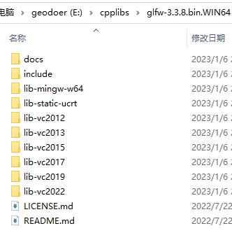

---
tags:
    - cmake
    - IMPORTED
---

对于预编译的第三方库，而且此库不支持CMake（没有CMake文件），可以使用imported关键字来创建TARGET，以此方便在工程中使用。


## 示例：glfw
glfw的预编译版本不支持CMake，我们可以为其编写`find<packagename>.cmake`文件，以便引用它。



第一步：在目录下新建`Findglfw.cmake`文件
```cmake

# 使用IMPORTED关键字从外部导入一个名为glfw的库
#STATIC表示静态链接的方式
add_library(glfw STATIC IMPORTED)
# 为glfw指定lib文件
set_property(
	TARGET glfw 
	PROPERTY 
		IMPORTED_LOCATION ${CMAKE_CURRENT_SOURCE_DIR}/extern/glfw/lib-vc2019/glfw3.lib
) 
# 指定include目录
#INTERFACE，接口式的include目录，表示为引用glfw的TARGET添加一个include目录
target_include_directories(
	glfw 
	INTERFACE ${CMAKE_CURRENT_SOURCE_DIR}/extern/glfw/include
)
```

在需要使用glfw的TARGET中，正常链接glfw就可以了
```cmake
cmake_minimum_required(VERSION 3.20)  
project(tryIMPORTED)  
  
set(CMAKE_CXX_STANDARD 17)  
set(CMAKE_CXX_STANDARD_REQUIRED ON)  
  
add_executable(main main.cpp)  
  
# 为名为main的TARGET链接glfw  
target_link_libraries(main glfw)  
  
# opengl  
find_package(OpenGL REQUIRED)  
target_link_libraries(main OpenGL::GL)
```


## 参考链接
1. [引入闭源/编译好的库：使用IMPORTED关键字 | Chunlei Li](https://chunleili.github.io/cmake/IMPORTED)