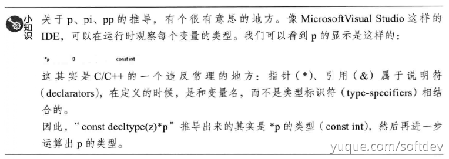
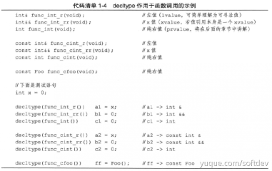

C++11新增了decltype关键字，用于在编译时期推导出一个表达式的类型。它的语法格式`decltype(expression)`

从格式上来看，decltype类似于sizeof，decltype的推导过程是在编译期完成的，并且不会真正计算表达式的值

- sizeof是用来推导表达式类型大小的操作符

```cpp
int x = 0;
decltype(x) y =0; 		//y -> int
decltype(x+y) z = 0;	//z -> int

const int& i = x;
decltype(i) j =y; 		//y -> const int&
	//decltype可以保留住表达式的引用及const限定符
	//实际上，对于一般的标记符表达式(id-expression)，decltype将精确地推导出表达式定义本身的类型，不会像auto那样在某些情况下舍弃引用和cv限定符

const decltype(z)* p =&z;	//p -> const int*
decltype(z) *pi = &z;		//pi -> int*
	//decltype可以像auto一样，加上引用和指针，以及cv限定符

decltype(pi) *pp = &pi;		//pp -> int**
	//当表达式是一个指针的时候，decltype仍然推导出表达式的实际类型（指针类型）
	//之后结合pp定义时的指针标记，得到的pp是一个二维指针类型。这也和auto不同的一点
```
对于decltype和引用结合的推导结果，与C++11中新增的引用折叠规则有关。请查看右值引用相关内容。




### decltype的推导规则
`decltype(exp)`推导规则

1. `exp`是标识符、类访问表达式，`decltype(exp)`和`exp`的类型一致
2. `exp`是函数调用，`decltype(exp)`和返回值的类型一致
3. 其他情况，若`exp`是一个左值，则`decltype(exp)`是`exp`类型的左值引用，否则和`exp`类型一致

根据上面的规则分三种情况讨论：

一、标识符表达式和类访问表达式
```cpp
class Foo{
public:
    static const int Number = 0;
    int x;
};

int n =0;
volatile const int& x = n;

decltype(n) a = n;	//a -> int
decltype(x) b = n;	//b -> const volatile int&
decltype(Foo::Number) c = 0;	// c -> const int
//decltype的推导结果就和这个变量的类型定义一致

Foo foo;
decltype(foo.x) d = 0;	//d ->int，类访问表达式
```

二、函数调用

如果表达式是一个函数调用，结果会如何呢？



- `c2`是`int`，而不是`const int`。因为函数返回值`int`是一个纯右值。对于纯右值而言，只有类类型可以携带cv限定符，此外则一般忽略掉cv限定

三、带括号的表达式和加法运算表达式
```cpp
struct Foo {int x;};
const Foo foo = Foo();

decltype(foo.x) a = 0;		//a -> int
decltype((foo.x)) b = a;	//b -> const int&
	//foo的定义是const Foo，所以foo.x是一个const int类型左值
	//故括号表达式也是一个左值
	//因此根据规则3，decltype结果是个左值引用

int n=0, m=0;
decltype(n+m) c = 0;	//c -> int
	//n+m返回一个右值，则规则3
decltype(n+=m) d = c;	//d -> int&
	//n+=m返回一个左值，则规则3
```

### decltype的实际引用
在冗长的代码中，人们往往只会关心**变量本身**，而并不关心它的**具体类型**。此时就可以使用`decltype`

这对理解一些变量类型复杂但操作统一的代码片段有很大好处。

#### 例：标准库中decltype的身影
```cpp
//这种定义方法的好处是，从类型的定义过程上就可以看出这个类型的含义了
typedef decltype(nullptr) nullptr_t;	//通过编译器关键字nullptr定义类型nullptr_t
typedef decltype(sizeof(0)) size_t;
```

#### 例：通过变量表达式抽取变量类型
decltype经常用在通过变量表达式抽取变量类型上，如
```cpp
vector<int> v;
//...
decltype(v)::value_type i = 0;
```

#### 例：泛型编程
decltype的应用多出现在泛型编程中。

```cpp
template<class ContainerT>
class Foo{
	typename ContainerT::iterator it_;	//类型定义可能有问题
    //因为这只是一个non_const的iterator；如果是const，这个iterator就出错了
public:
	void func(ContainerT& container) {
    	it_ = container.begin();
    }
}
```

这样的模板可能会出错
```cpp
typedef const std::vector<int> container_t;
container_t arr;

Foo<container_t> foo;
foo.func(arr); //func内的it_应该要是一个const_iterator
```

如果没有`decltype`（C++98/03）下，只能添加一个特化版本来处理`const`时的情况，这很麻烦！为了一个类型，而重写一个模板类。
```cpp
template<class ContainerT>
class Foo<const ContainerT> { //传入的是一个const类型
	typename ContainerT::const_iterator it_;
public:
	void func(const ContainerT& container) {
    	it_ = container.begin();
    }
    //...
};
```

但如果有了`decltype`，就可以这样
```cpp
template<class ContainerT>
class Foo{
	decltype(ContainerT().begin()) it_;
public:
	void func(ContainerT& container) {
    	it_ = container.begin();
    }
    //...
};
```

### 参考文章

1. 参考书籍《深入应用C++11》
