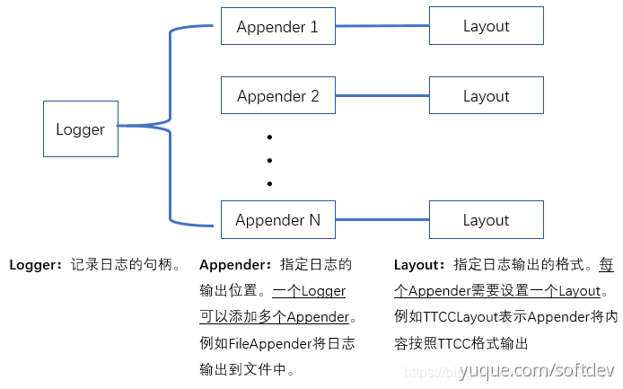
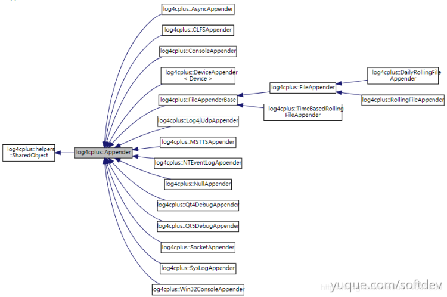
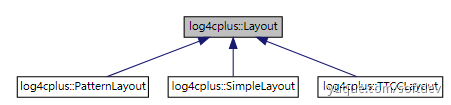

- 所有的日志类别都是从抽象 root 类继承日志级别和 appender，除非另行定义
- 支持记录工作线程的id，用来分析线程行为

## 主要类

| **类名** | **说明** |
| --- | --- |
| Logger | 记录器，保存并跟踪对象日志信息变更的实体，当你需要对一个对象进行记录时，就需要生成一个logger |
| Appender | 挂接器，与布局器和过滤器紧密配合，将特定格式的消息过滤后输出到所挂接的设备终端如屏幕，文件等等)。 |
| Layout | 布局器，控制输出消息的格式。 |
| LogLevel | 优先权，包括TRACE, DEBUG, INFO, WARNING, ERROR, FATAL。 |
| Hierarchy | 分类器，层次化的树型结构，用于对被记录信息的分类，层次中每一个节点维护一个logger的所有信息。 |
| Filter | 过滤器，过滤输出消息。 |

【其中有三个核心类】

1. logger：记录日志的句柄
2. Appender：指定输出的位置（如控制台、文件、远程服务器等）。一个logger可添加多个Appender，从而向多个地方输出日志
3. Layout：输出的格式。一个Appender对应一个Layout

【三者的关系】



### Appender
【Appender的所有类型】



### Layout
【类型】



| **类型** | **说明** |
| --- | --- |
| SimpleLayout  | 简单格式的布局器，在输出的原始信息之前加上LogLevel和一个"-" |
| TTCCLayout  | 其格式由时间，线程ID，Logger和NDC 组成 |
| PatternLayout  | 有词法分析功能的模式布局器,类似正则表达式。以“%”作为开头的特殊预定义标识符，将产生特殊的格式信息 |

```
（1）"%%"，转义为% 。
（2）"%c"，输出logger名称，如test.subtest 。也可以控制logger名称的显示层次，比如"%c{1}"时输出"test"，其中数字表示层次。
（3）"%D"，显示本地时间，比如："2004-10-16 18:55:45"，%d显示标准时间。   
可以通过%d{...}定义更详细的显示格式，比如%d{%H:%M:%s}表示要显示小时:分钟：秒。大括号中可显示的预定义标识符如下：
   %a -- 表示礼拜几，英文缩写形式，比如"Fri"
   %A -- 表示礼拜几，比如"Friday"
   %b -- 表示几月份，英文缩写形式，比如"Oct"
   %B -- 表示几月份，"October"
   %c -- 标准的日期＋时间格式，如"Sat Oct 16 18:56:19 2004"
   %d -- 表示今天是这个月的几号(1-31)"16"
   %H -- 表示当前时刻是几时(0-23)，如"18"
   %I -- 表示当前时刻是几时(1-12)，如"6"
   %j -- 表示今天是哪一天(1-366)，如"290"
   %m -- 表示本月是哪一月(1-12)，如"10"
   %M -- 表示当前时刻是哪一分钟(0-59)，如"59"
   %p -- 表示现在是上午还是下午，AM or PM
   %q -- 表示当前时刻中毫秒部分(0-999)，如"237"
   %Q -- 表示当前时刻中带小数的毫秒部分(0-999.999)，如 "430.732"
   %S -- 表示当前时刻的多少秒(0-59)，如"32"
   %U -- 表示本周是今年的第几个礼拜，以周日为第一天开始计算(0-53)，如 "41"
   %w -- 表示礼拜几，(0-6, 礼拜天为0)，如"6"
   %W -- 表示本周是今年的第几个礼拜，以周一为第一天开始计算(0-53)，如 "41"
   %x -- 标准的日期格式，如"10/16/04"
   %X -- 标准的时间格式，如"19:02:34"
   %y -- 两位数的年份(0-99)，如"04"
   %Y -- 四位数的年份，如"2004"
   %Z -- 时区名，比如"GMT"
（4）"%F"，输出当前记录器所在的文件名称，比如"main.cpp"
（5）"%L"，输出当前记录器所在的文件行号，比如"51"
（6）"%l"，输出当前记录器所在的文件名称和行号，比如"main.cpp:51"
（7）"%m"，输出原始信息。
（8）"%n"，换行符。
（9）"%p"，输出LogLevel，比如"DEBUG"
（10）"%t"，输出记录器所在的线程ID，比如 "1075298944"
（11）"%x"，嵌套诊断上下文NDC (nested diagnostic context) 输出，从堆栈中弹出上下文信息，NDC可以用对不同源的log信息（同时地）交叉输出进行区分。
（12）格式对齐，比如"%-10m"时表示左对齐，宽度是10，当然其它的控制字符也可以相同的方式来使用，比如"%-12d"，"%-5p"等等。
```

## 根节点root
获得根节点：`Logger logger = Logger::getRoot();`