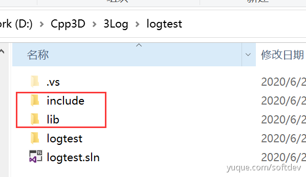
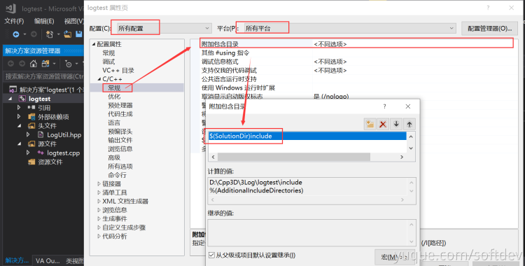
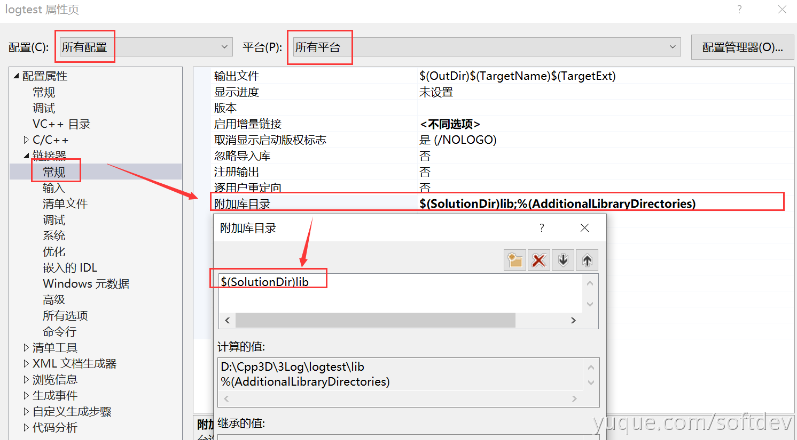
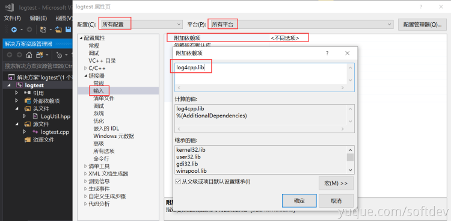

## 下载

1. [方式一：资源链接](https://nchc.dl.sourceforge.net/project/log4cpp/log4cpp-1.1.x%20%28new%29/log4cpp-1.1/log4cpp-1.1.3.tar.gz)
2. [方式二：官网](http://log4cpp.sourceforge.net/#download)

## 编译安装（windows）

1. 下载cmake（[下载地址](https://cmake.org/download)）
2. 解压压缩包，进入目录，创建build目录，运行cmake
```bash
C:\Users\geodoer>cmake --version
cmake version 3.17.1

CMake suite maintained and supported by Kitware (kitware.com/cmake).

C:\Users\geodoer>d:

D:\>cd D:\Cpp3D\3Log\log4cpp

D:\Cpp3D\3Log\log4cpp>mkdir build

D:\Cpp3D\3Log\log4cpp>cd build

D:\Cpp3D\3Log\log4cpp\build>cmake ../
-- Building for: Visual Studio 15 2017
-- Selecting Windows SDK version 10.0.17763.0 to target Windows 10.0.18363.
-- The C compiler identification is MSVC 19.16.27038.0
-- The CXX compiler identification is MSVC 19.16.27038.0
-- Check for working C compiler: C:/Program Files (x86)/Microsoft Visual Studio/2017/Community/VC/Tools/MSVC/14.16.27023/bin/Hostx86/x86/cl.exe
-- Check for working C compiler: C:/Program Files (x86)/Microsoft Visual Studio/2017/Community/VC/Tools/MSVC/14.16.27023/bin/Hostx86/x86/cl.exe - works
-- Detecting C compiler ABI info
-- Detecting C compiler ABI info - done
-- Detecting C compile features
-- Detecting C compile features - done
-- Check for working CXX compiler: C:/Program Files (x86)/Microsoft Visual Studio/2017/Community/VC/Tools/MSVC/14.16.27023/bin/Hostx86/x86/cl.exe
-- Check for working CXX compiler: C:/Program Files (x86)/Microsoft Visual Studio/2017/Community/VC/Tools/MSVC/14.16.27023/bin/Hostx86/x86/cl.exe - works
-- Detecting CXX compiler ABI info
-- Detecting CXX compiler ABI info - done
-- Detecting CXX compile features
-- Detecting CXX compile features - done
CMake Warning (dev) in CMakeLists.txt:
  No cmake_minimum_required command is present.  A line of code such as

    cmake_minimum_required(VERSION 3.17)

  should be added at the top of the file.  The version specified may be lower
  if you wish to support older CMake versions for this project.  For more
  information run "cmake --help-policy CMP0000".
This warning is for project developers.  Use -Wno-dev to suppress it.

-- Configuring done
-- Generating done
-- Build files have been written to: D:/Cpp3D/3Log/log4cpp/build
```

3. 用vs打开.sln文件，生成`ALL_BUILD`项目。此版本默认是debug、win32的

## 导入库
工程目录


1. 在工程目录下创建include文件夹，并把log4cpp\include\log4cpp整个文件夹复制进去
2. 在工程目录下创建lib文件夹，并把编译好的log4cpp.lib放进去（路径可查看编译时生成的结果）
3. 右键工程，添加头文件路径：`$(SolutionDir)include`



4. 添加lib路径：`$(SolutionDir)lib`



5. 添加lib文件名



## 配置文件log4cpp.conf
```python
#-------定义rootCategory的属性-------

#指定rootCategory的log优先级是ERROR，其Appenders有两个，分别是console,TESTAppender
log4cpp.rootCategory=DEBUG, console, TESTAppender

#-------定义console属性-------

#consoleAppender类型:控制台输出
#下面这三条语句表示控制台输出的log输出的布局按照指定的格式；输出格式是：[%p] %d{%H:%M:%S.%l} (%c): %m%n
log4cpp.appender.console=ConsoleAppender
log4cpp.appender.console.layout=PatternLayout
log4cpp.appender.console.layout.ConversionPattern=[%p] %d{%H:%M:%S.%l} (%c): %m%n

#-------定义TESTAppender的属性-------

#RollingFileAppender类型：输出到回卷文件，即文件到达某个大小的时候产生一个新的文件
#下面的语句表示文件输出到指定的log文件，输出的布局按照指定的格式，输出的格式是：[%d{%Y-%m-%d %H:%M:%S.%l} - %p] (%c): %m%n
log4cpp.appender.TESTAppender=RollingFileAppender

#当日志文件到达maxFileSize大小时，将会自动滚动
log4cpp.appender.TESTAppender.maxFileSize=1024000

#maxBackupIndex指定可以产生的滚动文件的最大数
log4cpp.appender.TESTAppender.maxBackupIndex=40

#fileName指定信息输出到logs/irismatch.log文件
log4cpp.appender.TESTAppender.fileName=/home/qilimi/log.log

#PatternLayout 表示可以灵活指定布局模式
log4cpp.appender.TESTAppender.layout=PatternLayout

#append=true 信息追加到上面指定的日志文件中，false表示将信息覆盖指定文件内容
log4cpp.appender.TESTAppender.append=true
log4cpp.appender.TESTAppender.layout.ConversionPattern=[%d{%Y-%m-%d %H:%M:%S.%l} - %p] (%c): %m%n
```
【ConversionPattern的参数含义】

| **符号** | **说明** |
| --- | --- |
| %c | 输出日志信息所属的类目，通常就是所在类的全名 |
| %d | 输出日志时间点的日期或时间，日期参照ANSI C函数的strftime<br/>示例：`%d{%Y-%m-%d %H:%M:%S.%l}`。输出：`2017-02-14 09:25:00.953` |
| %p | 优先级，即DEBUG,INFO等 |
| %m | 输出log的具体信息 |
| %n | 换行符，会根据平台的不同而不同，但对于用户透明 |
| %r | 自从layout被创建后的毫秒数 |
| %R | 从1970年1月1日0时开始到目前为止的秒数 |
| %u | 进程开始到目前为止的时钟周期数 |
| %x | NDC |

## Clog4Util日志工具类
Clog4Util.hpp文件：
```cpp
#pragma once

#include "log4cpp/Category.hh"
#include "log4cpp/Appender.hh"
#include "log4cpp/FileAppender.hh"
#include "log4cpp/OstreamAppender.hh"
#include "log4cpp/Layout.hh"
#include "log4cpp/BasicLayout.hh"
#include "log4cpp/Priority.hh"
#include "log4cpp/PropertyConfigurator.hh"

#include <string>

namespace LogUtil {

int init(const std::string& initfilename);
void close();

void debug(const std::string& tag, const std::string& msg);
void debug(const std::string& msg);

void info(const std::string& tag, const std::string& msg);
void info(const std::string& msg);

void error(const std::string& tag, const std::string& msg);
void error(const std::string& msg);
}

namespace LogUtil {

int init(const std::string& cfg_fp)
{
	try
	{
		log4cpp::PropertyConfigurator::configure(cfg_fp);
	}
	catch(log4cpp::ConfigureFailure&f)
	{
		std::cout << "Configure Problem " << f.what() << std::endl;//失败
		return -1;
	}

	return 0;
}

void close()
{
	try
	{
		log4cpp::Category::shutdown();
	}
	catch(...)
	{

	}
}

void debug(const std::string& tag, const std::string& msg)
{
	try
	{
		log4cpp::Category& t_debug = log4cpp::Category::getInstance(tag);
		t_debug.debug(msg);
	}
	catch(...)
	{

	}
}

void debug(const std::string& msg)
{
	try
	{
		log4cpp::Category& t_debug = log4cpp::Category::getInstance(std::string("Debug"));
		t_debug.debug(msg);
	}
	catch(...)
	{

	}
}

void info(const std::string& tag, const std::string& msg)
{
	try
	{
		log4cpp::Category& t_debug = log4cpp::Category::getInstance(tag);
		t_debug.info(msg);
	}
	catch(...)
	{

	}
}

void info(const std::string& msg)
{
	try
	{
		log4cpp::Category& t_info = log4cpp::Category::getInstance(std::string("Info"));
		t_info.info(msg);
	}
	catch(...)
	{

	}
}

void error(const std::string& tag, const std::string& msg)
{
	try
	{
		log4cpp::Category& t_debug = log4cpp::Category::getInstance(tag);
		t_debug.error(msg);
	}
	catch(...)
	{

	}
}

void error(const std::string& msg)
{
	try
	{
		log4cpp::Category& t_error = log4cpp::Category::getInstance(std::string("Error"));
		t_error.error(msg);
	}
	catch(...)
	{

	}
}
}
```

## 使用
```cpp
#include <stdio.h>

#include <ctype.h>
#include <signal.h>
#include <string.h>
#include <stdlib.h>
#include <errno.h>  
#include <thread>
#include <time.h>

#include "Clog4Util.h"

int main(int argc, char *argv[])
{
    if(argc < 2){
        printf("Usage: %s base exponent \n", argv[0]);
        return 1;
    }

    log4Util::Init(argv[1]);

    printf("test log4cpp\n");

    //存放日志信息
    char strLog_[1024] = { 0 };

    //建日志写到strLog_中
    sprintf(strLog_, "test error log， %s:%d.", __FILE__, __LINE__);

    //写入日志
    log4Util::Error(strLog_);

    //赋空
    memset(strLog_, 0, 1024);

    //建日志写到strLog_中
    sprintf(strLog_, "test error log， %s:%d.", __FILE__, __LINE__);

    //写入日志
    log4Util::Debug(strLog_);

    //赋空
    memset(strLog_, 0, 1024);

    //建日志写到strLog_中
    sprintf(strLog_, "test error log， %s:%d.", __FILE__, __LINE__);

    //写入日志
    log4Util::Info(strLog_);
	
    //赋空
    memset(strLog_, 0, 1024);

    //建日志写到strLog_中
    sprintf(strLog_, "test error log，tag:1 %s:%d.", __FILE__, __LINE__);

    //写入日志
    log4Util::Error("1", strLog_);

    //赋空
	memset(strLog_, 0, 1024);

    //建日志写到strLog_中
	sprintf(strLog_, "test error log，tag:2 %s:%d.", __FILE__, __LINE__);

    //写入日志
    log4Util::Debug("2", strLog_);

    //赋空
    memset(strLog_, 0, 1024);

    //建日志写到strLog_中
    sprintf(strLog_, "test error log，tag:3 %s:%d.", __FILE__, __LINE__);

    //写入日志
    log4Util::Info("3", strLog_);

	log4Util::close();
	
    return 0;
}
```

