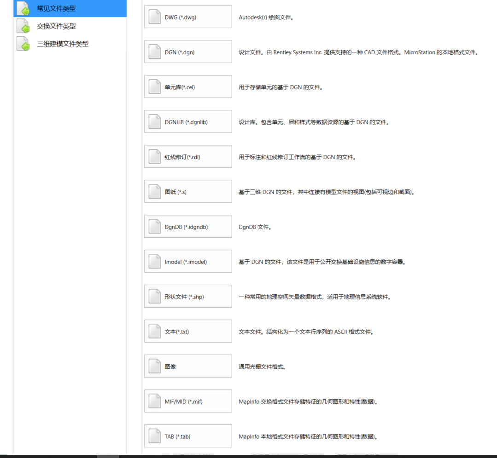
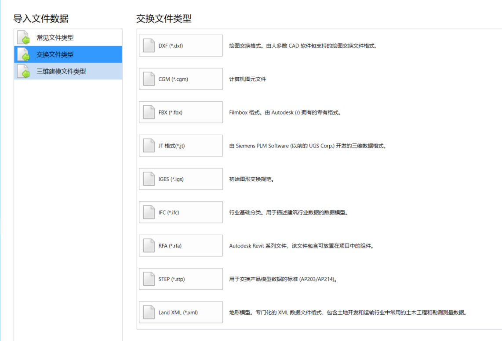
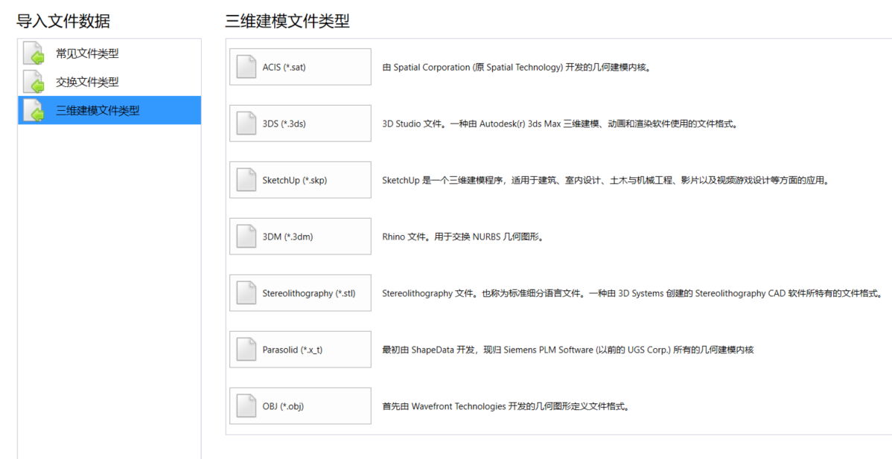
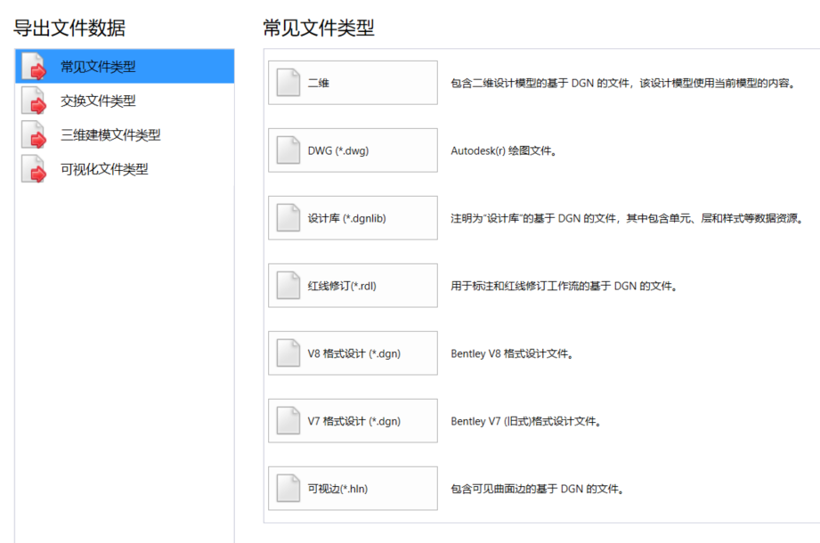
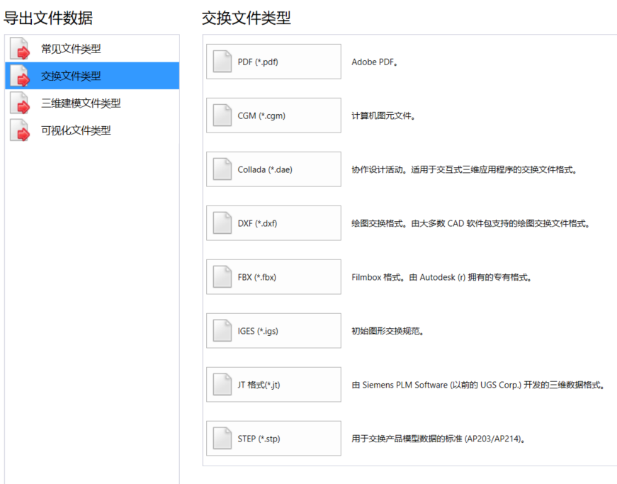
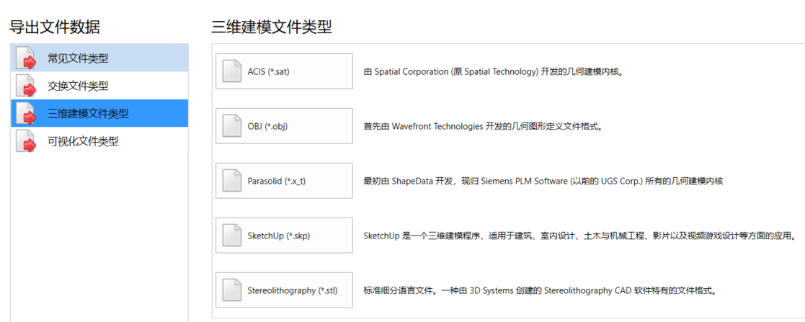
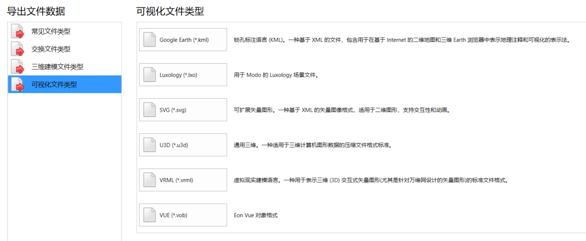

MicroStation是Bentley开发的CAD/BIM软件，支持很多格式。可以人工打开DGN格式，并导出成其他所支持的格式。

## 导入

## 导出

## 批转换工具
相关文档：[从系统命令行运行保存的批转换作业 (bentley.com)](https://docs.bentley.com/livecontent/web/microstation%20help-v23/zh-cn/GUID-D5CAEB8B-785B-C86F-DC1C-D81B36CD9344.html)

工具位置：文件 > 工具 > 批转换器

“批转换”所支持的“输出格式”：DGN V8、DGN V7、DWG、DXF、IGES、STEP、CGM、XMT、SAT、STL。

## 二次开发

MicroStation dotnet二次开发，可以无需下载SDK，链接软件安装目录下的dll即可。

相关资料

1. [MicroStation Wednesday视频分享](https://communities.bentley.com/communities/other_communities/chinafirst/w/chinawiki/54753/microstation-wednesday) 
2. [深入探讨MicroStation DGN基本概念系列](https://communities.bentley.com/communities/other_communities/chinafirst/w/chinawiki/54803/microstation-dgn)
3. [一步步学习MicroStation CE Addin开发](https://communities.bentley.com/communities/other_communities/chinafirst/w/chinawiki/57703/microstation-ce-addin)
4. [一步步学习MicroStation CE MDL开发](https://communities.bentley.com/communities/other_communities/chinafirst/w/chinawiki/57704/microstation-ce-mdl)