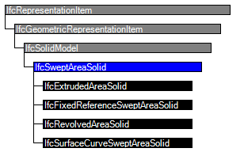
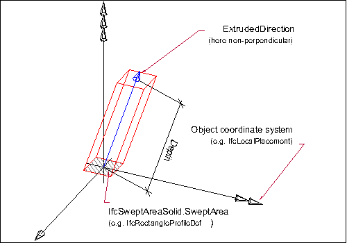

IFC在数据结构层面就定义了扫掠体，即IfcSweptAreaSolid。

## IfcExtrudedAreaSolid

## 示例
IfcPlusPlus官方示例： CreateWallAndWriteFile

## 参考文章

1.  [IfcExtrudedAreaSolid](https://www.cnblogs.com/herd/p/13579776.html)；[IfcExtrudedAreaSolid—Extruded solid](https://www.cnblogs.com/herd/p/13583843.html)
2.  [IfcSweptAreaSolid](https://www.cnblogs.com/herd/p/13572468.html)