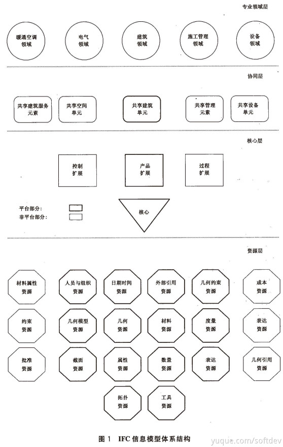

## IFC信息模型体系结构

IFC信息模型体系结构由四个概念层次组成

1.  资源层：提供资源类型，可被高层次的类型调用
2.  核心层：提供建筑工程核心数据模型，包括一个内核模块和几个核心扩展模块
3.  协同层：提供一系列模块，定义了跨多个专业领域或AEC工业领域的共同概念或对象
4.  专业领域层：它是IFC信息模型的最高层次，为特定AEC工业领域或应用类型定制一系列模块

### 资源层
资源层提供资源类的实体，为上层提供服务。具体包括：人员与组织、日期时间、几何、拓扑、几何模型、表达、几何约束、截面、材料、属性、数量、度量、外部引用与工具等。

| | 基本概念与设定 | 包含内容 |
| --- | --- | --- |
| 几何 | 几何模式定义几何表达资源。这个模式主要应用在形成产品模式的形状或几何的表达 |1. 用坐标值直接定义点 2. 定义方向、矢量和坐标轴 3. 定义变换操作 4. 定义参数曲线（包括子类型） 5. 定义二次曲线和基本曲面（包括子类型） 6. 由参数曲面定义的曲线 7. 定义扫掠曲面 8. 定义偏置曲线|
| 拓扑 | 拓扑模式定义用于拓扑表达的各种资源。这个资源的首要应用就是其在形状的边界表达或产品模型的几何形状 |1. 基本的拓扑实体定义，包括顶点、边和面，及其它们的特殊的子类型，这些子类型分别与几何中的点、曲线和面关联 2. 形成拓扑结构的基本实体集和，包括路径、环和壳，以及保证这些结构完整性的约束 3. 拓扑实体的方向 |
| 几何模型 | 几何模型模式定义用于几何模型表达的资源。这个资源的主要应用是为了表达产品模型的形状或几何外形 | 1. 三维实体对象的精确几何数据描述 2. 构造实体几何（CSG）模型 3. 半空间（简单CSG不在范围内）定义 4. 用扫掠操作（只有扫掠面实体）建立实体模型 5. 多种边界表达（BRep）模型（限制于小面片BRep） 6. 表面模型 7. 几何集 |
| 表达 | 表达模式为IFC信息模型中定义的产品提供作为重要定义属性的形状和拓扑表达定义 这些表达刻画产品的某些属性，而且可以为任何产品定义0、1或更多这样的属性 | 本模式定义两种表达产品定义属性的方法 1. 拓扑表达 2. 几何形状表达（IfcGeometricRepresentationContext 几何形状表达允许 1. 一个产品的同一产品定义形状的多个形状表达 2. 用形状外表分离产品定义形状的部件或部分的形状表达 |
| 几何约束 | 几何约束模式定义用于决定在工程的几何表达环境中的产品形状表达的位置的资源。它也约束分配给产品连接定义的资源定义，决定那些产品之间的几何连接约束 | 主要将这个资源应用到 1. 决定用于对象形状表达的对象坐标 2. 决定应用到对象两个形状之间连接的约束 |
| 界面 | 截面模式定义用于定义几何形状表达的二维截面或横截面 | 截面定义应用于：扫掠面、扫掠区域实体、脊线 |