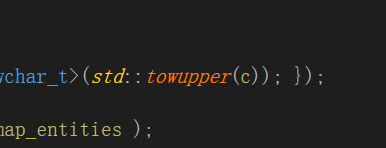

## VS19
直接编译即可

## VS17
s17编译不通过，涉及到一些C++17最新的用法

把toupper改成towupper



## ubuntu

1.  将代码上传到ubuntu上：ifcplusplus-1.1.tar.gz
2.  修改cmake，默认不编译例子
```
option(BUILD_CONSOLE_APPLICATION "Build an example CLI application" OFF)
option(BUILD_VIEWER_APPLICATION "Build the viewer example application" OFF)
```
3.  修改源码，注释ifcsite位置归0
4.  添加源代码中的earcut.hpp到安装include目录
```
cmake -G "Unix Makefiles" -DCMAKE_INSTALL_PREFIX=/home/cm/codes/Tools/3rdlib_linux/IfcPlusPlus -DCMAKE_BUILD_TYPE=Release ../
make
make install
```

### 警告

1.  编译时会警告：warning: 'template<class> class std::auto_ptr' is deprecated [-Wdeprecated-declarations]。说明 auto_ptr 已经过时了。
2. warning: ignoring return value of ‘int wctomb(char*, wchar_t)’