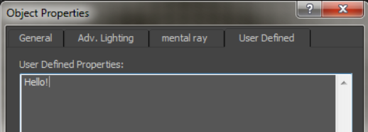

## 管理属性
```cpp
FbxProperty p = FbxProperty::Create(pScene, DTDouble3, "Vector3Property");
//可以FbxProperty::GetName()来访问创建FbxProperty的名称
//通过调用根属性上的FbxProperty::destroyrecur()来销毁FbxProperty的层次结构。

//使用以上类型传递给
FbxSet<FbxDouble3>(p, FbxDouble3(1.1, 2.2, 3.3));
```

## 访问属性
访问节点的属性

```cpp
//初始化FbxNode* lNode ...
//分别调用FbxProperty::set()和FbxProperty::Get()来设置和访问的数据
FbxDouble3 translation = lNode->LclTranslation.Get();
FbxDouble3 rotation = lNode->LclRotation.Get();
FbxDouble3 scaling = lNode->LclScaling.Get();
```

访问节点的属性结构：由于属性也可以是树状结构，所以访问属性的实质也是访问遍历树。

访问属性的结构有好几种方式

1. 搜索：`FbxObject::FindProperty()`
2. 迭代器：`FbxObject::GetFirstProperty()`和`FbxObject::GetNextProperty()`
3. 自行遍历树结构（可以通过以下导航函数来完成遍历）
   1. `FbxProperty::GetParent()`
   2. `FbxProperty::GetChild()`
   3. `FbxProperty::GetSibling()`
   4. `FbxProperty::Find()`

## 属性还可以包含一组`FbxPropertyFlags::eFbxPropertyFlags`
可以使用`FbxProperty::GetFlag()`和`FbxProperty::ModifyFlag()`进行操作

## 属性比较与赋值
FbxProperty重载了比较和赋值运算符

1. `FbxProperty::operator==()`
2. `FbxProperty::operator::operator!=()`
3. `FbxProperty::operator=()`

## 示例：创建自己的FbxProperty，并绑定到FbxObjectMetaData中

```cpp
//FbxScene* pScene ....; 创建一个场景

//在pScene中创建一个FbxObjectMetaData*对象。
FbxObjectMetaData* lFamilyMetaData = FbxObjectMetaData::Create(pScene, "Family");

//创建自定义的属性，并绑定到FbxObjectMetaData中
//1. 第一个参数，属性的父节点
//2. 第二个参数，数据类型，有DTString、DTFloat、DTDouble
//3. 第三个参数：属性名
//4. 第四个参数：可选的标签字符串，可以通过FbxProperty::GetLabel()和FbxProperty::SetLabel()方法获得与修改
//5. 可以通过FbxProperty::Set()设置属性值
FbxProperty::Create(lFamilyMetaData, DTString, "Level","Level").Set(FbxString("Family")); // String
FbxProperty::Create(lFamilyMetaData, DTString, "Type", "Type").Set(FbxString("Wall"));     // String
FbxProperty::Create(lFamilyMetaData, DTFloat, "Width", "Width").Set(10.0f);              // float
FbxProperty::Create(lFamilyMetaData, DTDouble, "Weight", "Weight").Set(25.0);            // double
FbxProperty::Create(lFamilyMetaData, DTDouble, "Cost", "Cost").Set(1.25);                // double
```

## 自定义属性
FbxProperty也是一个树节点，因此它也可以具有很多子节点。可以连接FbxObject或FbxProperty。

补：例子SDK>samples>ExportScene05说明了属性层次结构的构造

```cpp
#define PROPERTY "attribute_name"
FbxMesh* pMesh = (FbxMesh*)pFbxChildNode->GetNodeAttribute();
FbxProperty p = pFbxChildNode->FindProperty(PROPERTY, false);
if (p.IsValid())
{
    std::string nodeName = p.GetName();
    
    std::cout << "found property: " << nodeName <<std::endl;
}
```

## 3ds max的User Defined字段
3ds max里查看：选择一个模型 > 编辑 > 对象属性 > 用户定义



```cpp
//用户定义的属性存储在“ UDP3DSMAX” FBX属性中。
FbxProperty p = m_node->FindProperty("UDP3DSMAX");

if (p.IsValid())
    FbxString str = p.Get<FbxString>();
```