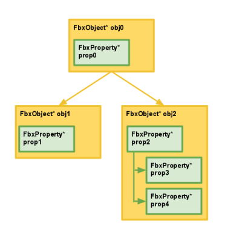

Visualizing connections可视化的连接，连接是一个FBX SDK数据结构，它管理FBX对象和FBX属性之间的双向关系。

## 连接的类型
为了保证FBX SDK内连接的一致性，实际的数据结构不会公开。相反，可以使用FbxObject和FbxProperty连接管理方法来操作连接，如：`FbxObject::ConnectSrcObject()`、`FbxObject::ConnectDstObject()`、`FbxProperty::ConnectDstObject()`、`FbxProperty::ConnectSrcProperty()`等。

FBX对象和属性关系可分为

|  关系  |  说明  |  方法 |
| --- | --- | --- |
| 对象-属性连接 | 属性作为源包含在对象中 | 1. FbxObject::GetSrcProperty()：将在给定的索引处返回对象的源属性<br/>2. FbxProperty::GetDstObject()：将返回属性的目标对象 |
| 对象-对象连接 | 对象之间的父子关系使用连接(例如:场景的节点层次结构)， | 1. 通常，对象的子对象是源，可以使用FbxObject::GetSrcObject()访问<br/>2. 对象的父对象是一个目的地，使用FbxObject::GetDstObject()访问它|
| 属性-属性连接 | 属性之间的父子关系也使用连接(例如:fbxiosetings的属性层次结构) | 1. 通常，属性的子元素是源，可以使用FbxProperty::GetSrcProperty()来访问<br/>2. 属性的父级被引用为目标，并使用FbxProperty::GetDstProperty()来访问|

注释：

1. 子节点是父节点的源对象（Src）
2. 父节点是子节点的目标对象（Dst）

## 示例



### 访问`obj0`的源对象
```cpp
//……假设obj0已经被初始化，以反映上面的关系图…
//为了便于说明，计算连接到obj0的源对象的数量。
int numSrcObjects = obj0->GetSrcObjectCount(); 
// numSrcObjects = 2

//访问连接到obj0的两个源对象
//注意，obj0->GetSrcObject(0)等价于调用obj0->GetSrcObject()
FbxObject* obj1 = obj0->GetSrcObject(0);
FbxObject* obj2 = obj0->GetSrcObject(1);
```

### 访问`obj0`的源属性
```cpp
//……假设obj0已经被初始化，以反映上面的关系图…
FbxProperty* prop0 = obj0->GetSrcProperty();
```

### 访问`obj1`的目标对象
```cpp
//……假设obj1已经被初始化，以反映上面的关系图…
FbxObject* obj0 = obj1->GetDstObject();
```

### 以特别的方式从`obj2`开始遍历树状结构
```cpp
//……假设obj2已经被初始化，以反映上面的关系图…
//使用obj2访问prop2。
FbxProperty* prop2 = obj2->GetSrcProperty();

//为了说明，计算prop2的源属性的数量。
int numSrcProperties = prop2->GetSrcPropertyCount(); // numSrcProperties = 2

//访问prop3和prop4，这是关于prop2的来源，
//分别以0和1为索引。
FbxProperty* prop3 = prop2->GetSrcProperty(0);
FbxProperty* prop4 = prop2->GetSrcProperty(1);

//使用obj2访问obj0。
FbxObject* obj0 = obj2->GetDstObject();

//使用obj0访问prop0。
FbxProperty* prop0 = obj0->GetSrcProperty();

//使用obj0访问obj1。
//这里，我们假设obj1的索引位置是0，而obj2的索引位置是1。
FbxObject* obj1 = obj0->GetSrcObject(0);

//使用obj1访问prop1。
FbxProperty* prop1 = obj1->GetSrcProperty();
```

## 连接对象和属性
