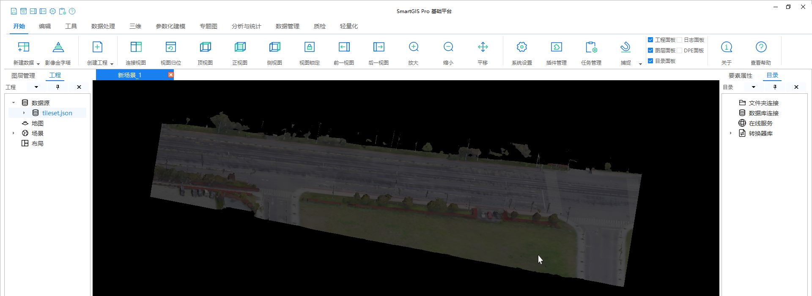
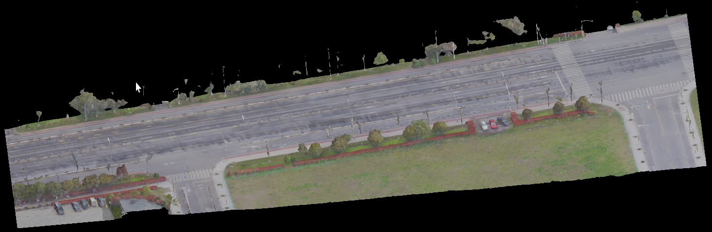

在加载3dtiles时，用tinygltf解析b3dm中的glb缓冲区，加载出来的倾斜非常暗。



原因：tinygltf材质中，金属度的默认值为1（详情请查阅pbr材质相关文档）

- 金属度是没有漫反射的，光线进入物体之后会被迅速吸收，因此baseColor实际会乘一个逆金属度，即`color = baseColor * (1-metallicFactor)`
- 而tinygltf材质的默认金属度为1，因此`color=0`。又因有其他项，所以整体来说，渲染结果很暗，并不会完全黑

```cpp
//File: tiny_gltf.h
// pbrMetallicRoughness class defined in glTF 2.0 spec.
struct PbrMetallicRoughness {
  std::vector<double> baseColorFactor;  // len = 4. default [1,1,1,1]
  TextureInfo baseColorTexture;
  double metallicFactor;   // default 1
  double roughnessFactor;  // default 1
  TextureInfo metallicRoughnessTexture;

  Value extras;
  ExtensionMap extensions;

  // Filled when SetStoreOriginalJSONForExtrasAndExtensions is enabled.
  std::string extras_json_string;
  std::string extensions_json_string;

  PbrMetallicRoughness()
      : baseColorFactor(std::vector<double>{1.0, 1.0, 1.0, 1.0}),
        metallicFactor(1.0),
        roughnessFactor(1.0) {}
  DEFAULT_METHODS(PbrMetallicRoughness)
  bool operator==(const PbrMetallicRoughness &) const;
};
```

将它的默认值改为0即可

```cpp
// pbrMetallicRoughness class defined in glTF 2.0 spec.
struct PbrMetallicRoughness {
  double metallicFactor;   // default 0

  PbrMetallicRoughness()
      : baseColorFactor(std::vector<double>{1.0, 1.0, 1.0, 1.0}),
        metallicFactor(0.0),
        roughnessFactor(1.0) {}
};
```

更改后的效果



