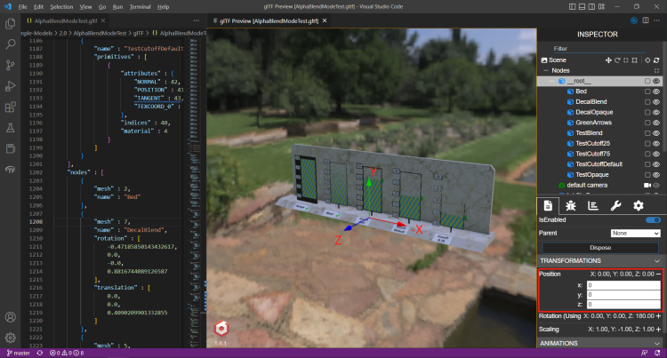
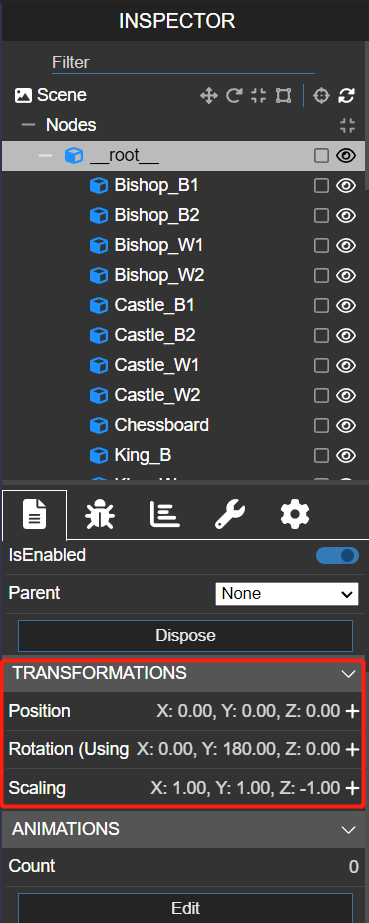

gltf的模型坐标系是Y轴向上的，因此它的坐标、矩阵都是基于此坐标系下的。  
在根节点上加上一个旋转矩阵（绕X轴旋转90°即可），将模型坐标系对标到世界坐标系上（Z轴朝上）

> Next, for consistency with the _z_-up coordinate system of 3D Tiles, glTFs must be transformed from _y_-up to _z_-up at runtime. This is done by rotating the model about the _x_-axis by π/2 radians. Equivalently, apply the following matrix transform (shown here as row-major):

y-up转z-up的矩阵（行优先存储）
```json
[
1.0, 0.0,  0.0, 0.0,
0.0, 0.0, -1.0, 0.0,
0.0, 1.0,  0.0, 0.0,
0.0, 0.0,  0.0, 1.0
]
```

y-up转z-up的矩阵（列优先存储）
```json
[
1.0,  0.0,  0.0, 0.0,
0.0,  0.0,  1.0, 0.0,
0.0, -1.0,  0.0, 0.0,
0.0,  0.0,  0.0, 1.0
]
```

参考链接： https://github.com/CesiumGS/3d-tiles/tree/main/specification#y-up-to-z-up


## 附：查看glTF坐标系的方法
查看方法：VSCode Gltf Tool工具 > 打开gltf文件 > alt+G打开预览 > 调整Position的XYZ即可发现XYZ

  根节点的局部坐标系


每个根节点的偏移矩阵（根节点 -> 场景的偏移矩阵）

- 绕Y轴旋转180°
- Z sclae -1



## 参考文章
1. [Cesium中gltf模型的坐标系](https://blog.csdn.net/u011575168/article/details/124016666)