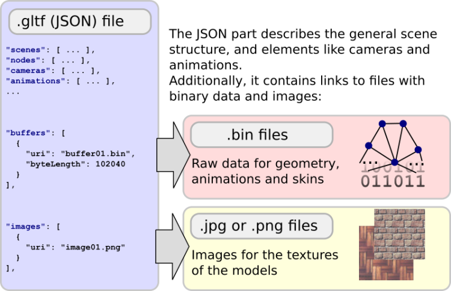
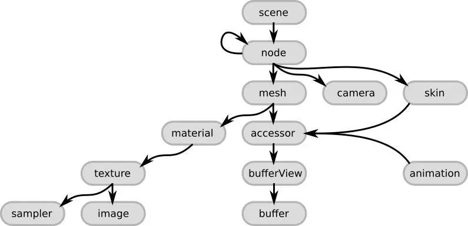

glTF格式有两种保存方式，一个是ASCII，一个是binary

1. ASCII的glTF，后缀名为`gltf`，由两种文件构成
   1. glTF的JSON文件
   2. 外部二进制文件（顶点、图片）
2. binary的glTF，后缀名为`glb`，所有内容都合并的存储在一个glb文件中



### JSON文件结构
glTF的核心文件是一个JSON文件，此文件描述了整个3D场景的内容，包括描述场景结构的场景图。

1. 场景中的3D对象通过场景结点引用网格进行定义
2. 材质定义了3D对象的外观
3. 动画定义了3D对象的变换操作（比如选择、平移操作）
4. 蒙皮定义了3D对象如何进行骨骼变换
5. 相机定义了渲染程序中视锥体

#### 文件简介
场景对象以数组的形式存储在此JSON文件中，可以通过对应的数组来索引访问
```json
//定义了多个网格对象
"meshes" : 
[
    { ... }
    { ... }
    ...
],
```
数组索引也会被用来定义对象之间的关系
```json
"nodes": //场景结点
[
    { "mesh": 0, ... }, //通过网格索引引用真正的网格对象
    { "mesh": 5, ... },
    ...
}
```

#### 顶级元素


- [scene](https://link.zhihu.com/?target=https%3A//github.com/KhronosGroup/glTF/tree/master/specification/2.0/%23reference-scene)：glTF格式的场景结构描述条目。它通过引用node来定义场景图。
- [node](https://link.zhihu.com/?target=https%3A//github.com/KhronosGroup/glTF/tree/master/specification/2.0/%23reference-node)：场景图中的一个结点。它可以包含一个变换(比如旋转或平移)，引用更多的子结点。它可以引用网格和相机，以及描述网格变换的蒙皮。
- [camera](https://link.zhihu.com/?target=https%3A//github.com/KhronosGroup/glTF/tree/master/specification/2.0/%23reference-camera)：定义了用于渲染场景的视锥体配置。
- [mesh](https://link.zhihu.com/?target=https%3A//github.com/KhronosGroup/glTF/tree/master/specification/2.0/%23reference-mesh)：描述了场景中出现的3D对象的网格数据。它引用的accessor对象可以用来访问真实的几何数据。它引用的material对象定义了3D对象的外观。
- [skin](https://link.zhihu.com/?target=https%3A//github.com/KhronosGroup/glTF/tree/master/specification/2.0/%23reference-skin)：定义了用于蒙皮的参数，参数的值通过一个accessor对象获得。
- [animation](https://link.zhihu.com/?target=https%3A//github.com/KhronosGroup/glTF/tree/master/specification/2.0/%23reference-animation)：描述了一些结点如何随时间进行变换(比如旋转或平移)。
- [accessor](https://link.zhihu.com/?target=https%3A//github.com/KhronosGroup/glTF/tree/master/specification/2.0/%23reference-accessor)：一个访问任意数据的抽象数据源。被mesh、skin和animation元素使用来提供几何数据，蒙皮参数和基于时间的动画值。它通过引用一个bufferView对象，来引用实际的二进制数据。
- [material](https://link.zhihu.com/?target=https%3A//github.com/KhronosGroup/glTF/tree/master/specification/2.0/%23reference-material)：包含了定义3D对象外观的参数。它通常引用了用于3D对象渲染的texture对象。
- [texture](https://link.zhihu.com/?target=https%3A//github.com/KhronosGroup/glTF/tree/master/specification/2.0/%23reference-texture)：定义了一个sampler对象和一个image对象。sampler对象定义了image对象在3D对象上的张贴方式。

### 引用外部数据
二进制数据通常以文件的形式存储在外部，在JSON文件中，通过链接进行挂接

- 这些二进制数据比如3D对象的几何数据、纹理数据等等
- 这使得几何、纹理等数据，可以以非常紧凑的形式进行存储，也方便网络传输，并且可以直接被渲染程序使用，无需额外的解码、预处理

#### 读取和管理外部数据
读取和处理glTF格式文件从分析JSON结构开始

1. 分析JSON文件之后，就可以使用buffers和images数组来访问对应的buffer、image对象
2. 每个buffer和image对象引用了一块二进制数据

通常会将二进制数据读取到内存中，以它们在buffers和images数组中的索引顺序进行存储，以便使用相同的索引来访问对象所对应的二进制数据

#### buffers中的二进制数据
一个buffer包含了一个指向二进制数据的URI
```json
"buffer01": {
    "byteLength": 12352,
    "type": "arraybuffer",
    "uri": "buffer01.bin"
}
```
二进制数据本质上是一个从buffer对象的URI处读取到的内存块，没有任何层次和结构信息。

#### images中的图像数据
一个image对象可以引用一个外部图像文件来作为要渲染的3D对象纹理
```json
"image01": {
    "uri": "image01.png"
}
```

### 数据URI中的二进制数据
通常，buffer和image对象的uri指向了一个包含实际数据的文件，但也可以直接在uri中通过数据URI直接包含数据


### 参考文章

1. [The Basic Structure of glTF](https://link.zhihu.com/?target=https%3A//github.com/KhronosGroup/glTF-Tutorials/blob/master/gltfTutorial/gltfTutorial_002_BasicGltfStructure.md)；[中文翻译](https://zhuanlan.zhihu.com/p/65265611)
