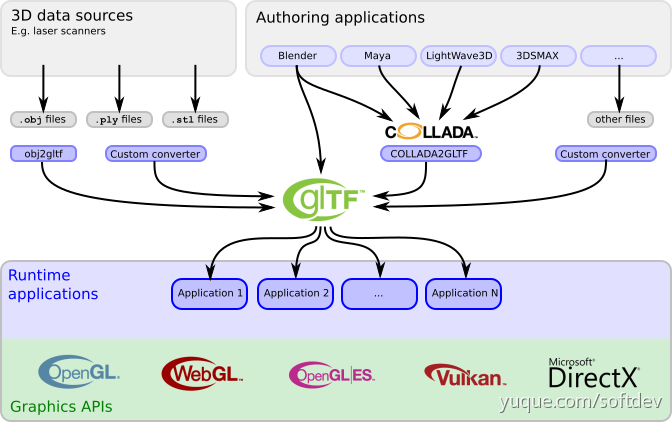

## 相关链接

| 类型 | 资源 | 说明 |
| - | - | -|
| glTF官方网站 | [Github仓库](https://github.com/KhronosGroup/glTF)  | |
| glTF标准书| [Github仓库中的标准书](https://github.com/KhronosGroup/glTF/blob/main/specification/2.0/Specification.adoc)；[gltf2.0标准书文档](https://registry.khronos.org/glTF/specs/2.0/glTF-2.0.html) |
| glTF教程 | 1. [Github仓库中的教程](https://github.com/KhronosGroup/glTF-Tutorials)；[glTF教程（中文翻译）](https://zhuanlan.zhihu.com/p/65264050)
| glTF模型 | [官方文件示例](https://github.com/KhronosGroup/glTF-Sample-Models) | |
| glTF渲染器 | 1. [OpenGL 4.5渲染glTF（包含pbr）](https://github.com/Snowapril/gl_shaded_gltfscene) 2. [Vulkan渲染glTF（包含pbr）](https://github.com/SaschaWillems/Vulkan-glTF-PBR) | |

## 引言

> 摘自：[3dTiles 数据规范详解](https://zhuanlan.zhihu.com/p/148312375)

在WebGL（包括所有GPU图形渲染编程）的眼里，它只认识：顶点、顶点颜色、顶点法线、着色语言……

所以，三维图形界的通用格式：glTF应运而生。glTF面向终点（数据的最终都是渲染与展示），它直接按照图形编程所需的格式来存储数据，借以二进制编码提高传输速度。

-   它不再使用 **面向对象的思维** 存储三维模型、贴图纹理，而是按 **显卡的思维存储** 。存的是顶点、法线、顶点颜色等最基础的信息，只不过 **组织结构上进行了精心的设计** 。
-   它面向终点，就意味着可编辑性差，因为渲染性能的提高牺牲了可编辑性，它不再像3ds、dae甚至是max、skp一样容易编辑和转换。

而且，大多数三维软件提供了glTF格式的转换，或多一步，或一步到位。

## 背景

1. 如今已经存在的3D格式：有一些没有包含场景信息；有一些虽然包含了场景信息，但这些场景信息只适用于某些特定软件。因此，许多时候，我们都需要对几何数据进行预处理之后，才能进行渲染
2. 现存的3D数据格式不方便在网上传输，以及直接进行高效渲染

## 目标

glTF，Graphics Language Transmission Formator，图形语言传输格式。由Khronos 3D标准组织创建与管理。

glTF格式是开放的3D模型和场景格式，旨在为3D数据格式提供一个统一的标准，以有效地传输丰富的场景3D数据，与方便应用程序的读取与渲染。

glTF的目标是作为一个中转格式，而不是一个新的3D格式。

- 使用JSON来描述场景结构，可以方便地被应用程序分析处理
- 3D数据以一种可以被大多数图形API直接使用的方式进行存储，不需要应用程序进行解码或预处理操作

## 特点

- 数据块连续存储
- 提供视图、访问器的概念
- 逻辑层与数据层分离
- 逻辑层用JSON保存

## 优点

易于读写

快速高效

直接读取游戏引擎

来自标准组的指导

丰富的场景数据

增强现实

  

## 缺点

不可编辑的3D模型

无着色器网络

非向后兼容扩展

  

## 当前的应用情况

1. 目前已经有一些3D内容创建软件可以将3D场景以glTF的格式进行存储
2. 一些应用程序也可以直接进行glTF场景数据的渲染

1. 几乎所有的3D内容创作软件都支持将场景导出到COLLADA格式，所以可以用此格式作为中转

## 参考链接

1. [BIM轻量化之路（二）-revit导出GLTF](https://blog.csdn.net/nihaozhe/article/details/108752926)
2. [glTF vs FBX: 应该使用哪种格式?](https://www.threekit.com/blog/gltf-vs-fbx-which-format-should-i-use)；[中文翻译](https://www.zhihu.com/search?type=content&q=gltf%E8%AF%BB%E5%86%99)