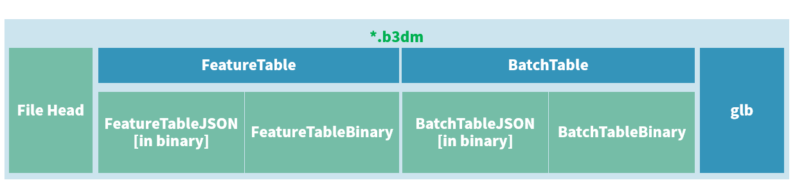
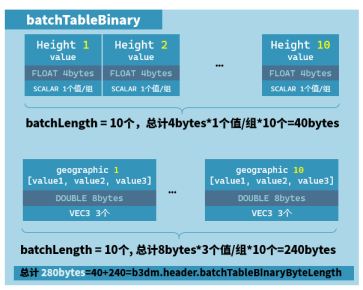

> 原文链接：
> 1. [3dTiles 数据规范详解[4.1] b3dm瓦片二进制数据文件结构](https://www.cnblogs.com/onsummer/p/13252896.html)


b3dm，batched 3d model，成批量的三维模型，它是3dtiles中瓦片的一种（还有i3dm、pnts、cmpt）。

- 在b3dm，一个模型称之为`batch`，等价于要素表中的`Feature`，batch概念引申自图形编程，意思是“一次性向图形处理器（GPU）发送的数据”，即批次
- 一个 b3dm 瓦片有多少个 batch（有多少个要素），是由要素表的 JSON 表头中的 BATCH_LENGTH 属性记录

# b3dm文件结构
b3dm是一个二进制文件，其文件结构如图所示。



在3dtiles的眼中，模型称之为一个Feature，或Batch

- FeatureTable要素表，存储的是模型**渲染相关**的信息
- BatchTable批量表，存储的是模型**属性相关**的信息
- 而模型实际的几何信息，通过glTF格式**存储在glb块**中，它会被客户端直接丢到GPU中进行渲染

注：

1. 如果glb模型并不需要属性数据，即要素表`FeatureTableBinary`和批量表`BatchTableBinary`有可能是空表

## 文件头
文件头一共占28字节。

| 属性的官方名称 | 字节长 | 类型 | 含义 |
| --- | --- | --- | --- |
| magic | 4 | string（或char[4]） | 该瓦片文件的类型，在b3dm中是 "b3dm" |
| version | 4 | uint32 | 该瓦片的版本，目前限定是 1. |
| byteLength | 4 | uint32 | 该瓦片文件的文件大小，单位：byte |
| featureTableJSONByteLength | 4 | uint32 | 要素表的JSON文本（二进制形式）长度 |
| featureTableBinaryByteLength | 4 | uint32 | 要素表的二进制数据长度 |
| batchTableJSONByteLength | 4 | uint32 | 批量表的JSON文本（二进制形式）长度 |
| batchTableBinaryByteLength | 4 | uint32 | 批量表的二进制数据长度 |

- 其中：`byteLength = 28 + featureTableJSONByteLength + featureTableBinaryByteLength + batchTableJSONByteLength + batchTableBinaryByteLength + glb的字节长度`

## 要素表（渲染相关信息）
要素表记录了整个瓦片**渲染相关的数据**，而不是渲染所需的数据（渲染所需数据在`glb`，比如点、面索引、法向量等）

- b3dm的要素表中存储了**全局属性**与**要素属性**
- 要素表使用JSON格式来组织，并使用二进制来存储（未使用明文存储）
- 如果某些数据的数据量很大，则可以考虑存储成二进制数据包，保存在FeatureTableBinary块中，在FeatureTableJson中使用外链的方式引用到JSON中

> 可以看出，这符合3dtiles的设计思想，tileset.json也是如此。
> 与tileset.json不同的是，要素表使用bypeOffset来引用二进制块，而tileset.json通过uri来引用二进制块


### 内容
要素表包含全局属性、要素属性等内容。

#### 全局属性
在b3dm，要素表有以下全局属性：

| 属性名 | 属性数据类型 | 属性描述 | 是否必须存在 |
| --- | --- | --- | --- |
| BATCH_LENGTH | uint32 | 当前瓦片文件内三维模型（BATCH、要素）的个数 | yes |
| RTC_CENTER | float32[3] | 如果模型的坐标是相对坐标，那么相对坐标的中心即此 | no |

- 如果glb模型并不需要属性数据，即要素表和批量表有可能是空表，那么`BATCH_LENGTH`的值应设为 0。

#### 要素属性
因要素属性是指渲染相关的属性。而b3dm没有要素属性，因为与渲染相关的属性，都存储在了glb当中。
但在i3dm、pnts这两种瓦片当中，要素属性就非常多。

### 结构
要素表包含FeatureTableJson与FeatureTableBinary两个数据块。

#### FeatureTableJson
FeatureTable采用JSON格式组织，使用二进制来存储。

例如，这是从一个b3dm文件中解析出来的FeatureTableJson

- 说明此b3dm瓦片有4个模型（4个要素、或4个BATCH），这4个`batchId`为0、1、2、3
```json
{
  "BATCH_LENGTH": 4
}
```

#### FeatureTableBinary
FeatureTableBinary要素表的二进制数据。
如果FeatureTableJson中某些数据的数据量过大，可用二进制来存储。在JSON中通过外链的方式挂接。

但在b3dm瓦片中，没有FeatureTableBinary。因为`BATCH_LENGTH`和`RTC_CENTER`数据量都不大。
但在i3dm和pnts类别的瓦片中，要素表就具有大量的FeatureTableBinary，其FeatureTableJson也会引用大量的二进制体。

## 批量表（属性信息）
批量表记录的是每个模型的属性信息，以及扩展数据。

与要素表的管理方式相同，批量表以JSON格式进行组织，并以二进制的形式存储（未使用明文来存储）。
而要素表JSON中过于庞大的数据将存储在`BatchTableBinary`块中，在JSON中以外链的形式引用进来。

要素表与批量表的唯一联系是`BATCH_LENGTH`。要素表中记录了有多少个模型，那么批量表每个属性就有多少个值。

- 在i3dm中叫`INSTANCE_LENGTH`
- 在pnts中叫`POINTS_LENGTH`

### BatchTableJson
这是一份b3dm的明文BatchTableJson（已从二进制中解析出来）

- 其中有两个属性`height`与`geographic`，按字面理解，即模型的高度值与地理坐标值
```json
{
  "height" : {
    "byteOffset" : 0,						//属性值在BatchTableBinary开头的地方（即0-39）
    "componentType" : "FLOAT",	//属性值类型为float
    "type" : "SCALAR"						//属性的元素类型为SCALAR
  },   
  "geographic" : {
    "byteOffset" : 40,					//属性值在BatchTableBinary+40的地方（即40-尾）
    "componentType" : "DOUBLE",	//属性值类型为double
    "type" : "VEC3"							//属性的元素类型为vec3
  },
}
```
属性值是以二进制块的形式存储在`BatchTableBinary`区域当中。所以每个属性都具有一个`byteOffset`信息，来标识此属性的属性值在二进制块的哪个字节开始存储。

### BatchTableBinary
BatchTableBinary存储着属性值，每个属性值是按顺序存储的。

查看本数据的FeatureTableJson，可知`BATCH_LENGTH`值为10，这说明此b3dm瓦片有10个模型。

- 对于`height`属性，其属性类型为标量，其值类型为float，一共有10个模型，那么`height`属性值就占40个byte
- 而`geographic`属性的总长=`componentType大小` * `BATCH_LENGTH` * `type的个数` = 8byte * 10 * 3 = 240byte



因此，这份数据的BatchTableBinary的二进制大小为280byte。即`batchTableBinaryByteLength`=280，`batchTableBinaryByteLength`其实在文件头中也有存储。

BatchTableBinary不是必须的，你完全可以不需要BatchTableBinary，而把所有的属性值都写在`BatchTableJson`当中，但JSON格式比按顺序存储来说，更浪费内存空间，因为JSON格式有诸如`[]`、`:`、`""`等描述符。
而考虑到3dtiles的网络传输，故3dtiles设计如此。

但对于类型是`object`、`string`、`bool`类型，则必须存储于JSON中，因为二进制只能存标量、234维向量的数字数据。

## 内嵌的glb
b3dm将模型几何相关的数据打包存储为了glTF格式，因glTF是面向GPU设计的数据格式，它可以直接提供给GPU进行渲染。因此，3dtiles采用了glTF格式。

# 字节对齐与编码端序
## JSON尾巴8字节对齐
FeatureTableJSON、BatchTableJSON的二进制块，最后一个字节相对于整个b3dm文件来说，**偏移量必须是8的倍数。**如果不够，必须用二进制空格（`0x20`）填够

-  因文件头一定是28byte，则`28 + FeatureTableJson的长度`一定要能整除8。`28 + FeatureTableJson的长度 + BatchTableJson的长度`也一定要能被8整除。

为什么`FeatureTableJSON`的起始偏移量不要求是8byte对齐

- 因为`FeatureTableJSON`之前有一个文件头，其空间一定是28byte。如果要8byte对齐，就还要填充4byte，那么每份文件都会浪费4byte

相关文章：

1. [FeatureTable的padding](https://github.com/CesiumGS/3d-tiles/blob/main/specification/TileFormats/FeatureTable/README.md#padding)

## 数据体头尾8字节对齐
例如上面的例子中，`height`属性值的二进制块、`geographic`属性值的二进制块都可称为**数据体**。

FeatureTableBinary、BatchTableBinary中的数据体首位必须是8对齐，如果不够，可以用任意空白字节填充。

- 首个字节相对于b3dm文件的字节偏移量（头），必须是8的倍数；
- 结束字节的字节偏移量（尾），也必须是8的倍数

比如上面的例子，`height`属性值的二进制块首位必须是8字节对齐；`geographic`属性值的二进制块也必须是8字节对齐

1. `height`属性是在`BatchTableJson`之后，而`BatchTableJson`的末尾是要求8byte对齐的，所以`height`的开头肯定是满足8byte对齐的。而`height`属性值二进制大小是40，40/8=5，所以末尾是8字节对齐
2. 但是假设`height`的类型是标量，其属性值类型是`byte`，一共有10个模型，那么`height`属性值二进制块的大小是10。假设`BatchTalbeJson`的大小为800。那下一个属性（`geographic`）的起始位置为810，此时不是8对齐，那就要在`height`属性值二进制块后填充任意8个字节，凑齐816

## 编码端序
要素表、批量表的二进制数据，无论是JSON还是数据体，均使用**小端序编码（LittleEndian）**。

endian字节存放次序。比如字节0111有两种存放方式：0111和1110。

- LITTLE-ENDIAN（小字节序、低字节序），即**低位字节**排放在内存的**低地址端**，**高位字节**排放在内存的**高地址端**
- BIG-ENDIAN（大字节序、高字节序）则相反

总之，低字节序低在低，高在高；高字节序高在低，低在高。

不同语言、不同场景，编码端序会不同

- C与平台有关，Java使用Big-Endian
- TCP/IP各层协议 Big-Endian 将字节序定义为Big-Endian，因此TCP/IP协议中使用的字节序通常称之为网络字节序

而3dtiles使用的是**小端序编码（LittleEndian）**。

# 扩展数据（extensions）与额外补充信息（extras）
无论是要素表，还是批量表，都允许在JSON中存储扩展数据，以扩充当前瓦片模型的功能，而并不是单一的一个一个模型顺序存储在瓦片文件、glb中。

详细内容可查看：[https://www.cnblogs.com/onsummer/p/14886996.html](https://www.cnblogs.com/onsummer/p/14886996.html)