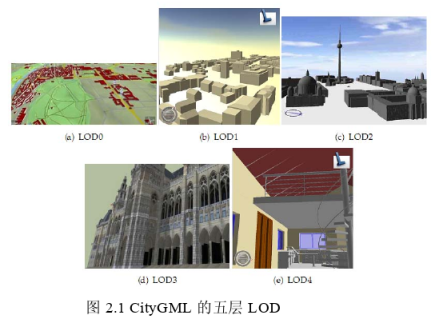
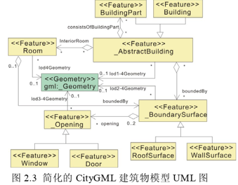
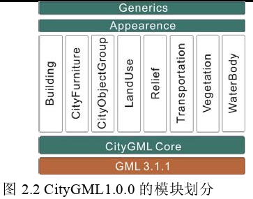

相关链接

1. [https://www.ogc.org/standards/citygml](https://www.ogc.org/standards/citygml)

城市地理标记语言CityGML（City Geography Markup Launguage）是一种用来表现城市三维对象的通用信息模型。

- 它是一种基于XML的开放数据模型
- 用来存储和交换三维城市模型
- CityGML 在 Geography Markup Language 3 (GML3)的基础上实现。GML3 是 Open Geospatial Consortium (OGC)和 ISO TC211 联合起草的可扩展的空间信息交换国际标准

## 简介
### 基于XML
CityGML 以 XML 作为存储和交换的数据格式，其文档遵循 XML 规范。
XML结构通常用**架构文件(.xsd)和实例文件(.xml)**表示，前者定义模型规则，后者包含具体数据。

### 历史

1. 从2002年起Special Interest Group 3D (SIG 3D)的成员们就开始开发CityGML，这个组织由德国的 Geodata Infrastructure North-Rhine Westphalia (GDI NRW)发起
2. 2009 年 8 月，CityGML 会成为 OGC 的标准

#### SIG3D组织
SIG3D 是一个开放的组织，包含了超过 70 家公司、政府机构、研究机构等，致力于 3D 模型互操作及可视化方面的技术开发和商业拓展。SIG3D 最近的另外一个工作成果是 Web 3D Service（W3DS）草案，即互联网三维服务的标准，已经进入了OGC 的讨论阶段(OGC Doc.No. 05-002)

### 目的
开发 CityGML 的目的就是要得到一个能够在**不同应用之间共享的通用模型**，用于定义基本实体、属性及其之间的关系。

- 格外重要的是，这也是为了降低三维城市模型的维护成本，使得将同一份数据出售给不同的应用领域成为可能。目标应用领域包括：城市规划、建筑设计、观光旅游、环境仿真、电信、灾难管理、国家安全、车辆及步行导航、训练模拟等

### 作用
传统的三维 GIS 主要面向可视化，各个系统使用各自专有的数据格式，系统间数据共享困难，难以实现互操作。CityGML 的推出主要是为了克服传统三维 GIS 的弊端。

CityGML 作为一种标准的建模语言

- 解决了三维GIS 缺乏模型标准的问题，使得各个系统间互操作实现成为可能
- 此外 CityGML是一种基于 XML 格式的数据交换标准，便于在网络上传输，这样就使得大规模数据的三维 GIS 可以通过网络服务实时获取数据

## 特点
CityGML 定义了城市中的大部分地理对象的分类及其之间的关系，而且充分地考虑了区域模型的几何、拓扑、语义、外观属性等。

- 其中包括了主题分类之间的层次、聚合、对象之间的关系、空间属性等。
- 这些专题信息不仅仅是一种图形交换格式，而且允许将虚拟 3D 城市模型部署到各种不同应用中的复杂分析任务，例如仿真、城市数据挖掘、设施管理、主题查询等。

### 五层LOD模型
CityGML 支持五种不同的 LOD（细节层次）模型

1. LOD0 是最粗糙的层次，本质上是一个 2.5 维的地形模型，覆盖上遥感影像或图片
2. LOD1 是指没有屋顶的“楼块”模型（block model）
3. LOD2 是指包含纹理和屋顶的粗模，植被在这层也可以表示
4. LOD3 是指包含更高分辨率纹理和更多细节的建筑物模型、更精细的植被模型以及交通运输模型
5. LOD4 是最详细的层次，它在 LOD3的基础上增加了 3D 物体的内部结构，如建筑物中的楼梯、过道、家具等

每个建筑物都可以用不同的 LOD（层次细节）来描述，不同的层次细节其模型表示各有不同。

- 如，对于 LOD4 模型，建筑物由多个房间组成，各个房间又由不同的墙面、屋顶等组成。
- 同时 CityGML 是一种语义与几何协同表示的模型，以上描述的模型组成都有其对应的几何表示，如：  BuildingPart（建筑物部分）对应 CompositeSolids（组合几何体）、Room（房间）对应 Solid（几何实体）、WallSurface（墙面）对应 CompositeSurface（组合表面）等。

### 语义/几何协同表示模型
CityGML 模型设计的一个重要原则就是语义、几何模型的协同。在语义层面上说，真实世界实体都是通过如建筑物、墙面、房屋等要素进行描述，同时这些描述中也包含了要素间的关系，因此要素间的关系只能在语义层面上表述，不涉及几何拓扑信息。而在空间层面上，物体是通过空间位置和范围等信息描述的。CityGML 包含了语义、几何两方面的信息，并且语义、几何之间是相互联系的，对同一个模型协同表示。

### CityGML的模块
CityGML 采用模块化构建思想，由一个核心模块和十一个扩展模块组成

### 应用领域扩展（Application Domain Extensions, ADE） 
应用领域扩展（Application Domain Extensions, ADE），允许对现有模型进行扩展。这些扩展包括对现有的 CityGML 对象定义新的属性以及建立新的对象模型。ADE 被定义为拥有自身命名空间的 XML  Schema，这样的好处是可以正式地对CityGML 进行扩展。ADE 可以被特殊应用领域感兴趣的信息者定义，并且可以对同一个数据集定义多个 ADE。 

## 复杂性
CityGML 作为三维城市模型的标记语言，具有非常复杂的数据结构，它的复杂性体现在以下几个方面

### 用大量的语义模型来表示城市拓扑对象
CityGML 用大量的语义模型来表示城市拓扑对象，这些模型各自具有不同的结构，表现在组成这些模型的要素之间不同的组合、聚合关系、要素具有不同的属性等。没有一个标准的语义模型使得各个语义模型能遵循。

### 从单个语义模型的层面来看
从单个语义模型的层面来看。首先，语义模型基于继承、组合的结构，有可能导致很深的连结深度；其次，一个模型有多个细节层次，需要维护它们之间的链接；第三，一个模型可能同时用多种几何模型表示。

### 从单个几何模型层面来看
从单个几何模型层面来看。CityGML 的几何模型语义模型是协同的，因此也具有复杂的继承和组合关系，而且各个组合元素可能还赋予不同的外观纹理和材质信息等。

## 参考文章

1. 许娇龙. 基于CityGML的三维GIS关键技术研究[D]. 国防科学技术大学, 2010.
