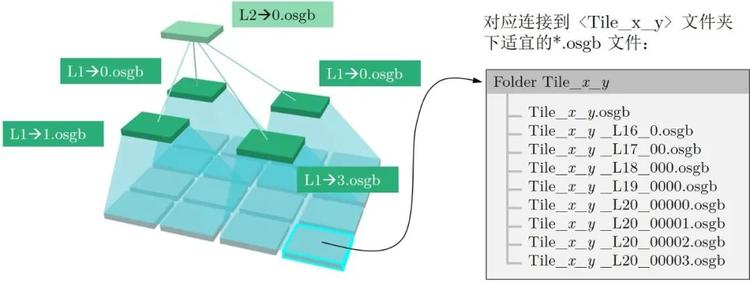

## 示例
```
Data
    - Tile_+000_+000
        - Tile_+000_+000.osgb
        - Tile_+000_+000_L17_0.osgb
        - Tile_+000_+000_L18_00.osgb
        - ……
    - Tile_+000_+001
    - ……
metadata.osgb
metadata.xml
```

1. Data为数据目录，它包含了很多瓦片数据。一个瓦片是一个LOD树形结构
2. 一个瓦片下包含了很多后缀为osgb的文件，其文件名的前缀Tile_+000_+000和目录名称一样。后缀_L17_0代表其LOD等级
3. ``./metadata.osgb`下是一个索引文件，内部链接了`./Data/xx`下的LOD节点
4. metadata.xml内包含了此数据的坐标系、原点信息

用户一般选择Data/目录作为输入
