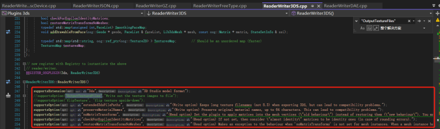
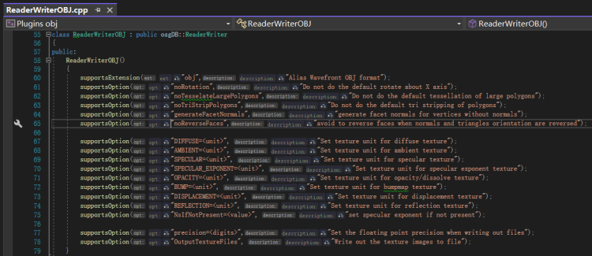
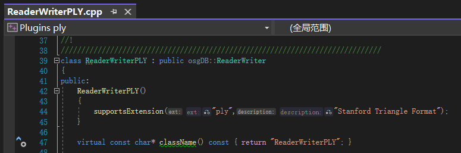
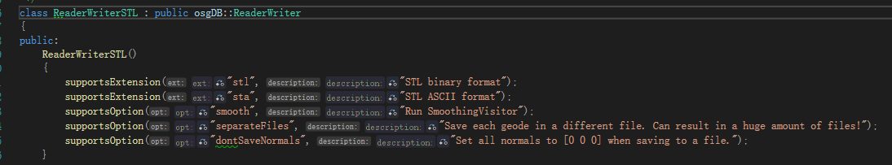
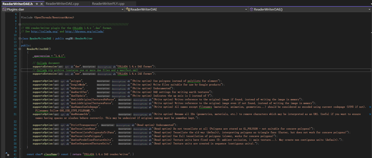

OSG C++编译之后，会在bin目录下生成一个osgconv.exe。

## 示例
### 格式转换
```
M:\02install\OpenSceneGraph-3.6.5-VC2022-64-Release\bin\osgconv.exe xxx.osgb xxx.osg
```

### 导出纹理
```
osgconv.exe xxx.osgb xxx.osg -O OutputTextureFiles
```

osgb内部的Texuture，一般都会包含一个路径，而osgconv它直接是保存到那个路径下。

## 批量处理
### 批量格式转换
示例：输入一个倾斜数据的`Data`目录，批量转成`obj`， **并保持原有目录结构**

```python
import os
import subprocess

osgconv_exe = r"M:\02install\OpenSceneGraph-3.6.5-VC2022-64-Release\bin\osgconv.exe"
#输入目录
workspace = r"F:\data\osgb\3D\Data\Tile_+000_+000"
#输出目录
out_dir = r"F:\data\osgb\osg_tree_demo\Tile_+000_+000"
#扫描的格式
in_ext = "osgb"	
#输出的格式			
out_ext = "osg"
#其他选项	
options = f"-O OutputTextureFiles={out_dir}"

def mk_outputdir(path):
	folder = None
	if os.path.isdir(path):
		folder = path
	else:
		folder = os.path.dirname(path)
		
	if os.path.exists(folder):
		return

	os.makedirs(folder)

for parent,dirnames,filenames in os.walk(workspace):
	for file in filenames:
		in_fp = os.path.join(parent, file)

		if not in_fp.endswith(in_ext):
			continue

		relative_dir = parent.replace(workspace, "")
		out_fp = f"{out_dir}{relative_dir}\\{file}"

		out_fn, old_ext = os.path.splitext(out_fp)
		out_fp = f"{out_fn}.{out_ext}"
		mk_outputdir(out_fp)

		# subprocess.call(["osgconv.exe",in_fp, out_fp])
		subprocess.call(f"{osgconv_exe} {in_fp} {out_fp} {options}")
		# print(f"[Done] {in_fp} -> {out_fp}" )
```

## 源码分析
### -O选项
将`-O`传入的字符串str，先按照空格（'  '）分割，再按照等号（'='）分割，然后存入`PluginStringDataMap _pluginStringData;`当中。到每个插件中，再具体使用（参考：`osgDB::ReaderWriter::Options`）

可以在插件类的构造函数中查看，此插件支持哪些参数



### 插件参数
#### Obj参数



#### Ply参数


#### STL读取参数


#### DAE读取参数


### 3ds读取参数
