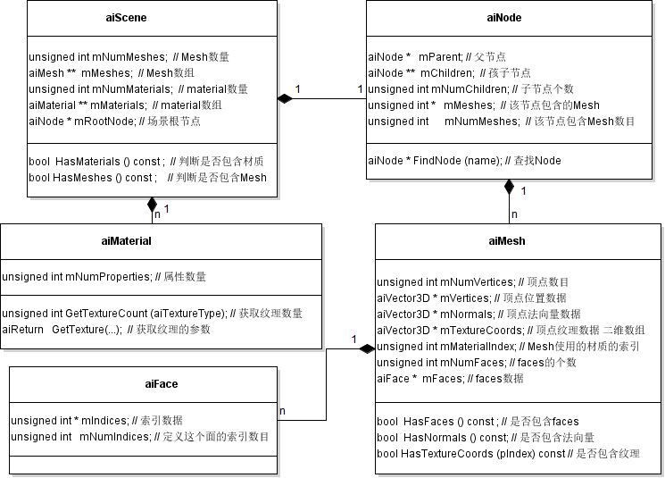
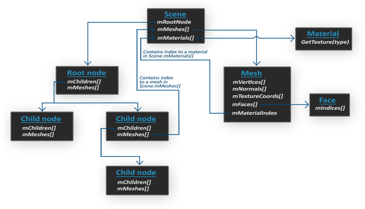

## 文件结构
```cpp
	/code		Source code
	/contrib	Third-party libraries
	/doc		Documentation (doxysource and pre-compiled docs)
	/include	Public header C and C++ header files
	/scripts 	Scripts used to generate the loading code for some formats
	/port		Ports to other languages and scripts to maintain those.
	/test		Unit- and regression tests, test suite of models
	/tools		Tools (old assimp viewer, command line `assimp`)
	/samples	A small number of samples to illustrate possible
                        use cases for Assimp

	/data     	测试数据
```
源代码结构
```cpp
	code/Common		The base implementation for importers and the infrastructure
	code/PostProcessing	The post-processing steps
	code/<FormatName>	Implementation for import and export for the format
```

## 类图

1. aiScene：场景下所有的Mesh、Material都存在scene中
2. 其他中存的都是aiScene下的索引



类之间的关系

1. aiScene:aiNode = 1:1
2. aiNode:aiNode = 1:n aiNode本身是树形结构
3. aiNode:aiMesh = 1:n 一个node中有多个mesh
4. aiMesh:aiFace = 1:n 一个mesh中有多个Face

Face表示渲染中的一个最基本的形状单元，即图元（如点、线、三角面片、多边形面片）
Mesh表示三维中最小的单元

1. 可以和Face同等级，如点、三角形、共面的多边形
2. 可以是Face的集合，如多点、多个三角形、多个多边形（一个多边形内的点是共面的）
3. 在放大，也可以是四面体、正方体、圆柱等三维的最小单元

Node类似于Model，这个模型而且可以是属性结构的，如此可以抽象表示LOD的情况
Scene即场景概念，其中有图中提及的属性，甚至还有光照、摄像机等

## 数据结构
Assimp导入模型的时候，它通常会将整个模型加载到一个场景(Scene)对象，这个对象包含了导入模型的所有数据。



1. `Scene`场景：有3个成员，分别是`mRootNode`（场景的根节点）、`mMeshes`（场景中所有网格Mesh）、`mMaterials`（场景中的所有材质）。
2. `Node`节点：结点有两个属性①`mChildren`指向多个自己，表示此结点下还有多个子结点，与子节点是一对多的关系；②`mMeshes`指向多个Mesh，指出哪些Mesh属于该结点。在Scene场景下挂载了一个根节点`mRootNode`，根节点下还有很多个结点。
3. `Mesh`网格：Mesh包含顶点集`mVertices`、顶点的法向量集`mNormals`、纹理坐标集`mTextureCoords`，面集合`mFaces`，还有一个是材质索引`mMaterialIndex`，指向此网格的材质
4. `Material`材质
5. `Face`面。一个Face表示一个物体的渲染图元（primitive）

## 其他
属性挂在aiNode里
