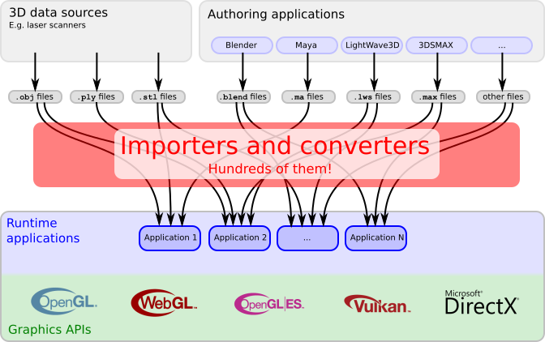

## 背景

3D内容的来源非常复杂，它们往往还具有不同的文件格式。[这里](https://link.zhihu.com/?target=https%3A//en.wikipedia.org/wiki/List_of_file_formats%233D_graphics)给出了多个不同的应用程序支持的超过70种不同的3D数据文件格式。

1.  通常，原生的3D数据由3D扫描器扫描得到。这些扫描器通常将扫描得到的3D数据以OBJ，PLY或STL格式存储，不包含任何场景结构信息以及3D数据如何被渲染的信息
2.  更为复杂的3D场景数据通常是使用一些创作软件得到的。这些创作软件允许对场景进行编辑，比如对光源、相机和动画进行编辑。创作软件通常以自己的方式来存储这些可以编辑的3D场景数据。比如Blender将它的场景数据存储为.blend文件，LightWave3D将它的场景数据存储为.lws文件，3ds Max将它的场景数据存储为.max文件，Maya将它的场景数据存储为.ma文件。

为了渲染来源不同的3D内容，应用程序需要能够读取这些个数不同的3D数据文件。为了进行渲染，场景数据和3D几何数据需要转换为图形API可以接受的形式，从而可以被传输到显卡上进行渲染。

通常，如下图所示，应用程序为此需要编写导入程序、加载程序

## 三维格式的分类
> 个人观点，欢迎讨论

根据三维格式所存储与关注的信息类型不同，笔者将它们划分为以下三个层级。

1. 几何层级：只表达（或重点表达）物体几何形体的格式，不包含（或表达能力有限）模型树、材质、动画等信息的格式。此类格式不仅包括存储表面网格的OFF、Ply与Obj格式；还包含存储参数化建模结果的几何格式，如igs、brep格式；甚至还包含存储体素网格的格式，如vtk格式；
2. 模型层级：在几何层级的基础上，添加了对模型树、材质、属性等信息的表达能力，但不包含（或表达能力有限）动画、摄像机、光源等信息的格式，例如IFC、3DTiles等格式；
3. 场景层级：在模型层级的基础上，侧重场景级别的表达与存储，能够较好的表达三维中的各类信息。此类格式诸如glTF、blend等等。

## 相关文章

1.  [wiki 3D graphics file formats](https://en.wikipedia.org/wiki/Category:3D_graphics_file_formats)

## 参考文章

1. [Introduction to glTF using WebGL](https://github.com/KhronosGroup/glTF-Tutorials/blob/master/gltfTutorial/gltfTutorial_001_Introduction.md)；[中文翻译](https://zhuanlan.zhihu.com/p/65264939)