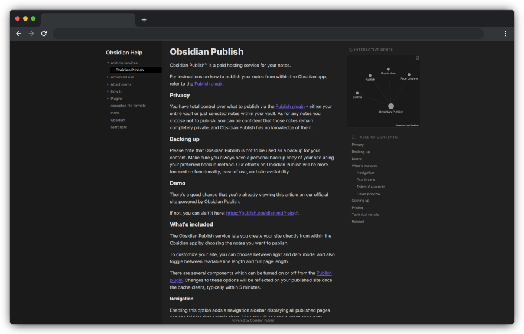

## Obsidian publish
地址：[https://obsidian.md/publish](https://obsidian.md/publish)

收费：20$ 每月，192$ 每年，7天内轻松退款

优点：支持Obsidian的许多特性，兼容良好

效果

## Hexo+Obsidian

相关链接：[Hexo + Obsidian + Git 完美的博客部署与编辑方案](https://juejin.cn/post/7120189614660255781)

解决方案：使用[hexo-auto-category](https://link.juejin.cn/?target=hexo-auto-category)插件，根据目录结构生成categories信息

缺点：

1.  部署前就需要将markdown生成html文件，再发布，会生成一堆`*.html`文件，污染仓库
2.  虽然有category查看网页，但查看某分类文章时还需要跳转新的页面，很不方便。希望有类似于文件浏览器的树状结构，并且文章也在同一个页面上，无需跳转
3.  没有Obsidian的其他特性，如文档的双向链接

## docsify

相关链接：

1.  [docsify官方文档](https://docsify.js.org/#/zh-cn/)
2.  [使用docsify生成项目文档](https://www.jianshu.com/p/4883e95aa903)

优点：适合轻量级文档

缺点：

1.  在网站运行时才将mardown文档渲染，并未像hexo事先转换成HTML，这会造成百度等搜索引擎只会收录首页，其他页面一个都不会收录
2.  docsify做一个简单的说明书网站还是不错的，但是每一个md文件每次都要自己上传，目录也要自己改写，并不是很方便

## mkdocs
mkdocs是将markdown文档转成

相关链接

1.  [使用Gitlab Pages发布Obsidian笔记](https://about.gitlab.com/blog/2022/03/15/publishing-obsidian-notes-with-gitlab-pages/)
2.  [mkdocs中文文档](https://markdown-docs-zh.readthedocs.io/zh_CN/latest/)

## Blot

Blot：博客平台，将文件夹转换成博客。

收费：$4每月

相关链接：[Why I’m no longer using Obsidian Publish](https://medium.com/effie-write-mindmap-note/why-im-no-longer-using-obsidian-publish-5234f35f089e)

## Webpage HTML export插件

参考链接

1. [Obsidian web online展示，OB秒变网页发布器_哔哩哔哩_bilibili](https://www.bilibili.com/video/BV1FG4y1Q7sm/?vd_source=28f192ec73ac2df3cc6eaa0100ebde4a)
2. 示例库在线展示地址: https://cuman.pptest.com.cn/

